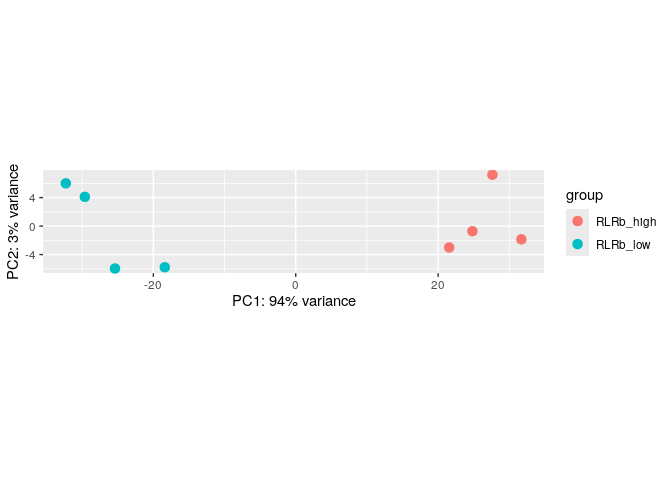
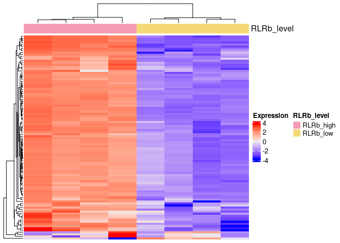
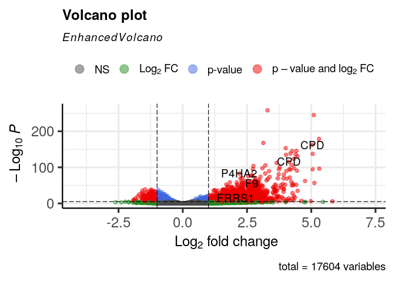
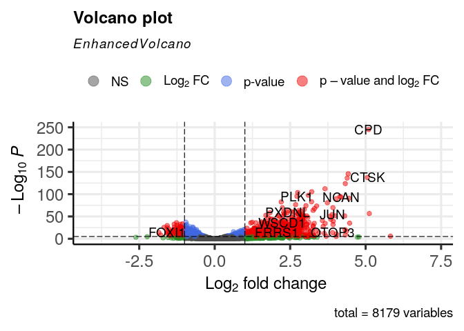
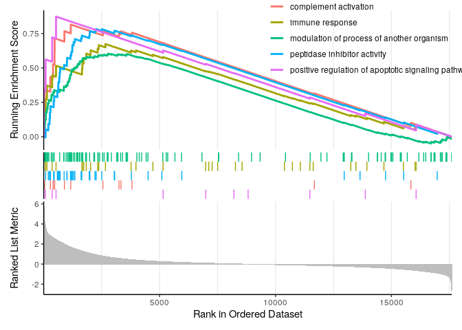
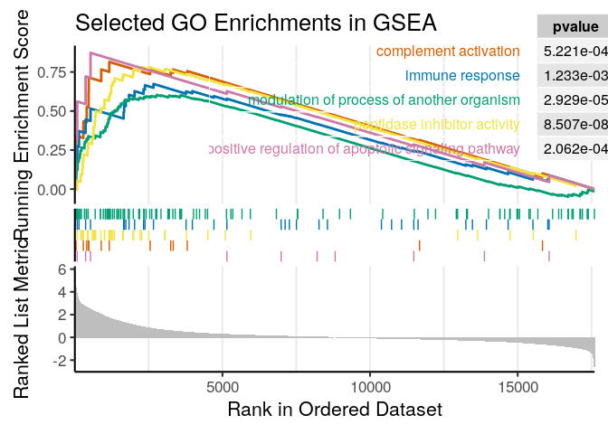
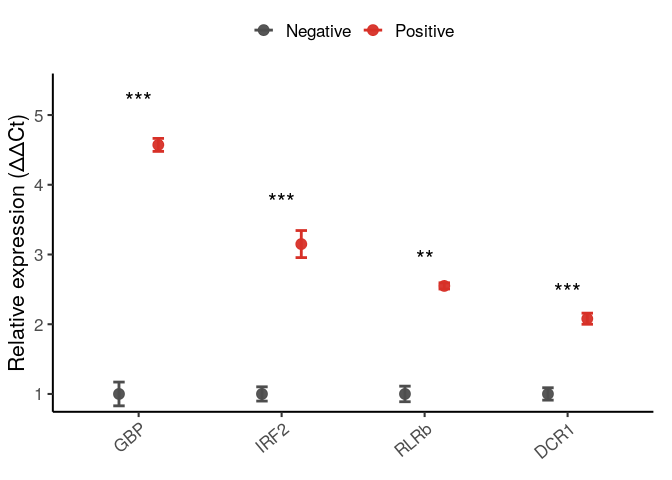

```         
setwd(
  "~/immune_cells/cnidarian_immune_cells/01_Immuno_FACS_bulkRNAseq/02_differential_expression_analysis/"
)
#Read count matrix
f <- "data/immuno_count_matrix.txt"
count_matrix <- read.delim(f,
                           header = T,
                           row.names = 1,
                           skip = 1)
colnames(count_matrix) <- c(
  "Chr",
  "Start",
  "End",
  "Strand",
  "Length",
  "RLRb_low1",
  "RLRb_low2",
  "RLRb_low3",
  "RLRb_low4",
  "RLRb_high1",
  "RLRb_high2",
  "RLRb_high3",
  "RLRb_high4"
)
library(dplyr)
colnames(count_matrix)

##  [1] "Chr"        "Start"      "End"        "Strand"    
##  [5] "Length"     "RLRb_low1"  "RLRb_low2"  "RLRb_low3" 
##  [9] "RLRb_low4"  "RLRb_high1" "RLRb_high2" "RLRb_high3"
## [13] "RLRb_high4"

count_matrix <- count_matrix %>% dplyr::select(-Chr, -Start, -End, -Strand)
countData <- as.matrix(count_matrix %>% dplyr::select(-Length))

#create coldata
SampleName <- colnames(countData)
Condition <- c(rep("RLRb_low", 4), rep("RLRb_high", 4))
colData <- data.frame(SampleName, Condition)
rownames(colData) <- colnames(countData)

all(rownames(colData) %in% colnames(countData))

## [1] TRUE

all(rownames(colData) == colnames(countData))

## [1] TRUE

library(DESeq2)
dds <- DESeqDataSetFromMatrix(countData = countData,
                              colData = colData,
                              design = ~ Condition)

## Warning in DESeqDataSet(se, design = design, ignoreRank):
## some variables in design formula are characters, converting
## to factors

#Filtering
keep <- rowSums(counts(dds)) >= 50
table(keep)

## keep
## FALSE  TRUE 
##  2927 17609

dds <- dds[keep, ]

#Running the analysis
dds <- DESeq(dds)

## estimating size factors

## estimating dispersions

## gene-wise dispersion estimates

## mean-dispersion relationship

## final dispersion estimates

## fitting model and testing

res <- results(dds)
# Define the contrasts correctly
res <- results(dds, contrast = c("Condition", "RLRb_high", "RLRb_low"))

res <- na.omit(res)
keep <- res$padj < 0.05 & res$log2FoldChange > 1
res_filt <- res[keep, ]
nrow(res_filt)

## [1] 2006

write.table(res_filt, "data/RLRb_high_upregulated_filt.txt", sep = "\t")
sum(res$padj < 0.05 & res$log2FoldChange > 1 , na.rm = T)

## [1] 2006

# 2048 upregulated
sum(res$padj < 0.05 & res$log2FoldChange < -1 , na.rm = T)

## [1] 382

# 384 downregulated
write.csv(res, file = "S2_table.csv", row.names = TRUE)

# Exploratory andlysis
# PCA plot
vsd <- vst(dds, blind = FALSE)
plotPCA(vsd, intgroup = "Condition")

## using ntop=500 top features by variance
```



```         
# Assuming 'vsd' is your variance-stabilized or rlog-transformed DESeq2 object
pcaData <- plotPCA(vsd, intgroup = "Condition", returnData = TRUE)

## using ntop=500 top features by variance

# Calculate percentage of variance explained by each principal component
percentVar <- round(100 * attr(pcaData, "percentVar"))
# Save files:
saveRDS(percentVar, "data/percentVar.rds")
saveRDS(pcaData, "data/pcaData.rds")

# Add homology table
peptides_anotation <- read.csv("../../09_supplementary_files/Dictionary_Kozlovski_et.al.csv")
res_df <- as.data.frame(res)
rownames(res_df) <- gsub("-", "_", rownames(res_df))
res_df$gene_name <- rownames(res_df)

# Heatmap
library(ComplexHeatmap)
ntd <- normTransform(dds, f = log2, pc = 1)
# Show only the top 100 genes
top.genes <- order(rowVars(assay(ntd)), decreasing = TRUE)[1:100]
top.ntd <- ntd[top.genes, ]
assay(top.ntd) <- assay(top.ntd) - rowMeans(assay(top.ntd))
col.anno <- HeatmapAnnotation(RLRb_level = ntd$Condition)

Heatmap(
  assay(top.ntd),
  show_row_names = FALSE,
  show_column_names = FALSE,
  name = "Expression",
  top_annotation = col.anno
)
```



```         
# Rename the RLRs
#RLRa
target_gene <- "Nvec-vc1.1-XM-032364224.2"
new_protein_name <- "RLRa"
peptides_anotation$protein[peptides_anotation$gene_name == target_gene] <- new_protein_name

# RLRb
target_gene <- "Nvec-vc1.1-XM-048731783.1"
new_protein_name <- "RLRb"
peptides_anotation$protein[peptides_anotation$gene_name == target_gene] <- new_protein_name

# RLRb paralog
target_gene <- "Nvec-vc1.1-XM-048731786.1"
new_protein_name <- "RLRb_2"
peptides_anotation$protein[peptides_anotation$gene_name == target_gene] <- new_protein_name

# Merge the dataframes
merged_df1 <- merge(
  res_df,
  peptides_anotation,
  by.x = "gene_name",
  by.y = "DToL_gene_model",
  all.x = TRUE,
  sort = FALSE
)

# Restore row names
rownames(merged_df1) <- merged_df1$gene_name
merged_df1$gene_name <- NULL


# Save as table S2
write.csv(merged_df1, "data/S2_table.csv")

library(EnhancedVolcano)
EnhancedVolcano(merged_df1,
                lab = merged_df1$protein,
                x = 'log2FoldChange',
                y = 'padj')
```



```         
# Take only one copy of a gene that is the most highly expressed
df <- merged_df1

filtered_df <- df %>%
  group_by(protein) %>%
  filter(abs(log2FoldChange) == max(abs(log2FoldChange))) %>%
  ungroup() %>% na.omit()

EnhancedVolcano(filtered_df,
                lab = filtered_df$protein,
                x = 'log2FoldChange',
                y = 'padj')
```



```         
# Improved visualization
library(EnhancedVolcano)

colors <- rep("#C0C0C0", nrow(filtered_df))
names(colors) <- rep("Negative", nrow(filtered_df))

#Assign colors to down vs. up genes

colors[which(filtered_df$log2FoldChange >= 1 &
               filtered_df$padj < 0.05)] <- "#D55E00"
names(colors) [which(filtered_df$log2FoldChange >= 1 &
                       filtered_df$padj < 0.05)] <- "UP"

colors[which(filtered_df$log2FoldChange <= -1 &
               filtered_df$padj < 0.05)] <- "#0072B2"
names(colors) [which(filtered_df$log2FoldChange <= -1 &
                       filtered_df$padj < 0.05)] <- "DOWN"

volcano_plot <- EnhancedVolcano(
  filtered_df,
  lab = filtered_df$protein,
  x = "log2FoldChange",
  y = "padj",
  pCutoff = 0.05,
  FCcutoff = 1,
  selectLab = c(
    "GBP3",
    "IRF8",
    "IFI30",
    "IRF2",
    "RLRb",
    "OAS1",
    "IFI44",
    "GBP6",
    "FOS",
    "TRIM56",
    "TRIM45",
    "CD38",
    "TRAF4",
    "JUN",
    "MAFA",
    "CLEC4A",
    "PTPRD",
    "LBP",
    "TRAF4"
  ),
  colCustom = colors,
  colAlpha = 0.3,
  title = "",
  subtitle = "",
  caption = "",
  drawConnectors = TRUE,
  widthConnectors = 0.75,
  ylim = c(NA, 150),
  max.overlaps = 33,
  labSize = 3.0
)

# Save the plot as a PDF
ggsave(
  filename = "data/volcano_plot1_RLRb.pdf",
  plot = volcano_plot,
  device = "pdf",
  width = 8,
  height = 6,
  dpi = 300
)

library(EnhancedVolcano)

# Generate the plot
volcano_plot2 <- EnhancedVolcano(
  filtered_df,
  lab = filtered_df$protein,
  x = "log2FoldChange",
  y = "padj",
  pCutoff = 0.05,
  FCcutoff = 1,
  selectLab = c(
    "GBP3",
    "IRF8",
    "IFI30",
    "IRF2",
    "RLRb",
    "OAS1",
    "IFI44",
    "GBP6",
    "FOS",
    "TRIM56",
    "TRIM45",
    "CD38",
    "TRAF4",
    "JUN",
    "MAFA",
    "CLEC4A",
    "PTPRD",
    "LBP",
    "TRAF4"
  ),
  colCustom = colors,
  colAlpha = 0.2,
  title = NULL,
  subtitle = NULL,
  caption = NULL,
  drawConnectors = TRUE,
  widthConnectors = 0.5,
  colConnectors = "grey30",
  boxedLabels = TRUE,
  labSize = 3.5,
  max.overlaps = Inf,
  pointSize = 2.0,
  axisLabSize = 12,
  labCol = "black",
  labFace = "plain",
  ylim = c(NA, 150)
)

ggsave(
  filename = "data/volcano_plot2.pdf",
  plot = volcano_plot2,
  device = "pdf",
  width = 7.5,
  height = 6,
  useDingbats = FALSE
)


# Gene set enrichment analysis  -------------------------------------------

merged_df = merged_df1
dim(merged_df)

## [1] 17604    13

head(merged_df)

##                            baseMean log2FoldChange
## Nvec_vc1.1_XM_032374162.2 2514.5527    -0.15902070
## Nvec_vc1.1_XM_001626535.3  249.0945     0.20413832
## Nvec_vc1.1_XM_001626549.3  526.7175    -0.29381173
## Nvec_vc1.1_XM_032374171.2  376.4195    -0.11273186
## Nvec_vc1.1_XM_001626548.3 9174.2223    -0.08731851
## Nvec_vc1.1_XM_032374170.2  243.5127    -0.24461537
##                                lfcSE       stat      pvalue
## Nvec_vc1.1_XM_032374162.2 0.10757770 -1.4781938 0.139355901
## Nvec_vc1.1_XM_001626535.3 0.13558129  1.5056526 0.132156378
## Nvec_vc1.1_XM_001626549.3 0.10600531 -2.7716700 0.005576955
## Nvec_vc1.1_XM_032374171.2 0.11247936 -1.0022449 0.316225337
## Nvec_vc1.1_XM_001626548.3 0.09791327 -0.8917944 0.372503134
## Nvec_vc1.1_XM_032374170.2 0.13861167 -1.7647531 0.077605272
##                                 padj    X
## Nvec_vc1.1_XM_032374162.2 0.24994450 9201
## Nvec_vc1.1_XM_001626535.3 0.24041344 2063
## Nvec_vc1.1_XM_001626549.3 0.01695918 2067
## Nvec_vc1.1_XM_032374171.2 0.46293812 9203
## Nvec_vc1.1_XM_001626548.3 0.52268015 2066
## Nvec_vc1.1_XM_032374170.2 0.15753727 9202
##                                                        NVE_gene_model
## Nvec_vc1.1_XM_032374162.2 NVE16689;NVE21489;NVE21491;NVE24349;NVE9654
## Nvec_vc1.1_XM_001626535.3                                     NVE9653
## Nvec_vc1.1_XM_001626549.3                            NVE21488;NVE9652
## Nvec_vc1.1_XM_032374171.2                            NVE24348;NVE9651
## Nvec_vc1.1_XM_001626548.3                            NVE24347;NVE9650
## Nvec_vc1.1_XM_032374170.2                                     NVE9649
##                                           nv2_gene_model
## Nvec_vc1.1_XM_032374162.2 NV2.25936;NA;NV2.5;NV2.2;NV2.3
## Nvec_vc1.1_XM_001626535.3                          NV2.7
## Nvec_vc1.1_XM_001626549.3                          NV2.8
## Nvec_vc1.1_XM_032374171.2                          NV2.9
## Nvec_vc1.1_XM_001626548.3                         NV2.10
## Nvec_vc1.1_XM_032374170.2                         NV2.11
##                                                                  gene_name.y
## Nvec_vc1.1_XM_032374162.2 SZT2-like-2;NA;SZT2-like-1;SZT2-like-6;SZT2-like-7
## Nvec_vc1.1_XM_001626535.3                                       RXLT1-like-1
## Nvec_vc1.1_XM_001626549.3                                       MED8A-like-1
## Nvec_vc1.1_XM_032374171.2                                       UTP23-like-1
## Nvec_vc1.1_XM_001626548.3                                        SSRD-like-1
## Nvec_vc1.1_XM_032374170.2                                       P20D1-like-1
##                           protein_homolog
## Nvec_vc1.1_XM_032374162.2            SZT2
## Nvec_vc1.1_XM_001626535.3          RXYLT1
## Nvec_vc1.1_XM_001626549.3            MED8
## Nvec_vc1.1_XM_032374171.2           UTP23
## Nvec_vc1.1_XM_001626548.3            SSR4
## Nvec_vc1.1_XM_032374170.2          PM20D1
##                                        pfam_domain protein
## Nvec_vc1.1_XM_032374162.2                             SZT2
## Nvec_vc1.1_XM_001626535.3                           RXYLT1
## Nvec_vc1.1_XM_001626549.3                    Med8/    MED8
## Nvec_vc1.1_XM_032374171.2                    Fcf1/   UTP23
## Nvec_vc1.1_XM_001626548.3              TRAP-delta/    SSR4
## Nvec_vc1.1_XM_032374170.2 Peptidase_M20/M20_dimer/  PM20D1

# we want the log2 fold change
original_gene_list <- merged_df1$log2FoldChange

# name the vector
names(original_gene_list) <- rownames(merged_df)
head(original_gene_list)

## Nvec_vc1.1_XM_032374162.2 Nvec_vc1.1_XM_001626535.3 
##               -0.15902070                0.20413832 
## Nvec_vc1.1_XM_001626549.3 Nvec_vc1.1_XM_032374171.2 
##               -0.29381173               -0.11273186 
## Nvec_vc1.1_XM_001626548.3 Nvec_vc1.1_XM_032374170.2 
##               -0.08731851               -0.24461537

# omit any NA values
gene_list <- na.omit(original_gene_list)

# sort the list in decreasing order (required for clusterProfiler)
gene_list = sort(gene_list, decreasing = TRUE)
# Loading Nematostella annotation files
setwd("~/immune_cells/scRNAseq_analysis/annotaion/GOseq/")
list.files()

##  [1] "Consolidated_by_Gene.csv"         
##  [2] "GoName_InputClusterprofile.csv"   
##  [3] "GoName_NewAnnotation.csv"         
##  [4] "GoTerms_InputClusterProfile.csv"  
##  [5] "Goterms_NewAnnotation.csv"        
##  [6] "Goterms_PM.csv"                   
##  [7] "Goterms_PMC.csv"                  
##  [8] "GSEA_metrics_table.pdf"           
##  [9] "GSEA_metrics_table.png"           
## [10] "ImmuneGenes_56.xlsx"              
## [11] "mCherry_upregulated_ORA.txt"      
## [12] "shared_immune_genes_31outOf48.csv"

TermGene  <- read.csv(file = 'GoName_NewAnnotation.csv',
                      header = TRUE,
                      check.names = FALSE)
head(TermGene)

##      Go_Term                       Ids
## 1 GO:0004930 Nvec_vc1.1_XM_001617885.3
## 2 GO:0008188 Nvec_vc1.1_XM_001617885.3
## 3 GO:0007165 Nvec_vc1.1_XM_001617885.3
## 4 GO:0007186 Nvec_vc1.1_XM_001617885.3
## 5 GO:0003677 Nvec_vc1.1_XM_001618208.3
## 6 GO:0030527 Nvec_vc1.1_XM_001618208.3

is.data.frame(TermGene)

## [1] TRUE

TermName  <- read.csv(file = 'Goterms_NewAnnotation.csv',
                      header = TRUE,
                      check.names = FALSE)
head(TermName)

##      Go_Term                                         Name
## 1 GO:0004930          G protein-coupled receptor activity
## 2 GO:0008188               neuropeptide receptor activity
## 3 GO:0007165                          signal transduction
## 4 GO:0007186 G protein-coupled receptor signaling pathway
## 5 GO:0003677                                  DNA binding
## 6 GO:0030527          structural constituent of chromatin

is.data.frame(TermName)

## [1] TRUE

#Running GSEA
library(clusterProfiler)
gse <- GSEA(
  gene_list,
  exponent = 1,
  minGSSize = 10,
  maxGSSize = 500,
  pvalueCutoff = 0.05,
  pAdjustMethod = "BH",
  TERM2GENE = TermGene,
  TERM2NAME = TermName,
  verbose = TRUE,
  seed = FALSE
)

## using 'fgsea' for GSEA analysis, please cite Korotkevich et al (2019).

## preparing geneSet collections...

## GSEA analysis...

## Warning in fgseaMultilevel(pathways = pathways, stats =
## stats, minSize = minSize, : There were 17 pathways for which
## P-values were not calculated properly due to unbalanced
## (positive and negative) gene-level statistic values. For
## such pathways pval, padj, NES, log2err are set to NA. You
## can try to increase the value of the argument nPermSimple
## (for example set it nPermSimple = 10000)

## Warning in fgseaMultilevel(pathways = pathways, stats =
## stats, minSize = minSize, : For some pathways, in reality
## P-values are less than 1e-10. You can set the `eps` argument
## to zero for better estimation.

## leading edge analysis...

## done...

#Save table
Results_GSEA <- as.data.frame(gse)
write.csv(Results_GSEA,
          file = "~/immune_cells/cnidarian_immune_cells/01_Immuno_FACS_bulkRNAseq/02_differential_expression_analysis/data/S3_table.csv",
          quote = FALSE,
          row.names = FALSE)

library(enrichplot)
# Representative processes
gseaplot2(
  gse,
  geneSetID = c(
    "GO:2001235",
    "GO:0006956",
    "GO:0030414",
    "GO:0006955",
    "GO:0035821"
  )
)
```



```         
library(clusterProfiler)
library(enrichplot)

# Optimized GSEA plot
gseaplot2(
  gse,
  geneSetID = c(
    "GO:2001235",
    "GO:0006956",
    "GO:0030414",
    "GO:0006955",
    "GO:0035821"
  ),
  base_size = 16,
  title = "Selected GO Enrichments in GSEA",
  subplots = 1:3,
  rel_heights = c(1.5, 0.5, 1),
  color = c("#D55E00", "#0072B2", "#009E73", "#F0E442", "#CC79A7"),
  pvalue_table = TRUE
)
```



```         
# Save the table of immune processes
library(gridExtra)
library(grid)
library(Cairo)

# Extract selected terms with additional metrics
selected_ids <- c("GO:2001235",
                  "GO:0006956",
                  "GO:0030414",
                  "GO:0006955",
                  "GO:0035821")

table_df <- gse@result[gse@result$ID %in% selected_ids, c("Description", "NES", "pvalue", "p.adjust", "setSize")]

# Clean and format
table_df$pvalue <- signif(table_df$pvalue, 3)
table_df$p.adjust <- signif(table_df$p.adjust, 3)
table_df$NES <- round(table_df$NES, 2)

# Rename for clarity
colnames(table_df) <- c("GO Term", "NES", "p-value", "Adjusted p-value", "Gene Set Size")


library(gridExtra)
library(grid)
library(Cairo)

# Build table grob with left alignment and larger font
table_grob <- tableGrob(
  table_df,
  rows = NULL,
  theme = ttheme_default(
    core = list(fg_params = list(
      hjust = 0,
      x = 0.05,
      fontsize = 11
    )),
    colhead = list(fg_params = list(
      fontface = "bold", fontsize = 12
    )),
    padding = unit(c(5, 5), "mm")
  )
)

# Widen left column if clipped
table_grob$widths[1] <- max(unit(4, "cm"), table_grob$widths[1])

# Save as high-quality PNG and PDF
CairoPNG(
  "GSEA_metrics_table.png",
  width = 2000,
  height = 700,
  res = 300
)
grid.newpage()
grid.draw(table_grob)
dev.off()

## RStudioGD 
##         2

CairoPDF("GSEA_metrics_table.pdf",
         width = 16,
         height = 2.8)
grid.newpage()
grid.draw(table_grob)
dev.off()

## RStudioGD 
##         2

# RT-qPCR validation ------------------------------------------------------

library(pcr)
#Loat CT values
res_tab <- read.csv(
  "~/immune_cells/cnidarian_immune_cells/01_Immuno_FACS_bulkRNAseq/02_differential_expression_analysis/data/CT_table.csv"
)

## add grouping variable
group_var <- rep(c('Positive', 'Negative'), each = 3)
# calculate all values and errors in one step
## mode == 'separate_tube' default

res1 <- pcr_analyze(res_tab,
                    group_var = group_var,
                    reference_gene = 'HKG',
                    reference_group = "Negative")
res1

##      group gene normalized calibrated relative_expression
## 1 Negative RLRb  1.6066667   0.000000            1.000000
## 2 Positive RLRb  0.2566667  -1.350000            2.549121
## 3 Negative IRF2  2.6390000   0.000000            1.000000
## 4 Positive IRF2  0.9840000  -1.655000            3.149232
## 5 Negative DCR1  4.5856667   0.000000            1.000000
## 6 Positive DCR1  3.5300000  -1.055667            2.078679
## 7 Negative  GBP  2.9763333   0.000000            1.000000
## 8 Positive  GBP  0.7836667  -2.192667            4.571497
##        error     lower    upper
## 1 0.11137474 0.9257055 1.080257
## 2 0.04416258 2.4722719 2.628359
## 3 0.10191500 0.9317953 1.073197
## 4 0.19413140 2.7527405 3.602832
## 5 0.08849482 0.9405035 1.063260
## 6 0.07954873 1.9671650 2.196514
## 7 0.17050122 0.8885339 1.125449
## 8 0.09298566 4.2861460 4.875845

library(ggpubr)

# Run t-test

tst1 <- pcr_test(res_tab,
                 group_var = group_var,
                 reference_gene = 'HKG',
                 reference_group = 'Negative',
                 test = 't.test')
knitr::kable(tst1, caption = 'pIC injection: t-test summary')
```

| gene |  estimate |   p_value |     lower |      upper |
|:-----|----------:|----------:|----------:|-----------:|
| RLRb | -1.350000 | 0.0018873 | -1.669752 | -1.0302485 |
| IRF2 | -1.655000 | 0.0003748 | -2.001974 | -1.3080257 |
| DCR1 | -1.055667 | 0.0001218 | -1.252106 | -0.8592271 |
| GBP  | -2.192667 | 0.0000535 | -2.487795 | -1.8975383 |

: pIC injection: t-test summary

```         
library(dplyr)
library(ggplot2)
library(forcats)

# --- Significance stars (trim whitespace just in case) ---
tst1_sig <- tst1 %>%
  mutate(sig = case_when(
    p_value < 0.001 ~ "***",
    p_value < 0.01  ~ "**",
    p_value < 0.05  ~ "*",
    TRUE ~ "ns"
  )) %>%
  mutate(sig = trimws(sig)) %>%
  select(gene, estimate, sig)

# Order genes by |effect| 
gene_order <- tst1_sig %>% arrange(desc(abs(estimate))) %>% pull(gene)

sum_df <- res1 %>%
  transmute(group, gene, relative_expression,
            sem = error) %>%
  left_join(tst1_sig %>% select(gene, sig), by = "gene") %>%
  mutate(
    gene  = factor(gene,  levels = gene_order),
    group = factor(group, levels = c("Negative","Positive"))
  )

# y-position for stars (slightly above the tallest mean+SEM per gene)
star_df <- sum_df %>%
  group_by(gene) %>%
  summarise(
    y_star = max(relative_expression + sem, na.rm = TRUE) * 1.09,
    sig    = dplyr::first(sig),
    .groups = "drop"
  )

pd <- position_dodge(width = 0.55)

p <- ggplot(sum_df, aes(x = gene, y = relative_expression, color = group, fill = group)) +
  geom_point(position = pd, size = 3.5, alpha = 0.95) +
  geom_errorbar(aes(ymin = relative_expression - sem, ymax = relative_expression + sem),
                position = pd, width = 0.16, linewidth = 1) +
  geom_text(data = star_df, aes(x = gene, y = y_star, label = sig),
            inherit.aes = FALSE, size = 6, vjust = 0) +
  # Custom stronger colors 
  scale_color_manual(values = c("Negative" = "#4D4D4D", "Positive" = "#D73027")) +
  scale_fill_manual(values = c("Negative" = "#4D4D4D", "Positive" = "#D73027")) +
  scale_y_continuous(expand = expansion(mult = c(0.02, 0.12))) +
  labs(x = NULL, y = "Relative expression (ΔΔCt)", color = NULL, fill = NULL) +
  theme_classic(base_size = 16) +   # bigger font
  theme(
    legend.position = "top",
    legend.box      = "horizontal",
    axis.text.x     = element_text(angle = 40, hjust = 1),
    axis.line       = element_line(linewidth = 0.7),
    plot.margin     = margin(6, 14, 12, 6)
  ) +
  coord_cartesian(clip = "off")

p
```



```         
sessionInfo()

## R version 4.4.1 (2024-06-14)
## Platform: x86_64-pc-linux-gnu
## Running under: Ubuntu 22.04.5 LTS
## 
## Matrix products: default
## BLAS:   /usr/lib/x86_64-linux-gnu/openblas-pthread/libblas.so.3 
## LAPACK: /usr/lib/x86_64-linux-gnu/openblas-pthread/libopenblasp-r0.3.20.so;  LAPACK version 3.10.0
## 
## locale:
##  [1] LC_CTYPE=en_US.UTF-8       LC_NUMERIC=C              
##  [3] LC_TIME=en_US.UTF-8        LC_COLLATE=en_US.UTF-8    
##  [5] LC_MONETARY=en_US.UTF-8    LC_MESSAGES=en_US.UTF-8   
##  [7] LC_PAPER=en_US.UTF-8       LC_NAME=C                 
##  [9] LC_ADDRESS=C               LC_TELEPHONE=C            
## [11] LC_MEASUREMENT=en_US.UTF-8 LC_IDENTIFICATION=C       
## 
## time zone: Etc/UTC
## tzcode source: system (glibc)
## 
## attached base packages:
## [1] grid      stats4    stats     graphics  grDevices
## [6] utils     datasets  methods   base     
## 
## other attached packages:
##  [1] Cairo_1.6-2                 gridExtra_2.3              
##  [3] enrichplot_1.24.4           clusterProfiler_4.12.6     
##  [5] EnhancedVolcano_1.22.0      ggrepel_0.9.6              
##  [7] ComplexHeatmap_2.20.0       DESeq2_1.44.0              
##  [9] SummarizedExperiment_1.34.0 Biobase_2.64.0             
## [11] MatrixGenerics_1.16.0       matrixStats_1.4.1          
## [13] GenomicRanges_1.56.2        GenomeInfoDb_1.40.1        
## [15] IRanges_2.38.1              S4Vectors_0.42.1           
## [17] BiocGenerics_0.50.0         pcr_1.2.2                  
## [19] ggpubr_0.6.0                lubridate_1.9.3            
## [21] forcats_1.0.0               stringr_1.5.1              
## [23] dplyr_1.1.4                 purrr_1.0.2                
## [25] readr_2.1.5                 tidyr_1.3.1                
## [27] tibble_3.2.1                ggplot2_3.5.1              
## [29] tidyverse_2.0.0            
## 
## loaded via a namespace (and not attached):
##   [1] splines_4.4.1           later_1.3.2            
##   [3] ggplotify_0.1.2         R.oo_1.26.0            
##   [5] polyclip_1.10-7         lifecycle_1.0.4        
##   [7] httr2_1.0.5             rstatix_0.7.2          
##   [9] doParallel_1.0.17       MASS_7.3-61            
##  [11] processx_3.8.4          lattice_0.22-6         
##  [13] backports_1.5.0         magrittr_2.0.3         
##  [15] sass_0.4.9              rmarkdown_2.28         
##  [17] jquerylib_0.1.4         yaml_2.3.10            
##  [19] remotes_2.5.0           httpuv_1.6.15          
##  [21] sessioninfo_1.2.2       pkgbuild_1.4.4         
##  [23] cowplot_1.1.3           DBI_1.2.3              
##  [25] RColorBrewer_1.1-3      abind_1.4-8            
##  [27] pkgload_1.4.0           zlibbioc_1.50.0        
##  [29] R.utils_2.12.3          ggraph_2.2.1           
##  [31] yulab.utils_0.1.7       tweenr_2.0.3           
##  [33] rappdirs_0.3.3          circlize_0.4.16        
##  [35] GenomeInfoDbData_1.2.12 tidytree_0.4.6         
##  [37] codetools_0.2-20        DelayedArray_0.30.1    
##  [39] ggforce_0.4.2           DOSE_3.30.5            
##  [41] tidyselect_1.2.1        shape_1.4.6.1          
##  [43] aplot_0.2.3             UCSC.utils_1.0.0       
##  [45] farver_2.1.2            viridis_0.6.5          
##  [47] jsonlite_1.8.9          GetoptLong_1.0.5       
##  [49] tidygraph_1.3.1         ellipsis_0.3.2         
##  [51] Formula_1.2-5           iterators_1.0.14       
##  [53] systemfonts_1.1.0       foreach_1.5.2          
##  [55] tools_4.4.1             treeio_1.28.0          
##  [57] Rcpp_1.0.14             glue_1.8.0             
##  [59] SparseArray_1.4.8       xfun_0.48              
##  [61] qvalue_2.36.0           usethis_3.0.0          
##  [63] withr_3.0.1             fastmap_1.2.0          
##  [65] fansi_1.0.6             callr_3.7.6            
##  [67] digest_0.6.37           gridGraphics_0.5-1     
##  [69] timechange_0.3.0        R6_2.5.1               
##  [71] mime_0.12               textshaping_0.4.0      
##  [73] colorspace_2.1-1        GO.db_3.19.1           
##  [75] RSQLite_2.3.7           R.methodsS3_1.8.2      
##  [77] utf8_1.2.4              generics_0.1.3         
##  [79] data.table_1.16.2       graphlayouts_1.2.0     
##  [81] httr_1.4.7              htmlwidgets_1.6.4      
##  [83] S4Arrays_1.4.1          scatterpie_0.2.4       
##  [85] pkgconfig_2.0.3         gtable_0.3.5           
##  [87] blob_1.2.4              XVector_0.44.0         
##  [89] shadowtext_0.1.4        htmltools_0.5.8.1      
##  [91] carData_3.0-5           profvis_0.4.0          
##  [93] fgsea_1.30.0            clue_0.3-65            
##  [95] scales_1.3.0            png_0.1-8              
##  [97] ggfun_0.1.7             knitr_1.48             
##  [99] rstudioapi_0.16.0       tzdb_0.4.0             
## [101] reshape2_1.4.4          rjson_0.2.23           
## [103] nlme_3.1-166            curl_5.2.3             
## [105] cachem_1.1.0            GlobalOptions_0.1.2    
## [107] parallel_4.4.1          miniUI_0.1.1.1         
## [109] AnnotationDbi_1.66.0    desc_1.4.3             
## [111] pillar_1.9.0            vctrs_0.6.5            
## [113] urlchecker_1.0.1        promises_1.3.0         
## [115] car_3.1-3               xtable_1.8-4           
## [117] cluster_2.1.6           evaluate_1.0.1         
## [119] cli_3.6.3               locfit_1.5-9.10        
## [121] compiler_4.4.1          rlang_1.1.4            
## [123] crayon_1.5.3            ggsignif_0.6.4         
## [125] labeling_0.4.3          ps_1.8.0               
## [127] plyr_1.8.9              fs_1.6.4               
## [129] stringi_1.8.4           viridisLite_0.4.2      
## [131] BiocParallel_1.38.0     munsell_0.5.1          
## [133] Biostrings_2.72.1       lazyeval_0.2.2         
## [135] devtools_2.4.5          GOSemSim_2.30.2        
## [137] Matrix_1.7-1            patchwork_1.3.0        
## [139] hms_1.1.3               bit64_4.5.2            
## [141] KEGGREST_1.44.1         shiny_1.9.1            
## [143] highr_0.11              igraph_2.0.3           
## [145] broom_1.0.7             memoise_2.0.1          
## [147] bslib_0.8.0             ggtree_3.12.0          
## [149] fastmatch_1.1-4         bit_4.5.0              
## [151] gson_0.1.0              ape_5.8
```
