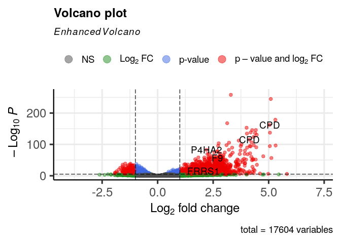
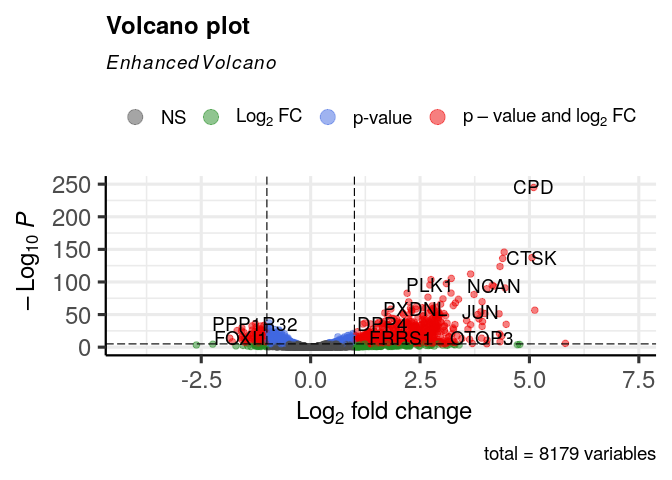

```         
setwd("~/immune_cells/cnidarian_immune_cells/01_Immuno_FACS_bulkRNAseq/02_differential_expression_analysis/")
#Read count matrix
f<- "data/immuno_count_matrix.txt"
count_matrix<- read.delim(f, header = T, row.names = 1, skip = 1)
colnames(count_matrix) <- c(
  "Chr",
  "Start",
  "End",
  "Strand",
  "Length",
  "RLRb_low1",
  "RLRb_low2",
  "RLRb_low3",
  "RLRb_low4",
  "RLRb_high1",
  "RLRb_high2",
  "RLRb_high3",
  "RLRb_high4"
)
library(dplyr)
colnames(count_matrix)

##  [1] "Chr"        "Start"      "End"       
##  [4] "Strand"     "Length"     "RLRb_low1" 
##  [7] "RLRb_low2"  "RLRb_low3"  "RLRb_low4" 
## [10] "RLRb_high1" "RLRb_high2" "RLRb_high3"
## [13] "RLRb_high4"

count_matrix<- count_matrix %>% dplyr::select(-Chr,-Start,-End,-Strand)
countData<- as.matrix(count_matrix %>% dplyr::select(-Length))

#create coldata
SampleName<- colnames(countData)
Condition<- c(rep("RLRb_low",4),rep("RLRb_high",4))
colData<- data.frame(SampleName,Condition)
rownames(colData)<- colnames(countData)

all(rownames(colData) %in% colnames(countData))

## [1] TRUE

all(rownames(colData) == colnames(countData))

## [1] TRUE

library(DESeq2)
dds<- DESeqDataSetFromMatrix(countData = countData, colData = colData, design = ~ Condition)

## Warning in DESeqDataSet(se, design = design,
## ignoreRank): some variables in design formula are
## characters, converting to factors

#Filtering 
keep <- rowSums(counts(dds)) >= 50
table(keep)

## keep
## FALSE  TRUE 
##  2927 17609

dds <- dds[keep,]

#Running the analysis
dds<- DESeq(dds)

## estimating size factors

## estimating dispersions

## gene-wise dispersion estimates

## mean-dispersion relationship

## final dispersion estimates

## fitting model and testing

res<- results(dds)
# Define the contrasts correctly 
res <- results(dds, contrast = c("Condition", "RLRb_high", "RLRb_low"))

res<- na.omit(res)
keep<- res$padj<0.05 & res$log2FoldChange>1
res_filt<- res[keep,]
nrow(res_filt)

## [1] 2006

write.table(res_filt, "data/RLRb_high_upregulated_filt.txt", sep = "\t")
sum(res$padj<0.05 & res$log2FoldChange>1 , na.rm = T)

## [1] 2006

# 2048 upregulated 
sum(res$padj<0.05 & res$log2FoldChange< -1 , na.rm = T)

## [1] 382

# 384 downregulated
write.csv(res, file = "S2_table.csv", row.names = TRUE)

# Exploratory andlysis 
# PCA plot
vsd <- vst(dds, blind=FALSE)
plotPCA(vsd, intgroup= "Condition" )

## using ntop=500 top features by variance
```


```         
# Assuming 'vsd' is your variance-stabilized or rlog-transformed DESeq2 object
pcaData <- plotPCA(vsd, intgroup = "Condition", returnData = TRUE)

## using ntop=500 top features by variance

# Calculate percentage of variance explained by each principal component
percentVar <- round(100 * attr(pcaData, "percentVar"))
# Save files:
saveRDS(percentVar, "data/percentVar.rds")
saveRDS(pcaData, "data/pcaData.rds")

# Add homology table 
peptides_anotation<- read.csv("../../08_supplementary_files/Dictionary_Kozlovski_et.al.csv")
res_df<- as.data.frame(res)
rownames(res_df) <- gsub("-", "_", rownames(res_df))
res_df$gene_name <- rownames(res_df)

# Heatmap
library(ComplexHeatmap)
ntd <- normTransform(dds, f = log2, pc = 1)
# Show only the top 100 genes 
top.genes <- order(rowVars(assay(ntd)), decreasing = TRUE)[1:100]
top.ntd <- ntd[top.genes,]
assay(top.ntd) <- assay(top.ntd) - rowMeans(assay(top.ntd))
col.anno <- HeatmapAnnotation(RLRb_level = ntd$Condition)

Heatmap(assay(top.ntd), 
        show_row_names = FALSE, 
        show_column_names = FALSE, 
        name = "Expression",
        top_annotation = col.anno)
```


```         
# Rename the RLRs
#RLRa
target_gene <- "Nvec-vc1.1-XM-032364224.2"
new_protein_name <- "RLRa"
peptides_anotation$protein[peptides_anotation$gene_name == target_gene] <- new_protein_name

# RLRb
target_gene <- "Nvec-vc1.1-XM-048731783.1"
new_protein_name <- "RLRb"
peptides_anotation$protein[peptides_anotation$gene_name == target_gene] <- new_protein_name

# RLRb paralog
target_gene <- "Nvec-vc1.1-XM-048731786.1"
new_protein_name <- "RLRb_2"
peptides_anotation$protein[peptides_anotation$gene_name == target_gene] <- new_protein_name

# Merge the dataframes
merged_df1 <- merge(
  res_df,               
  peptides_anotation,          
  by.x = "gene_name",      
  by.y = "DToL_gene_model",     
  all.x = TRUE,            
  sort = FALSE             
)

# Restore row names
rownames(merged_df1) <- merged_df1$gene_name
merged_df1$gene_name <- NULL


# Save as table S2
write.csv(merged_df1, "data/S2_table.csv")

library(EnhancedVolcano)
EnhancedVolcano(merged_df1,
                lab = merged_df1$protein,
                x = 'log2FoldChange',
                y = 'padj')
```



```         
# Take only one copy of a gene that is the most highly expressed
df<- merged_df1

filtered_df<- df %>%
  group_by(protein) %>%
  filter(abs(log2FoldChange) == max(abs(log2FoldChange))) %>%
  ungroup() %>% na.omit()

EnhancedVolcano(
  filtered_df,
  lab = filtered_df$protein,
  x = 'log2FoldChange',
  y = 'padj'
)
```



```         
# Improved visualization 
library(EnhancedVolcano)

colors <- rep("#C0C0C0", nrow(filtered_df))
names(colors) <- rep("Negative", nrow(filtered_df))

#Assign colors to down vs. up genes

colors[which(filtered_df$log2FoldChange >= 1 & filtered_df$padj < 0.05)] <- "#D55E00"
names(colors) [which(filtered_df$log2FoldChange >= 1 & filtered_df$padj < 0.05)] <- "UP"

colors[which(filtered_df$log2FoldChange <= -1 & filtered_df$padj < 0.05)] <- "#0072B2"
names(colors) [which(filtered_df$log2FoldChange <= -1 & filtered_df$padj < 0.05)] <- "DOWN"

volcano_plot<- EnhancedVolcano(
  filtered_df,
  lab = filtered_df$protein,
  x = "log2FoldChange",
  y = "padj",
  pCutoff = 0.05,
  FCcutoff = 1,
  selectLab = c("GBP3","IRF8","IFI30","IRF2","RLRb","OAS1","IFI44","GBP6","FOS","TRIM56","TRIM45","CD38","TRAF4","JUN","MAFA","CLEC4A","PTPRD","LBP","TRAF4"),
  colCustom = colors,
  colAlpha = 0.3,
  title = "",
  subtitle = "",
  caption = "",
  drawConnectors = TRUE,
  widthConnectors = 0.75,
  ylim = c(NA, 150),
  max.overlaps = 33,      
  labSize = 3.0           
)

# Save the plot as a PDF
ggsave(
  filename = "data/volcano_plot1_RLRb.pdf",  
  plot = volcano_plot,           
  device = "pdf",                
  width = 8, height = 6,         
  dpi = 300                      
)

library(EnhancedVolcano)

# Generate the plot
volcano_plot2 <- EnhancedVolcano(
  filtered_df,
  lab = filtered_df$protein,
  x = "log2FoldChange",
  y = "padj",
  pCutoff = 0.05,
  FCcutoff = 1,
  selectLab = c("GBP3", "IRF8", "IFI30", "IRF2", "RLRb", "OAS1", "IFI44",
                "GBP6", "FOS", "TRIM56", "TRIM45", "CD38", "TRAF4", "JUN",
                "MAFA", "CLEC4A", "PTPRD", "LBP", "TRAF4"),
  colCustom = colors,
  colAlpha = 0.2,                  
  title = NULL,
  subtitle = NULL,
  caption = NULL,
  drawConnectors = TRUE,
  widthConnectors = 0.5,           
  colConnectors = "grey30",        
  boxedLabels = TRUE,             
  labSize = 3.5,                   
  max.overlaps = Inf,             
  pointSize = 2.0,                 
  axisLabSize = 12,                
  labCol = "black",                
  labFace = "plain",               
  ylim = c(NA, 150)
)

ggsave(
  filename = "data/volcano_plot2.pdf",
  plot = volcano_plot2,
  device = "pdf",
  width = 7.5, height = 6,
  useDingbats = FALSE              
)


# Gene set enrichment analysis  -------------------------------------------

merged_df = merged_df1
dim(merged_df)

## [1] 17604    13

head(merged_df)

##                            baseMean log2FoldChange
## Nvec_vc1.1_XM_032374162.2 2514.5527    -0.15902070
## Nvec_vc1.1_XM_001626535.3  249.0945     0.20413832
## Nvec_vc1.1_XM_001626549.3  526.7175    -0.29381173
## Nvec_vc1.1_XM_032374171.2  376.4195    -0.11273186
## Nvec_vc1.1_XM_001626548.3 9174.2223    -0.08731851
## Nvec_vc1.1_XM_032374170.2  243.5127    -0.24461537
##                                lfcSE       stat
## Nvec_vc1.1_XM_032374162.2 0.10757770 -1.4781938
## Nvec_vc1.1_XM_001626535.3 0.13558129  1.5056526
## Nvec_vc1.1_XM_001626549.3 0.10600531 -2.7716700
## Nvec_vc1.1_XM_032374171.2 0.11247936 -1.0022449
## Nvec_vc1.1_XM_001626548.3 0.09791327 -0.8917944
## Nvec_vc1.1_XM_032374170.2 0.13861167 -1.7647531
##                                pvalue       padj
## Nvec_vc1.1_XM_032374162.2 0.139355901 0.24994450
## Nvec_vc1.1_XM_001626535.3 0.132156378 0.24041344
## Nvec_vc1.1_XM_001626549.3 0.005576955 0.01695918
## Nvec_vc1.1_XM_032374171.2 0.316225337 0.46293812
## Nvec_vc1.1_XM_001626548.3 0.372503134 0.52268015
## Nvec_vc1.1_XM_032374170.2 0.077605272 0.15753727
##                              X
## Nvec_vc1.1_XM_032374162.2 9201
## Nvec_vc1.1_XM_001626535.3 2063
## Nvec_vc1.1_XM_001626549.3 2067
## Nvec_vc1.1_XM_032374171.2 9203
## Nvec_vc1.1_XM_001626548.3 2066
## Nvec_vc1.1_XM_032374170.2 9202
##                                                        NVE_gene_model
## Nvec_vc1.1_XM_032374162.2 NVE16689;NVE21489;NVE21491;NVE24349;NVE9654
## Nvec_vc1.1_XM_001626535.3                                     NVE9653
## Nvec_vc1.1_XM_001626549.3                            NVE21488;NVE9652
## Nvec_vc1.1_XM_032374171.2                            NVE24348;NVE9651
## Nvec_vc1.1_XM_001626548.3                            NVE24347;NVE9650
## Nvec_vc1.1_XM_032374170.2                                     NVE9649
##                                           nv2_gene_model
## Nvec_vc1.1_XM_032374162.2 NV2.25936;NA;NV2.5;NV2.2;NV2.3
## Nvec_vc1.1_XM_001626535.3                          NV2.7
## Nvec_vc1.1_XM_001626549.3                          NV2.8
## Nvec_vc1.1_XM_032374171.2                          NV2.9
## Nvec_vc1.1_XM_001626548.3                         NV2.10
## Nvec_vc1.1_XM_032374170.2                         NV2.11
##                                                                  gene_name.y
## Nvec_vc1.1_XM_032374162.2 SZT2-like-2;NA;SZT2-like-1;SZT2-like-6;SZT2-like-7
## Nvec_vc1.1_XM_001626535.3                                       RXLT1-like-1
## Nvec_vc1.1_XM_001626549.3                                       MED8A-like-1
## Nvec_vc1.1_XM_032374171.2                                       UTP23-like-1
## Nvec_vc1.1_XM_001626548.3                                        SSRD-like-1
## Nvec_vc1.1_XM_032374170.2                                       P20D1-like-1
##                           protein_homolog
## Nvec_vc1.1_XM_032374162.2            SZT2
## Nvec_vc1.1_XM_001626535.3          RXYLT1
## Nvec_vc1.1_XM_001626549.3            MED8
## Nvec_vc1.1_XM_032374171.2           UTP23
## Nvec_vc1.1_XM_001626548.3            SSR4
## Nvec_vc1.1_XM_032374170.2          PM20D1
##                                        pfam_domain
## Nvec_vc1.1_XM_032374162.2                         
## Nvec_vc1.1_XM_001626535.3                         
## Nvec_vc1.1_XM_001626549.3                    Med8/
## Nvec_vc1.1_XM_032374171.2                    Fcf1/
## Nvec_vc1.1_XM_001626548.3              TRAP-delta/
## Nvec_vc1.1_XM_032374170.2 Peptidase_M20/M20_dimer/
##                           protein
## Nvec_vc1.1_XM_032374162.2    SZT2
## Nvec_vc1.1_XM_001626535.3  RXYLT1
## Nvec_vc1.1_XM_001626549.3    MED8
## Nvec_vc1.1_XM_032374171.2   UTP23
## Nvec_vc1.1_XM_001626548.3    SSR4
## Nvec_vc1.1_XM_032374170.2  PM20D1

# we want the log2 fold change 
original_gene_list <- merged_df1$log2FoldChange

# name the vector
names(original_gene_list) <- rownames(merged_df)
head(original_gene_list)

## Nvec_vc1.1_XM_032374162.2 Nvec_vc1.1_XM_001626535.3 
##               -0.15902070                0.20413832 
## Nvec_vc1.1_XM_001626549.3 Nvec_vc1.1_XM_032374171.2 
##               -0.29381173               -0.11273186 
## Nvec_vc1.1_XM_001626548.3 Nvec_vc1.1_XM_032374170.2 
##               -0.08731851               -0.24461537

# omit any NA values 
gene_list<-na.omit(original_gene_list)

# sort the list in decreasing order (required for clusterProfiler)
gene_list = sort(gene_list, decreasing = TRUE)
# Loading Nematostella annotation files
setwd("~/immune_cells/scRNAseq_analysis/annotaion/GOseq/")
list.files()

##  [1] "Consolidated_by_Gene.csv"         
##  [2] "GoName_InputClusterprofile.csv"   
##  [3] "GoName_NewAnnotation.csv"         
##  [4] "GoTerms_InputClusterProfile.csv"  
##  [5] "Goterms_NewAnnotation.csv"        
##  [6] "Goterms_PM.csv"                   
##  [7] "Goterms_PMC.csv"                  
##  [8] "GSEA_metrics_table.pdf"           
##  [9] "GSEA_metrics_table.png"           
## [10] "ImmuneGenes_56.xlsx"              
## [11] "mCherry_upregulated_ORA.txt"      
## [12] "shared_immune_genes_31outOf48.csv"

TermGene  <- read.csv(file = 'GoName_NewAnnotation.csv',header=TRUE, check.names=FALSE)
head(TermGene)

##      Go_Term                       Ids
## 1 GO:0004930 Nvec_vc1.1_XM_001617885.3
## 2 GO:0008188 Nvec_vc1.1_XM_001617885.3
## 3 GO:0007165 Nvec_vc1.1_XM_001617885.3
## 4 GO:0007186 Nvec_vc1.1_XM_001617885.3
## 5 GO:0003677 Nvec_vc1.1_XM_001618208.3
## 6 GO:0030527 Nvec_vc1.1_XM_001618208.3

is.data.frame(TermGene)

## [1] TRUE

TermName  <- read.csv(file = 'Goterms_NewAnnotation.csv',header=TRUE, check.names=FALSE)
head(TermName)

##      Go_Term
## 1 GO:0004930
## 2 GO:0008188
## 3 GO:0007165
## 4 GO:0007186
## 5 GO:0003677
## 6 GO:0030527
##                                           Name
## 1          G protein-coupled receptor activity
## 2               neuropeptide receptor activity
## 3                          signal transduction
## 4 G protein-coupled receptor signaling pathway
## 5                                  DNA binding
## 6          structural constituent of chromatin

is.data.frame(TermName)

## [1] TRUE

#Running GSEA 
library(clusterProfiler)
gse <- GSEA(gene_list, exponent = 1, minGSSize = 10, maxGSSize = 500, pvalueCutoff = 0.05, pAdjustMethod = "BH",TERM2GENE = TermGene, TERM2NAME = TermName, verbose = TRUE, seed = FALSE)

## using 'fgsea' for GSEA analysis, please cite Korotkevich et al (2019).

## preparing geneSet collections...

## GSEA analysis...

## Warning in fgseaMultilevel(pathways = pathways,
## stats = stats, minSize = minSize, : There were 17
## pathways for which P-values were not calculated
## properly due to unbalanced (positive and negative)
## gene-level statistic values. For such pathways
## pval, padj, NES, log2err are set to NA. You can try
## to increase the value of the argument nPermSimple
## (for example set it nPermSimple = 10000)

## Warning in fgseaMultilevel(pathways = pathways,
## stats = stats, minSize = minSize, : For some
## pathways, in reality P-values are less than 1e-10.
## You can set the `eps` argument to zero for better
## estimation.

## leading edge analysis...

## done...

#Save table 
Results_GSEA<- as.data.frame(gse)
write.csv(Results_GSEA, file = "~/immune_cells/cnidarian_immune_cells/01_Immuno_FACS_bulkRNAseq/02_differential_expression_analysis/data/S3_table.csv", quote = FALSE, row.names = FALSE)


# Representative processes 
gseaplot2(gse, geneSetID = c("GO:2001235","GO:0006956","GO:0030414","GO:0006955","GO:0035821"))
```


```         
library(clusterProfiler)
library(enrichplot)

# Optimized GSEA plot
gseaplot2(
  gse,
  geneSetID = c("GO:2001235", "GO:0006956", "GO:0030414", "GO:0006955", "GO:0035821"),
  base_size = 16,  
  title = "Selected GO Enrichments in GSEA",
  subplots = 1:3,  
  rel_heights = c(1.5, 0.5, 1),  
  color = c("#D55E00", "#0072B2", "#009E73", "#F0E442", "#CC79A7"), 
  pvalue_table = TRUE  
) 
```


```         
# Save the table of immune processes 
library(gridExtra)
library(grid)
library(Cairo)

# Extract selected terms with additional metrics
selected_ids <- c("GO:2001235", "GO:0006956", "GO:0030414", "GO:0006955", "GO:0035821")

table_df <- gse@result[gse@result$ID %in% selected_ids, 
                       c("Description", "NES", "pvalue", "p.adjust", "setSize")]

# Clean and format
table_df$pvalue <- signif(table_df$pvalue, 3)
table_df$p.adjust <- signif(table_df$p.adjust, 3)
table_df$NES <- round(table_df$NES, 2)

# Rename for clarity
colnames(table_df) <- c("GO Term", "NES", "p-value", "Adjusted p-value", "Gene Set Size")


library(gridExtra)
library(grid)
library(Cairo)

# Build table grob with left alignment and larger font
table_grob <- tableGrob(table_df, rows = NULL, theme = ttheme_default(
  core = list(fg_params = list(hjust = 0, x = 0.05, fontsize = 11)),
  colhead = list(fg_params = list(fontface = "bold", fontsize = 12)),
  padding = unit(c(5, 5), "mm")
))

# Widen left column if clipped
table_grob$widths[1] <- max(unit(4, "cm"), table_grob$widths[1])

# Save as high-quality PNG and PDF
CairoPNG("GSEA_metrics_table.png", width = 2000, height = 700, res = 300)
grid.newpage()
grid.draw(table_grob)
dev.off()

## RStudioGD 
##         2

CairoPDF("GSEA_metrics_table.pdf", width = 16, height = 2.8)
grid.newpage()
grid.draw(table_grob)
dev.off()

## RStudioGD 
##         2
```
