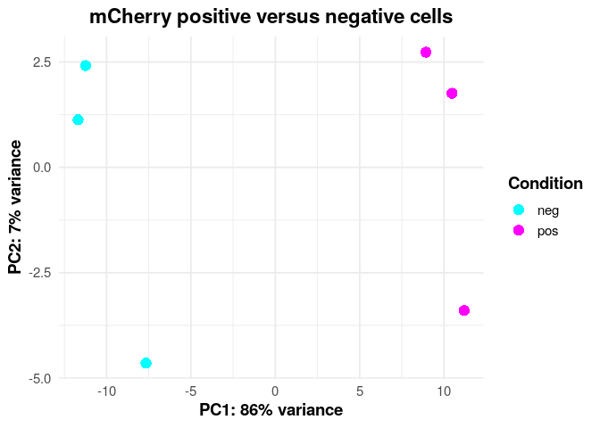
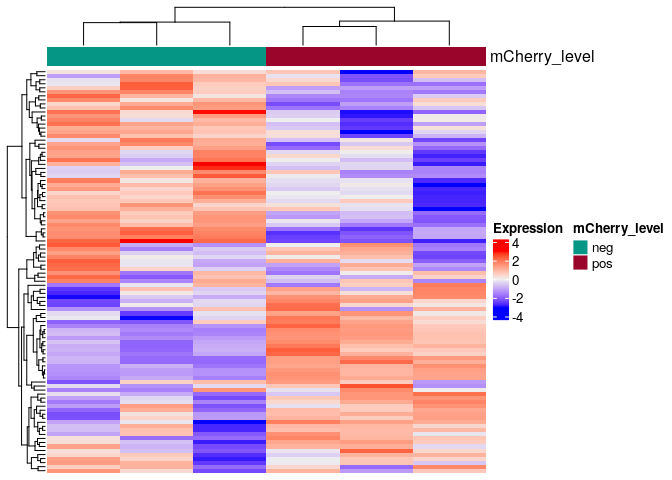
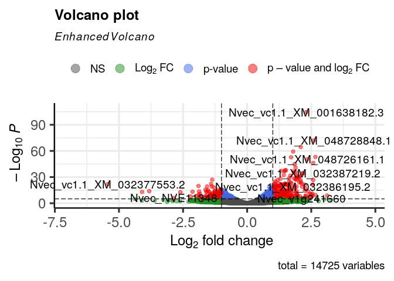
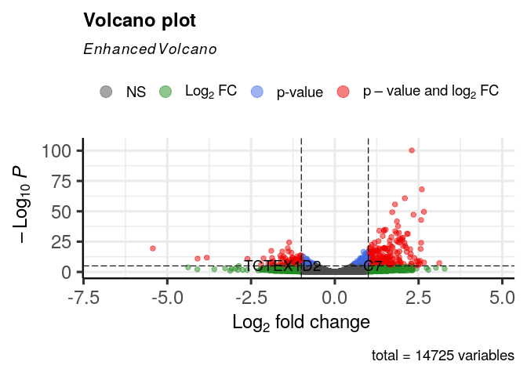
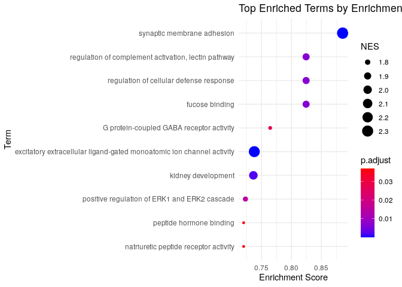
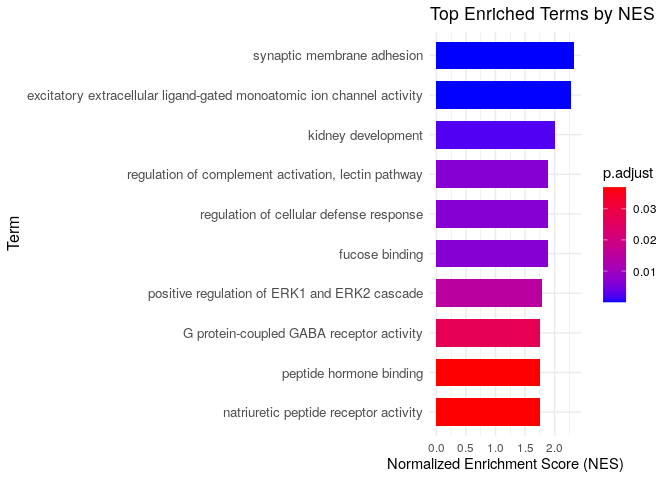
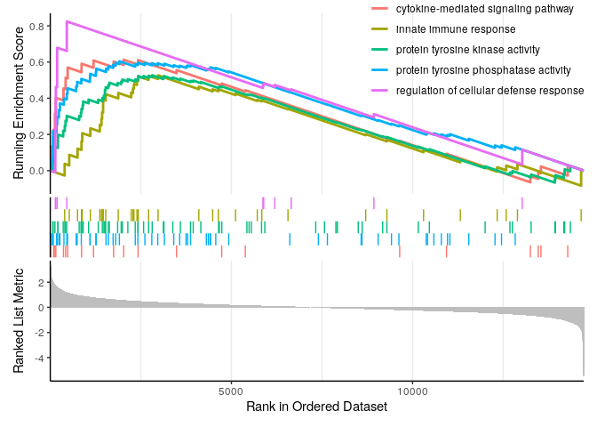

```         
# Differential expression analysis with DESeq2 ----------------------------


#Read count matrix
f <- "~/immune_cells/cnidarian_immune_cells/02_mCherry_FACS_bulkRNAseq/02_differential_expression_analysis/data/count_matrix_updated_FeatureCounts_output.txt"
count_matrix <- read.delim(f,
                           header = T,
                           row.names = 1
                          )
colnames(count_matrix) <- c(
  "Chr",
  "Start",
  "End",
  "Strand",
  "Length",
  "mCherry_neg1",
  "mCherry_neg2",
  "mCherry_neg3",
  "mCherry_pos1",
  "mCherry_pos2",
  "mCherry_pos3"
)
library(dplyr)
colnames(count_matrix)

##  [1] "Chr"          "Start"       
##  [3] "End"          "Strand"      
##  [5] "Length"       "mCherry_neg1"
##  [7] "mCherry_neg2" "mCherry_neg3"
##  [9] "mCherry_pos1" "mCherry_pos2"
## [11] "mCherry_pos3" NA

count_matrix <- count_matrix %>% dplyr::select(
  -Chr,
  -Start,
  -End,
  -Strand,
  -12
)
countData <- as.matrix(count_matrix %>% dplyr::select(-Length))

#create coldata
SampleName <- colnames(countData)
Condition <- c("neg", "neg", "neg", "pos", "pos", "pos")
colData <- data.frame(SampleName, Condition)
rownames(colData) <- colnames(countData)

all(rownames(colData) %in% colnames(countData))

## [1] TRUE

all(rownames(colData) == colnames(countData))

## [1] TRUE

library(DESeq2)
dds <- DESeqDataSetFromMatrix(countData = countData,
                              colData = colData,
                              design = ~ Condition)

## Warning in DESeqDataSet(se, design =
## design, ignoreRank): some variables in
## design formula are characters,
## converting to factors

#Filtering
keep <- rowSums(counts(dds)) >= 10
table(keep)

## keep
## FALSE  TRUE 
##  3872 16664

dds <- dds[keep, ]

#Running the analysis
dds <- DESeq(dds)

## estimating size factors

## estimating dispersions

## gene-wise dispersion estimates

## mean-dispersion relationship

## final dispersion estimates

## fitting model and testing

res <- results(dds)
res <- na.omit(res)

# Generate a table of upregulated genes
keep <- res$padj < 0.05 & res$log2FoldChange > 1
res_filt <- res[keep, ]
nrow(res_filt)

## [1] 484

write.table(
  res_filt,
  "~/immune_cells/cnidarian_immune_cells/02_mCherry_FACS_bulkRNAseq/02_differential_expression_analysis/data/mCherry_upregulated.txt",
  sep = "\t"
)

# How many genes are upregulated?
sum(res$padj < 0.05 & res$log2FoldChange > 1 , na.rm = T)

## [1] 484

# How many genes are downregulated
sum(res$padj < 0.05 & res$log2FoldChange < -1 , na.rm = T)

## [1] 355

# Generate a table ofdownregulated genes
keep = res$padj < 0.05 & res$log2FoldChange < -1
downregulated <- res[keep, ]
write.table(
  downregulated,
  "~/immune_cells/cnidarian_immune_cells/02_mCherry_FACS_bulkRNAseq/02_differential_expression_analysis/data/mCherry_downregulated.txt",
  sep = "\t"
)

# Generate a table of all the results
write.csv(res, file = "~/immune_cells/cnidarian_immune_cells/02_mCherry_FACS_bulkRNAseq/02_differential_expression_analysis/data/DE_table.csv", row.names = TRUE)


# Exploratory analysis  ---------------------------------------------------
library(ggplot2)
# PCA plot
vsd <- vst(dds, blind=FALSE)
plotPCA(vsd, intgroup= "Condition" )

## using ntop=500 top features by variance
```


```         
# Plot externally with ggplot2
pcaData <- plotPCA(vsd, intgroup = "Condition", returnData = TRUE)

## using ntop=500 top features by variance

# Calculate percentage of variance explained by each principal component
percentVar <- round(100 * attr(pcaData, "percentVar"))

# Define custom colors for Conditions
custom_colors <- c("neg" = "cyan", "pos" = "magenta") 

# Create PCA plot
pca_plot <- ggplot(pcaData, aes(x = PC1, y = PC2, label = rownames(pcaData), color = Condition)) +
  geom_point(size = 4, shape = 16) +                            
  scale_color_manual(values = custom_colors) +                
  labs(
    x = paste0("PC1: ", percentVar[1], "% variance"),
    y = paste0("PC2: ", percentVar[2], "% variance"),
    title = "mCherry positive versus negative cells",
    color = "Condition"                                          
  ) +
  theme_minimal(base_size = 14) +                               
  theme(
    plot.title = element_text(hjust = 0.5, face = "bold"),      
    axis.title = element_text(face = "bold"),                  
    legend.position = "right",                                 
    legend.title = element_text(face = "bold")                 
  )

print(pca_plot)
```



```         
# Heatmap
library(ComplexHeatmap)
ntd <- normTransform(dds, f = log2, pc = 1)
# Show only the top 100 genes 
top.genes <- order(rowVars(assay(ntd)), decreasing = TRUE)[1:100]
top.ntd <- ntd[top.genes,]
assay(top.ntd) <- assay(top.ntd) - rowMeans(assay(top.ntd))
col.anno <- HeatmapAnnotation(mCherry_level = ntd$Condition)

Heatmap(assay(top.ntd), 
        show_row_names = FALSE, 
        show_column_names = FALSE, 
        name = "Expression",
        top_annotation = col.anno)
```



```         
# Volcano plot
#Most basic
#Plot
library(EnhancedVolcano)
EnhancedVolcano(res,
                lab = rownames(res),
                x = 'log2FoldChange',
                y = 'pvalue')
```



```         
# Functional annotations and GSEA analysis  -------------------------------

#Assign gene names from Arnau's file
peptides_anotation<- readRDS("~/immune_cells/scRNAseq_analysis/annotaion/peptides_annotation.rds")
res_df<- as.data.frame(res)
rownames(res_df) <- gsub("_", "-", rownames(res_df))
res_df$gene_name <- rownames(res_df)

# Merge the dataframes
merged_df1 <- merge(
  res_df,               
  peptides_anotation,           
  by.x = "gene_name",      
  by.y = "gene_name",      
  all.x = TRUE,            
  sort = FALSE             
)

write.csv(merged_df1, "~/immune_cells/cnidarian_immune_cells/02_mCherry_FACS_bulkRNAseq/02_differential_expression_analysis/data/S4_table.csv")

# Restore row names
rownames(merged_df1) <- merged_df1$gene_name
merged_df1$gene_name <- NULL
library(EnhancedVolcano)
EnhancedVolcano(merged_df1,
                lab = merged_df1$protein,
                x = 'log2FoldChange',
                y = 'padj')
```



```         
dim(merged_df1)

## [1] 14725     8

# we want the log2 fold change 
original_gene_list <- merged_df1$log2FoldChange

# name the vector
names(original_gene_list) <- gsub("-", "_", rownames(merged_df1))
head(original_gene_list)

## Nvec_vc1.1_XM_032374162.2 
##               -0.09085432 
## Nvec_vc1.1_XM_001626535.3 
##                0.07625077 
## Nvec_vc1.1_XM_001626549.3 
##               -0.20664279 
## Nvec_vc1.1_XM_032374171.2 
##               -0.15932455 
## Nvec_vc1.1_XM_001626548.3 
##               -0.09932838 
## Nvec_vc1.1_XM_032374170.2 
##               -0.22468282

# omit any NA values 
gene_list<-na.omit(original_gene_list)

# sort the list in decreasing order (required for clusterProfiler)
gene_list = sort(gene_list, decreasing = TRUE)
# Loading Nematostella annotation files
setwd("~/immune_cells/scRNAseq_analysis/annotaion/GOseq/")
list.files()

##  [1] "Consolidated_by_Gene.csv"         
##  [2] "GoName_InputClusterprofile.csv"   
##  [3] "GoName_NewAnnotation.csv"         
##  [4] "GoTerms_InputClusterProfile.csv"  
##  [5] "Goterms_NewAnnotation.csv"        
##  [6] "Goterms_PM.csv"                   
##  [7] "Goterms_PMC.csv"                  
##  [8] "GSEA_metrics_table.pdf"           
##  [9] "ImmuneGenes_56.xlsx"              
## [10] "mCherry_upregulated_ORA.txt"      
## [11] "shared_immune_genes_31outOf48.csv"

TermGene  <- read.csv(file = 'GoName_NewAnnotation.csv',header=TRUE, check.names=FALSE)
head(TermGene)

##      Go_Term                       Ids
## 1 GO:0004930 Nvec_vc1.1_XM_001617885.3
## 2 GO:0008188 Nvec_vc1.1_XM_001617885.3
## 3 GO:0007165 Nvec_vc1.1_XM_001617885.3
## 4 GO:0007186 Nvec_vc1.1_XM_001617885.3
## 5 GO:0003677 Nvec_vc1.1_XM_001618208.3
## 6 GO:0030527 Nvec_vc1.1_XM_001618208.3

is.data.frame(TermGene)

## [1] TRUE

TermName  <- read.csv(file = 'Goterms_NewAnnotation.csv',header=TRUE, check.names=FALSE)
head(TermName)

##      Go_Term
## 1 GO:0004930
## 2 GO:0008188
## 3 GO:0007165
## 4 GO:0007186
## 5 GO:0003677
## 6 GO:0030527
##                                           Name
## 1          G protein-coupled receptor activity
## 2               neuropeptide receptor activity
## 3                          signal transduction
## 4 G protein-coupled receptor signaling pathway
## 5                                  DNA binding
## 6          structural constituent of chromatin

is.data.frame(TermName)

## [1] TRUE

#Running GSEA 
library(clusterProfiler)
gse <- GSEA(gene_list, exponent = 1, minGSSize = 10, maxGSSize = 500, pvalueCutoff = 0.05, pAdjustMethod = "BH",TERM2GENE = TermGene, TERM2NAME = TermName, verbose = TRUE, seed = FALSE)

## using 'fgsea' for GSEA analysis, please cite Korotkevich et al (2019).

## preparing geneSet collections...

## GSEA analysis...

## Warning in fgseaMultilevel(pathways =
## pathways, stats = stats, minSize =
## minSize, : For some pathways, in
## reality P-values are less than 1e-10.
## You can set the `eps` argument to zero
## for better estimation.

## leading edge analysis...

## done...

#Save table 
Results_GSEA<- as.data.frame(gse)
write.csv(Results_GSEA, file = "~/immune_cells/cnidarian_immune_cells/02_mCherry_FACS_bulkRNAseq/02_differential_expression_analysis/data/Results_GSEA_New.csv", quote = FALSE, row.names = FALSE)

# Visualize based on enrichment score
library(ggplot2)

# Filter significant terms
filtered_df <- gse@result[gse@result$p.adjust < 0.05, ]

# Reorder by enrichmentScore
ordered_df <- filtered_df[order(filtered_df$enrichmentScore, decreasing = TRUE), ]

# Take top 10 terms
top_df <- head(ordered_df, 10)

# Create a dot plot
ggplot(top_df, aes(x = reorder(Description, enrichmentScore), y = enrichmentScore)) +
  geom_point(aes(size = NES, color = p.adjust)) +
  scale_color_gradient(low = "blue", high = "red") +
  coord_flip() +
  labs(
    title = "Top Enriched Terms by Enrichment Score",
    x = "Term",
    y = "Enrichment Score"
  ) +
  theme_minimal()
```



```         
# Create a horizontal bar plot
ggplot(top_df, aes(x = NES, y = reorder(Description, NES))) +
  geom_bar(stat = "identity", aes(fill = p.adjust), width = 0.7) +
  scale_fill_gradient(low = "blue", high = "red") +
  labs(
    title = "Top Enriched Terms by NES",
    x = "Normalized Enrichment Score (NES)",
    y = "Term"
  ) +
  theme_minimal() +
  theme(
    axis.text.y = element_text(size = 10),
    axis.title.y = element_text(size = 12)
  )
```



```         
library(enrichplot)
# Selected terms 
gseaplot2(gse, geneSetID = c("GO:0019221","GO:0004725","GO:0004713","GO:0045087","GO:0010185"))
```



```         
selected_terms<- c("GO:0019221","GO:0004725","GO:0004713","GO:0045087","GO:0010185")


# Generate a table
# Extract selected terms with additional metrics
selected_ids <- c("GO:0019221","GO:0004725","GO:0004713","GO:0045087","GO:0010185")

table_df <- gse@result[gse@result$ID %in% selected_ids, 
                       c("Description", "NES", "pvalue", "p.adjust", "setSize")]

# Clean and format
table_df$pvalue <- signif(table_df$pvalue, 3)
table_df$p.adjust <- signif(table_df$p.adjust, 3)
table_df$NES <- round(table_df$NES, 2)

# Rename for clarity
colnames(table_df) <- c("GO Term", "NES", "p-value", "Adjusted p-value", "Gene Set Size")

print(table_df)

##                                            GO Term
## GO:0004725   protein tyrosine phosphatase activity
## GO:0004713        protein tyrosine kinase activity
## GO:0010185 regulation of cellular defense response
## GO:0045087                  innate immune response
## GO:0019221     cytokine-mediated signaling pathway
##             NES  p-value
## GO:0004725 2.15 1.39e-06
## GO:0004713 1.93 3.31e-05
## GO:0010185 1.90 4.54e-04
## GO:0045087 1.68 4.70e-03
## GO:0019221 1.73 5.03e-03
##            Adjusted p-value
## GO:0004725         6.66e-05
## GO:0004713         8.70e-04
## GO:0010185         6.72e-03
## GO:0045087         3.72e-02
## GO:0019221         3.90e-02
##            Gene Set Size
## GO:0004725            58
## GO:0004713            67
## GO:0010185            10
## GO:0045087            35
## GO:0019221            21

library(gridExtra)
library(grid)
library(Cairo)

# Build table grob with left alignment and larger font
table_grob <- tableGrob(table_df, rows = NULL, theme = ttheme_default(
  core = list(fg_params = list(hjust = 0, x = 0.05, fontsize = 11)),
  colhead = list(fg_params = list(fontface = "bold", fontsize = 12)),
  padding = unit(c(5, 5), "mm")
))

# Widen left column if clipped
table_grob$widths[1] <- max(unit(4, "cm"), table_grob$widths[1])

# Save as high-quality PNG and PDF
CairoPNG("~/immune_cells/cnidarian_immune_cells/02_mCherry_FACS_bulkRNAseq/02_differential_expression_analysis/data/GSEA_metrics_table.png", width = 2000, height = 700, res = 300)
grid.newpage()
grid.draw(table_grob)
dev.off()

## RStudioGD 
##         2

CairoPDF("~/immune_cells/cnidarian_immune_cells/02_mCherry_FACS_bulkRNAseq/02_differential_expression_analysis/data/GSEA_metrics_table.pdf", width = 16, height = 2.8)
grid.newpage()
grid.draw(table_grob)
dev.off()

## RStudioGD 
##         2
```
