```         
library(Seurat)
library(Matrix)
library(ggplot2)
library(ggpubr)
library(MAST)
library(scCustomize)
library(tidyverse)
# Load counts
counts_matrix <- readRDS("~/immune_cells/scRNAseq_analysis/Expression_matrix/Nvec_sc_raw_counts.rds")
counts_matrix <- as.matrix(counts_matrix)

# Create Seurat object
seurat_object <- CreateSeuratObject(counts = counts_matrix)

## Warning: Feature names cannot have
## underscores ('_'), replacing with dashes
## ('-')

## Warning: Data is of class matrix. Coercing
## to dgCMatrix.

# Read metadata tables
cellid_to_mc <- read.delim(
  "~/immune_cells/scRNAseq_analysis/Expression_matrix/CellID_to_MC_table.txt",
  header = FALSE
)
exp_class <- read.delim(
  "~/immune_cells/scRNAseq_analysis/Expression_matrix/Nvec_sc_experiment_classification.txt",
  header = FALSE
)

colnames(cellid_to_mc) <- c("CellName", "CellID")
colnames(exp_class)    <- c("CellName", "Condition")

# Merge metadata (by cell barcode)
meta <- merge(cellid_to_mc, exp_class, by = "CellName", all = FALSE)

# Keep only cells that exist in Seurat object
meta <- meta[meta$CellName %in% colnames(seurat_object), ]

# Put CellName as rownames so Seurat can align safely
rownames(meta) <- meta$CellName
meta$CellName <- NULL

# Make sure I am not missing anything unexpectedly
stopifnot(all(rownames(meta) %in% colnames(seurat_object)))

# Add once (Seurat will match by rownames)
seurat_object <- AddMetaData(seurat_object, metadata = meta)

stopifnot(!anyDuplicated(rownames(meta)))

stopifnot(!anyNA(meta$CellID), !anyNA(meta$Condition))

table(table(rownames(meta)))

## 
##     1 
## 11550

unique(seurat_object@meta.data$Condition)

## [1] "iHCl" "Ctrl" "tPIC"

#Replace with the correct conditions

seurat_object$Condition <- dplyr::recode(seurat_object$Condition,
                                         "iHCl" = "NaCl",
                                         "tPIC" = "pIC")

seurat <- seurat_object
# Pre-processing and QC ---------------------------------------------------

setwd("~/immune_cells/scRNAseq_analysis/seurat_pipeline/")
#saveRDS(seurat, "seurat_unprocessed.rds")
seurat <- readRDS("seurat_unprocessed.rds")
# Visualize QC metrics as a violin plot
VlnPlot(seurat,
        features = c("nFeature_RNA", "nCount_RNA"),
        ncol = 2)

## Warning: Default search for "data" layer in
## "RNA" assay yielded no results; utilizing
## "counts" layer instead.
```

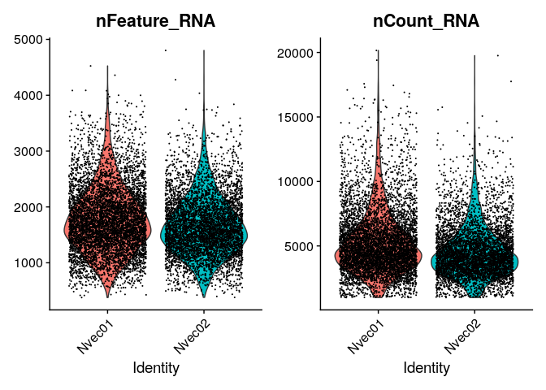

```         
# nCount_RNA vs nFeature_RNA: depth–complexity relationship per cell - looks good.
# nFeature_RNA violin: gene detection comparability across identities - looks good.

# Assess relationship between sequencing depth (UMI counts) and transcriptome complexity (detected genes) per cell.
# Check if there is any difference between the biological replicates

FeatureScatter(seurat, feature1 = "nCount_RNA", feature2 = "nFeature_RNA")
```

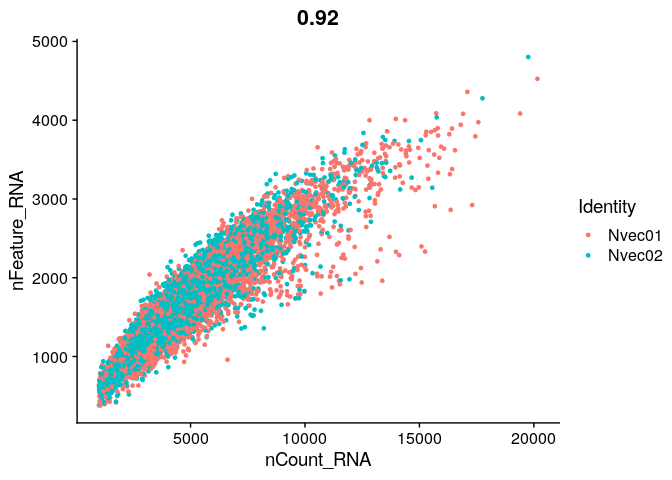

```         
# Overall, looks clean. Minimal filtering is needed.


#-----------------------------#
# QC filtering thresholds
#-----------------------------#
MIN_FEATURES <- 500
MAX_FEATURES <- 3000
MAX_COUNTS   <- 10000

MIN_CELLS_PER_GENE <- 10
REMOVE_PATTERN     <- "orphan"   # Remove "orphan" genes which are irrelevant for this project.

#-----------------------------#
# Data before filtering
#-----------------------------#
qc_before <- seurat@meta.data[, c("nFeature_RNA", "nCount_RNA")]
qc_before$stage <- "Before"

#-----------------------------#
# Cell filtering
#-----------------------------#
seurat_filt <- subset(seurat,
                      subset = nFeature_RNA > MIN_FEATURES &
                        nFeature_RNA < MAX_FEATURES &
                        nCount_RNA   < MAX_COUNTS)

#-----------------------------#
# Gene filtering
#-----------------------------#
counts_mat <- GetAssayData(seurat_filt, assay = "RNA", layer = "counts")

keep_by_detection <- Matrix::rowSums(counts_mat > 0) >= MIN_CELLS_PER_GENE
keep_by_name      <- !grepl(REMOVE_PATTERN, rownames(seurat_filt), ignore.case = TRUE)

seurat_filt <- seurat_filt[keep_by_detection & keep_by_name, ]

stopifnot(!any(grepl(
  REMOVE_PATTERN, rownames(seurat_filt), ignore.case = TRUE
)))

#-----------------------------#
# Data after filtering
#-----------------------------#
qc_after <- seurat_filt@meta.data[, c("nFeature_RNA", "nCount_RNA")]
qc_after$stage <- "After"

qc_all <- rbind(qc_before, qc_after)

# Quick summaries
cat("Cells before:", nrow(qc_before), "\n")

## Cells before: 11550

cat("Cells after :", nrow(qc_after), "\n")

## Cells after : 11065

cat("Genes before:", nrow(seurat), "\n")

## Genes before: 21329

cat("Genes after :", nrow(seurat_filt), "\n")

## Genes after : 16535

#-----------------------------#
# Plots with thresholds
#-----------------------------#

# Scatter: nCount vs nFeature (Before/After) + threshold lines
p_scatter <- ggplot(qc_all, aes(x = nCount_RNA, y = nFeature_RNA)) +
  geom_point(size = 0.4, alpha = 0.35) +
  facet_wrap( ~ stage) +
  geom_vline(xintercept = MAX_COUNTS, linetype = "dashed") +
  geom_hline(yintercept = MIN_FEATURES, linetype = "dashed") +
  geom_hline(yintercept = MAX_FEATURES, linetype = "dashed") +
  theme_classic() +
  labs(title = "QC space before/after filtering", x = "nCount_RNA (UMIs per cell)", y = "nFeature_RNA (genes detected per cell)")

# Violin: nFeature_RNA + thresholds
p_vln_feat <- ggplot(qc_all, aes(x = stage, y = nFeature_RNA)) +
  geom_violin() +
  geom_jitter(width = 0.2,
              size = 0.25,
              alpha = 0.25) +
  geom_hline(yintercept = MIN_FEATURES, linetype = "dashed") +
  geom_hline(yintercept = MAX_FEATURES, linetype = "dashed") +
  theme_classic() +
  labs(title = "nFeature_RNA before/after", x = NULL, y = "nFeature_RNA")

# Violin: nCount_RNA + threshold
p_vln_count <- ggplot(qc_all, aes(x = stage, y = nCount_RNA)) +
  geom_violin() +
  geom_jitter(width = 0.2,
              size = 0.25,
              alpha = 0.25) +
  geom_hline(yintercept = MAX_COUNTS, linetype = "dashed") +
  theme_classic() +
  labs(title = "nCount_RNA before/after", x = NULL, y = "nCount_RNA")

# Print plots
p_scatter
```

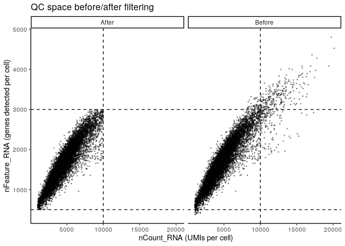

```         
p_vln_feat
```

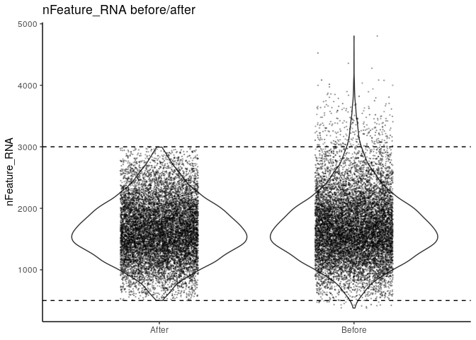

```         
p_vln_count
```

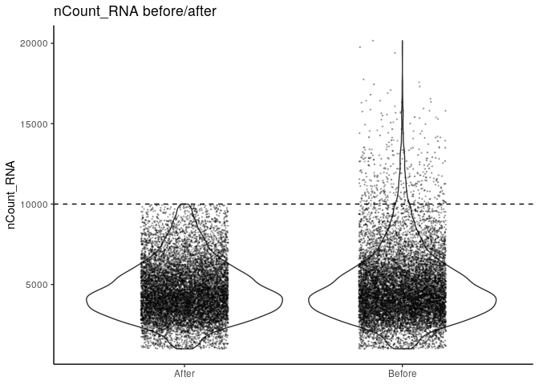

```         
# Save filtered object
#saveRDS(seurat_filt, "seurat_filt.RDS")


# Normalization and transformation ----------------------------------------

# I used the sctransform R package (https://github.com/satijalab/sctransform) to preform normalization and transformation

# I ran the following command in R on the cluster:

# library(sctransform)

# seurat <- SCTransform(
#  seurat,
#  verbose = FALSE
# )

# Then I saved the SCT object:
# saveRDS(seurat, "seurat_SCT.rds")


# Dimension reduction and clustering  -------------------------------------

seurat_SCT <- readRDS("~/immune_cells/scRNAseq_analysis/seurat_pipeline/seurat_SCT.rds")

# These are now standard steps in the Seurat workflow for visualization and clustering
seurat <- RunPCA(seurat_SCT, verbose = FALSE)
# Inspect the elbow plot
ElbowPlot(seurat, ndims = 50)
```

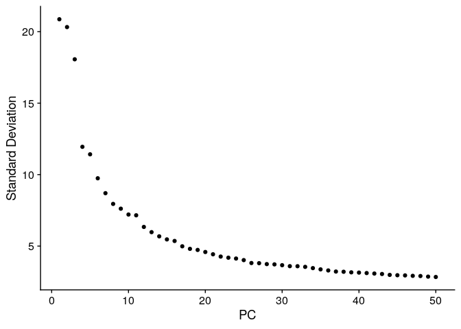

```         
# PC 1 to 30 explain most of the variance

seurat <- RunUMAP(seurat, dims = 1:30, verbose = FALSE)

seurat <- FindNeighbors(seurat, dims = 1:30, verbose = FALSE)

# Louvain clustering
# I intentionally used low resolution to avoid over-clustering and to focus on main cell types in early embryos
# This allowed the detection of neurons, gland cells, and even a tiny cnidocyte population

seurat <- FindClusters(seurat, verbose = FALSE, resolution = 0.2)

# Visualize
DimPlot(seurat, label = TRUE)
```

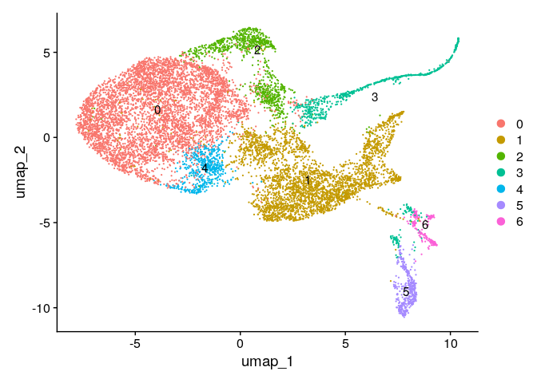

```         
scCustomize::DimPlot_scCustom(
  seurat,
  label = T,
  figure_plot = T,
  colors_use = "Dark2",
  shuffle = T
)

## Warning: Removed 1 row containing missing values or
## values outside the scale range
## (`geom_point()`).
```


```         
# Save the clustered object
#saveRDS(seurat,
#        "~/immune_cells/scRNAseq_analysis/seurat_pipeline/seurat_clust.RDS")


#QC
DefaultAssay(seurat) <- "RNA"
FeaturePlot(seurat, features = c("nCount_RNA", "nFeature_RNA"))
```


```         
# It looks relatively uniform:
# The UMAP structure was not shaped by sequencing depth or detected gene counts.
# I will proceed without further filtering.


# Analysis and visualization  ---------------------------------------------

# Read the clustered object

seurat <- readRDS("~/immune_cells/scRNAseq_analysis/seurat_pipeline/seurat_clust.RDS")

# Visualize replicates
# Extract replicate information from the cell names
seurat$Replicate <- ifelse(grepl("^Nvec01_", colnames(seurat)), "Replicate 1", "Replicate 2")

# Visualize UMAP, coloring cells by the 'Replicate' column
DimPlot(seurat, group.by = "Replicate")
```

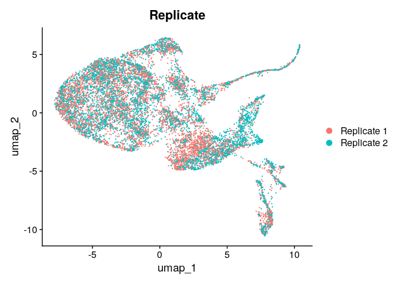

```         
# No batch effect - the two replicates are nearly identical.

# Visualize the distribution of cells by conditions
DimPlot(seurat, group.by = "Condition")
```

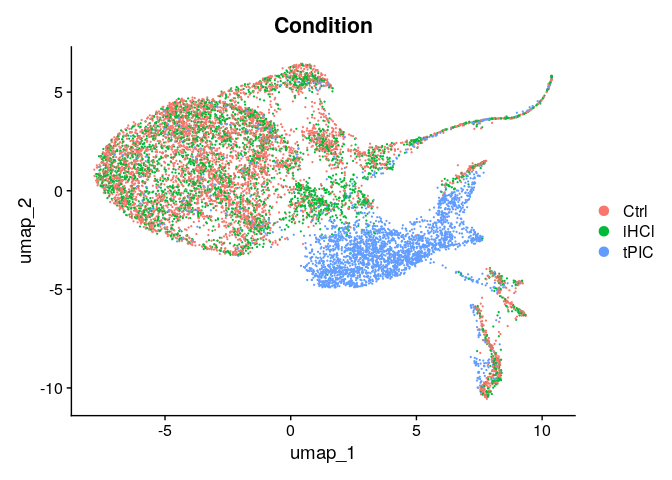

```         
# poly(I:C) has a strong enrichment of cells in cluster 1

# Visualize metacells

DimPlot(seurat, group.by = "CellID")
```

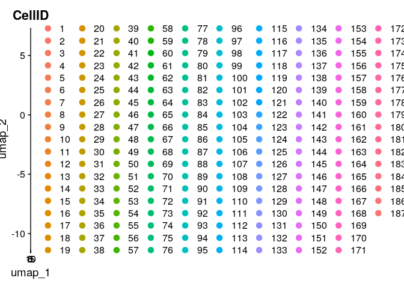

```         
# Difficult to see. Another method:

meta <- seurat@meta.data %>%
  select(CellID, seurat_clusters)

# contingency table
mc_cluster_tab <- table(meta$CellID, meta$seurat_clusters)

mc_frac <- as.data.frame(mc_cluster_tab)
colnames(mc_frac) <- c("CellID", "Cluster", "n_cells")

mc_frac <- mc_frac %>%
  group_by(CellID) %>%
  mutate(total_cells = sum(n_cells),
         frac = n_cells / total_cells) %>%
  ungroup()

mc_cluster1 <- mc_frac %>%
  filter(Cluster == "1") %>%
  arrange(desc(frac))

head(mc_cluster1, 20)

## # A tibble: 20 × 5
##    CellID Cluster n_cells total_cells  frac
##    <fct>  <fct>     <int>       <int> <dbl>
##  1 141    1            62          62     1
##  2 146    1            71          71     1
##  3 155    1            50          50     1
##  4 156    1            67          67     1
##  5 158    1            67          67     1
##  6 159    1            52          52     1
##  7 160    1            56          56     1
##  8 161    1            77          77     1
##  9 163    1            45          45     1
## 10 165    1            33          33     1
## 11 166    1            40          40     1
## 12 167    1            75          75     1
## 13 168    1            63          63     1
## 14 169    1            56          56     1
## 15 170    1            55          55     1
## 16 174    1            62          62     1
## 17 175    1            44          44     1
## 18 176    1            68          68     1
## 19 177    1            79          79     1
## 20 178    1            93          93     1

# Mostly the metacells from 141 and above which fits Arnau's analysis.

# Visualize expression of genes of interest

FeaturePlot(seurat, features = "mCherry-plus-strand")
```


```         
VlnPlot(seurat,
        features = "mCherry-plus-strand",
        pt.size = 0.2,
        split.by = "Condition")
```

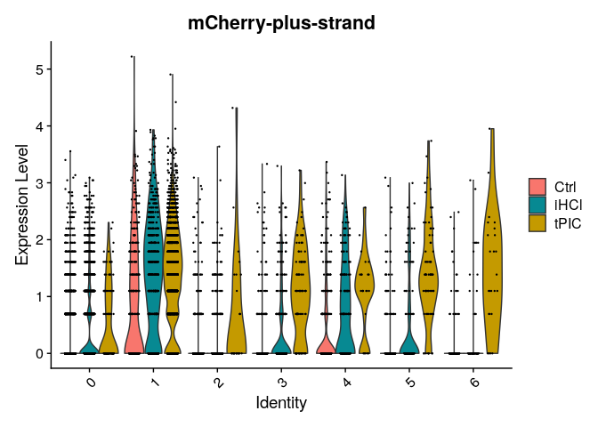

```         
library(scCustomize)


# RlRb_1 "Nvec-vc1.1-XM-048731783.1"
FeaturePlot_scCustom(seurat, features = "Nvec-vc1.1-XM-048731783.1")
```

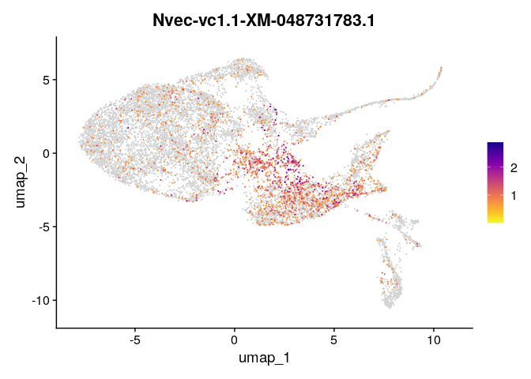

```         
# RLRb_2 Nvec-vc1.1-XM-048731783.1
FeaturePlot_scCustom(seurat, features = "Nvec-vc1.1-XM-048731786.1")
```

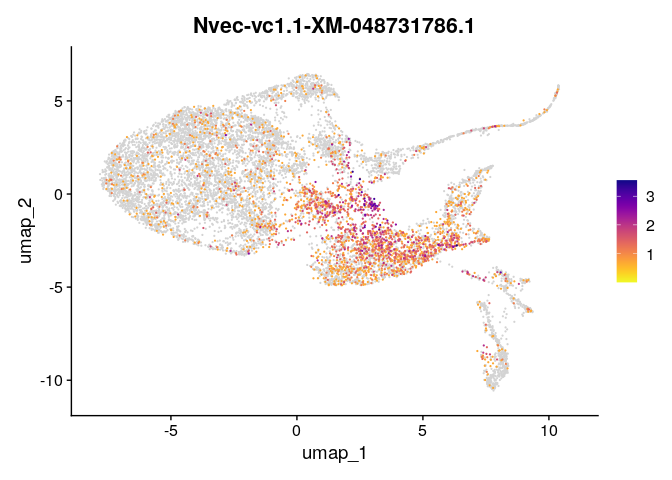

```         
# Visualize mCherry-plus-strand expression on UMAP grouped by 'Condition'
FeaturePlot_scCustom(seurat, features = "mCherry-plus-strand", split.by = "Condition")
```

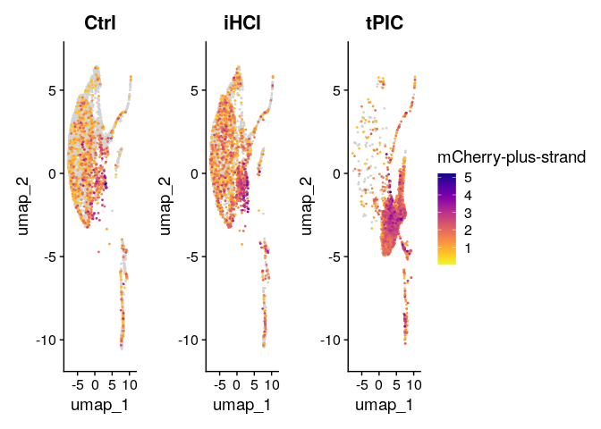

```         
# RLRb_1
FeaturePlot_scCustom(seurat, features = "Nvec-vc1.1-XM-048731783.1", split.by = "Condition")
```

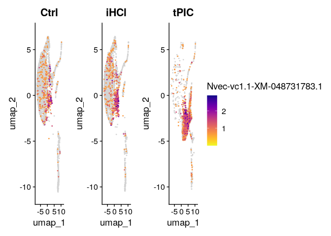

```         
# Check the correlation in the metacell expression matrix (uploaded to Zenodo).
f <- "~/working/scRNAseq Arnau/to_yehu/expression_matrices/Nvec_mc_umifrac.txt"
tab <- read.delim(header = T, f)

rows <- tab[c("mCherry_plus_strand", "Nvec_vc1.1_XM_048731783.1"), ]

df <- as.data.frame(t(rows))

# Create scatter plot with linear regression line and R-squared value
plot <- ggscatter(
  df,
  x = "Nvec_vc1.1_XM_048731783.1",
  y = "mCherry_plus_strand",
  add = "reg.line",
  conf.int = TRUE,
  cor.coef = TRUE,
  cor.method = "pearson",
  ggtheme = theme_pubr()
) +
  stat_cor(aes(label = paste(..rr.label.., sep = "~`, `~")), label.x = 0.1, label.y = 2) +
  labs(title = "", x = "RLRb UMI fraction", y = "mCherry UMI fraction") +
  theme(text = element_text(size = 12))

# Save as PNG
# ggsave("scatter_plot_mc.png", plot, width = 7, height = 5, dpi = 300)

print(plot)
```

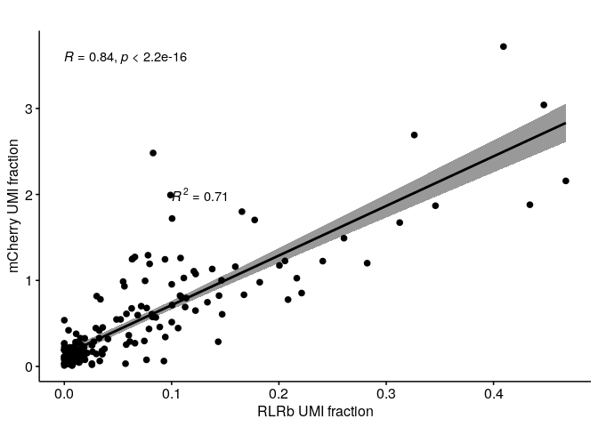

```         
# RLRb_1 against RLRb_2

rows <- tab[c("Nvec_vc1.1_XM_048731783.1", "Nvec_vc1.1_XM_048731786.1"), ]

df <- as.data.frame(t(rows))

# Create scatter plot with linear regression line and R-squared value
plot <- ggscatter(
  df,
  x = "Nvec_vc1.1_XM_048731783.1",
  y = "Nvec_vc1.1_XM_048731786.1",
  add = "reg.line",
  conf.int = TRUE,
  cor.coef = TRUE,
  cor.method = "pearson",
  ggtheme = theme_pubr()
) +
  stat_cor(aes(label = paste(..rr.label.., sep = "~`, `~")), label.x = 0.1, label.y = 2) +
  labs(title = "", x = "RLRb_1 UMI fraction", y = "RLRb_2 UMI fraction") +
  theme(text = element_text(size = 12))

print(plot)
```

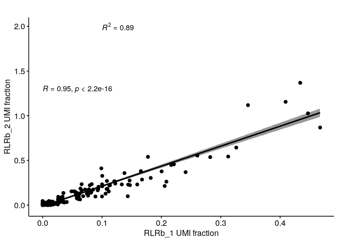

```         
# RLRb against GAPDH - as a sanity check

rows <- tab[c("Nvec_vc1.1_XM_048731783.1", "Nvec_vc1.1_XM_032382055.2"), ]

df <- as.data.frame(t(rows))

# Create scatter plot with linear regression line and R-squared value
plot <- ggscatter(
  df,
  x = "Nvec_vc1.1_XM_048731783.1",
  y = "Nvec_vc1.1_XM_032382055.2",
  add = "reg.line",
  conf.int = TRUE,
  cor.coef = TRUE,
  cor.method = "pearson",
  ggtheme = theme_pubr()
) +
  stat_cor(aes(label = paste(..rr.label.., sep = "~`, `~")), label.x = 0.1, label.y = 2) +
  labs(title = "", x = "RLRb_1 UMI fraction", y = "GAPDH UMI fraction") +
  theme(text = element_text(size = 12))

print(plot)
```


```         
# No correlation.

# Visualize the expression of mCherry per condition

gene_expression <- FetchData(seurat, vars = c("mCherry-plus-strand", "Condition"))

# Create a boxplot
ggplot(gene_expression,
       aes(x = Condition, y = `mCherry-plus-strand`, fill = Condition)) +
  geom_boxplot(outlier.shape = NA) +  # Boxplot without outliers
  geom_jitter(
    width = 0.2,
    alpha = 0.6,
    color = "black",
    size = 0.5
  ) +  # Add jitter for individual cells
  theme_minimal() +
  labs(title = "Expression of GeneX across Conditions", x = "Condition", y = "Expression Level") +
  scale_fill_brewer(palette = "Set2")
```


```         
unique(gene_expression$Condition)

## [1] "iHCl" "Ctrl" "tPIC"

# Cleaner version
ggplot(gene_expression,
       aes(x = Condition, y = `mCherry-plus-strand`, fill = Condition)) +
  geom_boxplot(outlier.shape = NA) +
  stat_compare_means(method = "wilcox.test",
                     label = "p.signif",
                     comparisons = list(c("iHCl", "Ctrl"), c("tPIC", "iHCl"), c("tPIC", "Ctrl"))) +
  theme_minimal(base_size = 14) +
  theme(
    axis.text = element_text(size = 12, color = "black"),
    axis.title = element_text(size = 14, face = "bold"),
    legend.position = "none",
    plot.title = element_text(size = 16, face = "bold", hjust = 0.5)
  ) +
  labs(title = "GeneX Expression Across Conditions", x = "Condition", y = "Expression Level") +
  scale_fill_manual(values = c("#1f78b4", "#33a02c", "#e31a1c"))
```

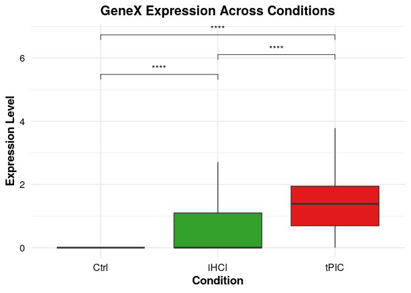

```         
# Visualize co-expression of RLRb and mCherry
umap_data <- FetchData(seurat, vars = c("umap_1", "umap_2", "mCherry-plus-strand", "Nvec-vc1.1-XM-048731783.1"))

umap_data$`mCherry-plus-strand` <- scales::rescale(umap_data$`mCherry-plus-strand`, to = c(0, 1))
umap_data$`Nvec-vc1.1-XM-048731783.1` <- scales::rescale(umap_data$`Nvec-vc1.1-XM-048731783.1`, to = c(0, 1))

ggplot(umap_data, aes(x = umap_1, y = umap_2)) +
  geom_point(aes(color = rgb(`mCherry-plus-strand`,`Nvec-vc1.1-XM-048731783.1`,0)), size = 1) +
  scale_color_identity() +
  theme_minimal() +
  labs(title = "Co-expression of mCherry and RLRb", x = "UMAP 1", y = "UMAP 2")
```

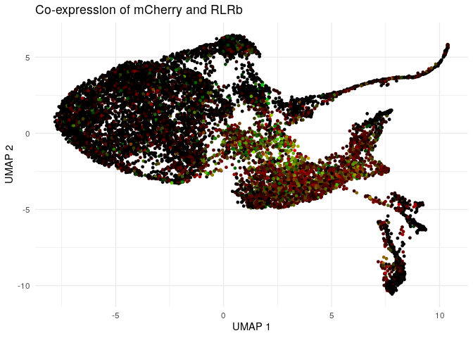

```         
# Determine cell type proportions

# Create a contingency table of clusters and conditions
cluster_condition_table <- table(seurat$seurat_clusters, seurat$Condition)

# Convert to proportions
cluster_condition_proportions <- prop.table(cluster_condition_table, margin = 2)

# Plot using ggplot2
library(ggplot2)
data <- as.data.frame(as.table(cluster_condition_proportions))
colnames(data) <- c("Cluster", "Condition", "Proportion")

ggplot(data, aes(x = Condition, y = Proportion, fill = Cluster)) +
  geom_bar(stat = "identity", position = "fill") +
  theme_minimal() +
  labs(y = "Proportion", x = "Condition", fill = "Cluster") +
  theme(axis.text.x = element_text(angle = 45, hjust = 1))
```

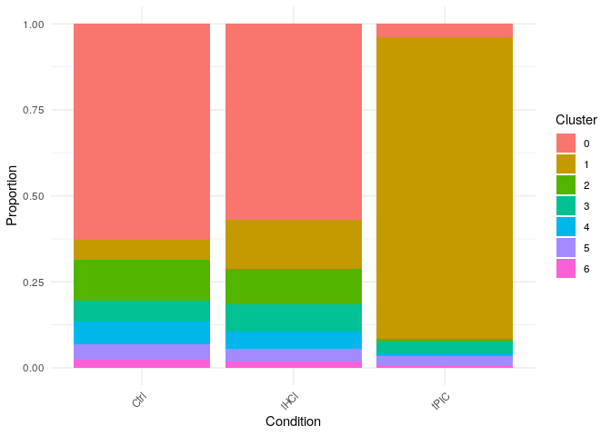

```         
# Activated versus control molecular profile ------------------------------
seurat <- readRDS("~/immune_cells/scRNAseq_analysis/seurat_pipeline/seurat_clust.RDS")

# Subset cells

Idents(seurat) <- "Condition"
subset_seurat <- subset(seurat, idents = c("iHCl", "tPIC"))

# Use MAST for differential expression analysis between poly(I:C) ("tPIC") cells vsrsus
# NaCl cells ("iHCl).
#"MAST" : Identifies differentially expressed genes between two groups of cells using a hurdle model tailored to scRNA-seq data. Utilizes the MAST package to run the DE testing.
# This can take a few minutes to run

#de_results <- FindMarkers(
#  seurat,
#  ident.1 = "tPIC",
#  ident.2 = "iHCl",
#  test.use = "MAST"
#)

# Save the MAST resuls
#saveRDS(de_results, "~/immune_cells/scRNAseq_analysis/seurat_pipeline/MAST_pIC_NaCl.rds")

de_results<- readRDS("~/immune_cells/scRNAseq_analysis/seurat_pipeline/MAST_pIC_NaCl.rds")
# Obtain annotations and load results

gene_names_df <- readRDS("~/immune_cells/scRNAseq_analysis/annotaion/peptides_annotation.rds")
de_results$gene_name <- rownames(de_results)
de_results <- readRDS("~/immune_cells/scRNAseq_analysis/seurat_pipeline/MAST_pIC_NaCl.rds")
de_results$gene_name <- rownames(de_results)

# Merge the dataframes
merged_df <- merge(
  de_results,
  gene_names_df,
  by.x = "gene_name",
  by.y = "gene_name",
  all.x = TRUE,
  sort = FALSE
)

# Restore row names
rownames(merged_df) <- merged_df$gene_name
merged_df$gene_name <- NULL

# View the result
head(merged_df)

##                           p_val avg_log2FC
## Nvec-vc1.1-XM-001624274.3     0   4.031165
## Nvec-vc1.1-XM-001641466.3     0   4.311015
## Nvec-vc1.1-XM-001633857.3     0   6.198074
## Nvec-vc1.1-XM-001637235.3     0   2.528539
## Nvec-vc1.1-XM-048733148.1     0   3.828831
## Nvec-NVE814                   0   3.691906
##                           pct.1 pct.2
## Nvec-vc1.1-XM-001624274.3 0.895 0.139
## Nvec-vc1.1-XM-001641466.3 0.847 0.098
## Nvec-vc1.1-XM-001633857.3 0.700 0.022
## Nvec-vc1.1-XM-001637235.3 0.850 0.197
## Nvec-vc1.1-XM-048733148.1 0.720 0.070
## Nvec-NVE814               0.909 0.265
##                           p_val_adj protein
## Nvec-vc1.1-XM-001624274.3         0        
## Nvec-vc1.1-XM-001641466.3         0 ZCCHC24
## Nvec-vc1.1-XM-001633857.3         0        
## Nvec-vc1.1-XM-001637235.3         0   IFI44
## Nvec-vc1.1-XM-048733148.1         0        
## Nvec-NVE814                       0        
##                                domain
## Nvec-vc1.1-XM-001624274.3            
## Nvec-vc1.1-XM-001641466.3 zf-3CxxC_2/
## Nvec-vc1.1-XM-001633857.3            
## Nvec-vc1.1-XM-001637235.3     Septin/
## Nvec-vc1.1-XM-048733148.1            
## Nvec-NVE814

# Visualize top genes using a heatmap
top_genes <- rownames(de_results[de_results$p_val_adj < 0.05 &
                                   abs(de_results$avg_log2FC) > 2, ])
DoHeatmap(subset_seurat, features = top_genes) +
  theme(axis.text.y = element_blank(), axis.ticks.y = element_blank())

## Warning in DoHeatmap(subset_seurat, features
## = top_genes): The following features were
## omitted as they were not found in the
## scale.data slot for the SCT assay:
## Nvec-vc1.1-XM-032378056.2,
## Nvec-vc1.1-XM-048732850.1,
## Nvec-vc1.1-XM-001624947.3,
## Nvec-vc1.1-XM-032370019.2,
## Nvec-vc1.1-XM-048719950.1,
## Nvec-vc1.1-XM-001641157.3,
## Nvec-vc1.1-XM-032366874.2,
## Nvec-vc1.1-XM-048721612.1,
## Nvec-vc1.1-XM-048720207.1,
## Nvec-vc1.1-XM-032375603.2, Nvec-v1g248480,
## Nvec-vc1.1-XM-032376441.2,
## Nvec-vc1.1-XM-048732024.1,
## Nvec-vc1.1-XM-032370497.2,
## Nvec-vc1.1-XM-048734095.1,
## Nvec-vc1.1-XM-048732901.1,
## Nvec-vc1.1-XM-048724448.1,
## Nvec-vc1.1-XM-001637953.3,
## Nvec-vc1.1-XM-001634990.3,
## Nvec-vc1.1-XM-032379398.2,
## Nvec-vc1.1-XM-048730483.1,
## Nvec-vc1.1-XM-032382277.2,
## Nvec-vc1.1-XM-048723374.1,
## Nvec-vc1.1-XM-048733294.1,
## Nvec-vc1.1-XM-048733785.1,
## Nvec-vc1.1-XM-048731819.1,
## Nvec-vc1.1-XM-032375574.2,
## Nvec-vc1.1-XM-001640215.3,
## Nvec-vc1.1-XM-032383310.2,
## Nvec-vc1.1-XM-032370334.2,
## Nvec-vc1.1-XM-048731845.1, Nvec-v1g239996,
## Nvec-vc1.1-XM-048725023.1,
## Nvec-vc1.1-XM-001623361.3,
## Nvec-vc1.1-XM-032377522.2,
## Nvec-vc1.1-XM-001629642.3,
## Nvec-vc1.1-XM-032379326.2,
## Nvec-vc1.1-XM-001634275.3,
## Nvec-vc1.1-XM-001637057.3,
## Nvec-vc1.1-XM-001634653.3,
## Nvec-vc1.1-XM-048720000.1,
## Nvec-vc1.1-XM-032375533.2,
## Nvec-vc1.1-XM-032366964.2,
## Nvec-vc1.1-XM-032384029.2,
## Nvec-vc1.1-XM-001622557.3,
## Nvec-vc1.1-XM-032376197.2,
## Nvec-vc1.1-XM-048724297.1,
## Nvec-vc1.1-XM-048731723.1,
## Nvec-vc1.1-XM-032367751.2,
## Nvec-vc1.1-XM-032373910.2,
## Nvec-vc1.1-XM-048720228.1,
## Nvec-vc1.1-XM-032371233.2,
## Nvec-vc1.1-XM-032363955.2,
## Nvec-vc1.1-XM-048725400.1, Nvec-NVE5267,
## Nvec-vc1.1-XM-048720243.1,
## Nvec-vc1.1-XM-001641093.3,
## Nvec-vc1.1-XM-032364864.2,
## Nvec-vc1.1-XM-032375542.2,
## Nvec-vc1.1-XM-032377357.1,
## Nvec-vc1.1-XM-048732880.1,
## Nvec-vc1.1-XM-032382196.2,
## Nvec-vc1.1-XM-048719942.1, Nvec-NVE4416,
## Nvec-vc1.1-XM-032387333.2,
## Nvec-vc1.1-XM-001630891.3,
## Nvec-vc1.1-XM-001636955.3,
## Nvec-vc1.1-XM-001635935.3,
## Nvec-vc1.1-XM-048724698.1,
## Nvec-vc1.1-XM-032386291.2,
## Nvec-vc1.1-XM-032371141.2,
## Nvec-vc1.1-XM-048732129.1,
## Nvec-vc1.1-XM-032371889.2,
## Nvec-vc1.1-XM-001622084.3,
## Nvec-vc1.1-XM-001624997.3,
## Nvec-vc1.1-XM-032383381.2,
## Nvec-vc1.1-XM-032370086.2,
## Nvec-vc1.1-XM-001629371.3, Nvec-NVE8786,
## Nvec-vc1.1-XM-032373982.2,
## Nvec-vc1.1-XM-048731263.1, Nvec-v1g198549,
## Nvec-NVE16861, Nvec-vc1.1-XM-032365042.2,
## Nvec-NVE6867, Nvec-vc1.1-XM-001624564.3,
## Nvec-vc1.1-XM-032377937.2,
## Nvec-vc1.1-XM-032371568.2,
## Nvec-vc1.1-XM-048722710.1,
## Nvec-vc1.1-XM-032385180.2,
## Nvec-vc1.1-XM-048725266.1,
## Nvec-vc1.1-XM-001629468.3,
## Nvec-vc1.1-XM-048722053.1,
## Nvec-vc1.1-XM-032361845.2,
## Nvec-vc1.1-XM-001629401.3,
## Nvec-vc1.1-XM-032379550.2,
## Nvec-vc1.1-XM-048733574.1, Nvec-v1g238666,
## Nvec-vc1.1-XM-032371512.2,
## Nvec-vc1.1-XM-048729958.1,
## Nvec-vc1.1-XM-001625476.3,
## Nvec-vc1.1-XM-032380165.2,
## Nvec-vc1.1-XM-048732153.1,
## Nvec-vc1.1-XM-048721536.1,
## Nvec-vc1.1-XM-048721923.1,
## Nvec-vc1.1-XM-032375432.2,
## Nvec-vc1.1-XM-032381215.2,
## Nvec-vc1.1-XM-032380820.2,
## Nvec-vc1.1-XM-048719359.1,
## Nvec-vc1.1-XM-032386576.2,
## Nvec-vc1.1-XM-048727579.1,
## Nvec-vc1.1-XM-032371443.2,
## Nvec-vc1.1-XM-048725640.1,
## Nvec-vc1.1-XM-001630717.3,
## Nvec-vc1.1-XM-032373008.2,
## Nvec-vc1.1-XM-048721807.1,
## Nvec-vc1.1-XM-032382427.2,
## Nvec-vc1.1-XM-048734392.1,
## Nvec-vc1.1-XM-032382117.2,
## Nvec-vc1.1-XM-032374183.2,
## Nvec-vc1.1-XM-048724139.1,
## Nvec-vc1.1-XM-048732603.1,
## Nvec-vc1.1-XM-048728763.1,
## Nvec-vc1.1-XM-032365231.2,
## Nvec-vc1.1-XM-048728010.1,
## Nvec-vc1.1-XM-032386292.2,
## Nvec-vc1.1-XM-001639717.3,
## Nvec-vc1.1-XM-032378472.2,
## Nvec-vc1.1-XM-048730254.1,
## Nvec-vc1.1-XM-032387348.2, Nvec-v1g244688,
## Nvec-vc1.1-XM-048720298.1,
## Nvec-vc1.1-XM-001627773.3,
## Nvec-vc1.1-XM-032371612.2, Nvec-v1g71242,
## Nvec-vc1.1-XM-001636093.3,
## Nvec-vc1.1-XM-001640804.3,
## Nvec-vc1.1-XM-032386416.2,
## Nvec-vc1.1-XM-032375704.2,
## Nvec-vc1.1-XM-032386262.2,
## Nvec-vc1.1-XM-048732025.1,
## Nvec-vc1.1-XM-048722141.1,
## Nvec-vc1.1-XM-032370184.2,
## Nvec-vc1.1-XM-048732499.1,
## Nvec-vc1.1-XM-048731669.1,
## Nvec-vc1.1-XM-032362841.2, Nvec-NVE17096,
## Nvec-vc1.1-XM-032376614.2,
## Nvec-vc1.1-XM-048725431.1,
## Nvec-vc1.1-XM-001621781.3,
## Nvec-vc1.1-XM-048729540.1, Nvec-NVE4470,
## Nvec-vc1.1-XM-032382934.2,
## Nvec-vc1.1-XM-048729646.1,
## Nvec-vc1.1-XM-048724213.1,
## Nvec-vc1.1-XM-001640257.3,
## Nvec-vc1.1-XM-032367138.2,
## Nvec-vc1.1-XM-048728490.1,
## Nvec-vc1.1-XM-032366225.2,
## Nvec-vc1.1-XM-048726085.1,
## Nvec-vc1.1-XM-048728039.1,
## Nvec-vc1.1-XM-001640389.3,
## Nvec-vc1.1-XM-032362439.2,
## Nvec-vc1.1-XM-032367008.2,
## Nvec-vc1.1-XM-048720937.1,
## Nvec-vc1.1-XM-032376553.2,
## Nvec-vc1.1-XM-001638897.3,
## Nvec-vc1.1-XM-048720727.1,
## Nvec-vc1.1-XM-048724505.1,
## Nvec-vc1.1-XM-032384878.2,
## Nvec-vc1.1-XM-048724737.1,
## Nvec-vc1.1-XM-032378236.2,
## Nvec-vc1.1-XM-032378366.2,
## Nvec-vc1.1-XM-032361875.2,
## Nvec-vc1.1-XM-032372440.2,
## Nvec-vc1.1-XM-032384966.2,
## Nvec-vc1.1-XM-001623817.3,
## Nvec-vc1.1-XM-032387110.2,
## Nvec-vc1.1-XM-032378771.2,
## Nvec-vc1.1-XM-048720426.1,
## Nvec-vc1.1-XM-048726678.1,
## Nvec-vc1.1-XM-032377385.2,
## Nvec-vc1.1-XM-048721756.1,
## Nvec-vc1.1-XM-032365561.2,
## Nvec-vc1.1-XM-032374044.2,
## Nvec-vc1.1-XM-048733389.1,
## Nvec-vc1.1-XM-001641694.3,
## Nvec-vc1.1-XM-001639126.3, Nvec-v1g240669,
## Nvec-vc1.1-XM-032365236.2,
## Nvec-vc1.1-XM-032384838.2,
## Nvec-vc1.1-XM-032385755.2,
## Nvec-vc1.1-XM-032384511.2,
## Nvec-vc1.1-XM-032381408.2,
## Nvec-vc1.1-XM-001635569.3,
## Nvec-vc1.1-XM-032377090.2,
## Nvec-vc1.1-XM-048732002.1,
## Nvec-vc1.1-XM-032378372.2,
## Nvec-vc1.1-XM-001634203.3,
## Nvec-vc1.1-XM-032386985.2,
## Nvec-vc1.1-XM-048726942.1,
## Nvec-vc1.1-XM-001641080.3,
## Nvec-vc1.1-XM-032370281.2,
## Nvec-vc1.1-XM-001628116.3,
## Nvec-vc1.1-XM-032367418.2,
## Nvec-vc1.1-XM-048730109.1,
## Nvec-vc1.1-XM-048733319.1,
## Nvec-vc1.1-XM-001638779.3,
## Nvec-vc1.1-XM-001627458.3,
## Nvec-vc1.1-XM-001640379.3,
## Nvec-vc1.1-XM-048720683.1,
## Nvec-vc1.1-XM-001630319.3,
## Nvec-vc1.1-XM-048734306.1,
## Nvec-vc1.1-XM-001639804.3,
## Nvec-vc1.1-XM-032376623.2,
## Nvec-vc1.1-XM-001638224.3,
## Nvec-vc1.1-XM-048721478.1,
## Nvec-vc1.1-XM-032383500.2,
## Nvec-vc1.1-XM-048734687.1,
## Nvec-vc1.1-XM-001631310.3,
## Nvec-vc1.1-XM-032367207.2,
## Nvec-vc1.1-XM-048719986.1,
## Nvec-vc1.1-XM-032365166.2,
## Nvec-vc1.1-XM-032382396.2,
## Nvec-vc1.1-XM-048733773.1,
## Nvec-vc1.1-XM-001638670.3,
## Nvec-vc1.1-XM-048721511.1,
## Nvec-vc1.1-XM-001625058.3,
## Nvec-vc1.1-XM-048732149.1,
## Nvec-vc1.1-XM-032362450.2,
## Nvec-vc1.1-XM-001632417.3,
## Nvec-vc1.1-XM-048724378.1,
## Nvec-vc1.1-XM-048733594.1,
## Nvec-vc1.1-XM-048726908.1,
## Nvec-vc1.1-XM-048721969.1,
## Nvec-vc1.1-XM-032366663.2,
## Nvec-vc1.1-XM-048727754.1,
## Nvec-vc1.1-XM-032376794.2,
## Nvec-vc1.1-XM-032369105.2,
## Nvec-vc1.1-XM-048722632.1,
## Nvec-vc1.1-XM-032382594.2,
## Nvec-vc1.1-XM-001623940.3,
## Nvec-vc1.1-XM-032366717.2,
## Nvec-vc1.1-XM-048722708.1,
## Nvec-vc1.1-XM-048727865.1,
## Nvec-vc1.1-XM-001628635.3,
## Nvec-vc1.1-XM-001629582.3,
## Nvec-vc1.1-XM-032381829.2,
## Nvec-vc1.1-XM-001640585.3,
## Nvec-vc1.1-XM-048726418.1,
## Nvec-vc1.1-XM-048723605.1,
## Nvec-vc1.1-XM-048722462.1,
## Nvec-vc1.1-XM-001641757.3,
## Nvec-vc1.1-XM-032369921.2, Nvec-v1g201852,
## Nvec-vc1.1-XM-032376742.2,
## Nvec-vc1.1-XM-001639153.3, Nvec-NVE124,
## Nvec-vc1.1-XM-032365212.2,
## Nvec-vc1.1-XM-001628985.3,
## Nvec-vc1.1-XM-032367365.2,
## Nvec-vc1.1-XM-032373809.2,
## Nvec-vc1.1-XM-001637262.3,
## Nvec-vc1.1-XM-032380887.2,
## Nvec-vc1.1-XM-032372092.2,
## Nvec-vc1.1-XM-001628645.3,
## Nvec-vc1.1-XM-032367467.2,
## Nvec-vc1.1-XM-032367697.2,
## Nvec-vc1.1-XM-048733400.1,
## Nvec-vc1.1-XM-032364244.2,
## Nvec-vc1.1-XM-001631285.3,
## Nvec-vc1.1-XM-001637408.3,
## Nvec-vc1.1-XM-048733066.1,
## Nvec-vc1.1-XM-032384571.2,
## Nvec-vc1.1-XM-048732210.1,
## Nvec-vc1.1-XM-048720903.1,
## Nvec-vc1.1-XM-001634705.3,
## Nvec-vc1.1-XM-032383554.2,
## Nvec-vc1.1-XM-032365155.2,
## Nvec-vc1.1-XM-048730525.1,
## Nvec-vc1.1-XM-048734399.1,
## Nvec-vc1.1-XM-048728423.1,
## Nvec-vc1.1-XM-048727388.1,
## Nvec-vc1.1-XM-032383541.2,
## Nvec-vc1.1-XM-032363582.2,
## Nvec-vc1.1-XM-048722760.1,
## Nvec-vc1.1-XM-032380628.2,
## Nvec-vc1.1-XM-032378393.2,
## Nvec-vc1.1-XM-032370897.2,
## Nvec-vc1.1-XM-048733829.1, Nvec-NVE16333,
## Nvec-vc1.1-XM-001630539.3,
## Nvec-vc1.1-XM-048726173.1,
## Nvec-vc1.1-XM-032365240.2,
## Nvec-vc1.1-XM-032381688.2,
## Nvec-vc1.1-XM-048731247.1, Nvec-NVE5061,
## Nvec-vc1.1-XM-048729213.1,
## Nvec-vc1.1-XM-032378649.2,
## Nvec-vc1.1-XM-001640934.3,
## Nvec-vc1.1-XM-001629620.3,
## Nvec-vc1.1-XM-032374118.2,
## Nvec-vc1.1-XM-048729133.1,
## Nvec-vc1.1-XM-001634592.3,
## Nvec-vc1.1-XM-032379957.2, Nvec-NVE13521,
## Nvec-vc1.1-XM-032366892.2, Nvec-NVE8123,
## Nvec-vc1.1-XM-0
```

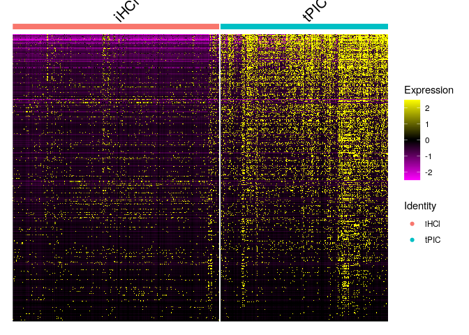

```         
# Volcano plot
df <- merged_df
library(tidyverse)

filtered_df <- df %>%
  group_by(protein) %>%
  filter(abs(avg_log2FC) == max(abs(avg_log2FC))) %>%
  ungroup() %>% na.omit()


colors <- rep("#BFBFBF", nrow(filtered_df))
names(colors) <- rep("Negative", nrow(filtered_df))

colors[which(filtered_df$avg_log2FC >= 1 &
               filtered_df$p_val_adj < 0.05)] <- "#E69F00"
names(colors) [which(filtered_df$avg_log2FC >= 1 &
                       filtered_df$p_val_adj < 0.05)] <- "UP"

colors[which(filtered_df$avg_log2FC <= -1 &
               filtered_df$p_val_adj < 0.05)] <- "#990099"
names(colors) [which(filtered_df$avg_log2FC <= -1 &
                       filtered_df$p_val_adj < 0.05)] <- "DOWN"

library(EnhancedVolcano)

volcano_plot <- EnhancedVolcano(
  filtered_df,
  lab = filtered_df$protein,
  x = "avg_log2FC",
  y = "p_val_adj",
  pCutoff = 0.05,
  FCcutoff = 1,
  colCustom = colors,
  colAlpha = 0.3,
  title = "",
  subtitle = "",
  caption = "",
  drawConnectors = TRUE,
  widthConnectors = 0.75,
  ylim = c(NA, 100),
  max.overlaps = 15,
  labSize = 3.0
)

## Warning: One or more p-values is 0.
## Converting to 10^-1 * current lowest
## non-zero p-value...

# Save the plot as a PDF
ggsave(
  filename = "~/immune_cells/scRNAseq_analysis/seurat_pipeline/figs_publication/MAST_volcano_corrected.pdf",
  # File name
  plot = volcano_plot,
  # The plot object
  device = "pdf",
  # File format
  width = 8,
  height = 6,
  # Dimensions in inches
  dpi = 300                      # Resolution (not relevant for PDFs but ensures sharpness)
)

## Warning: ggrepel: 1669 unlabeled data points
## (too many overlaps). Consider increasing
## max.overlaps
```

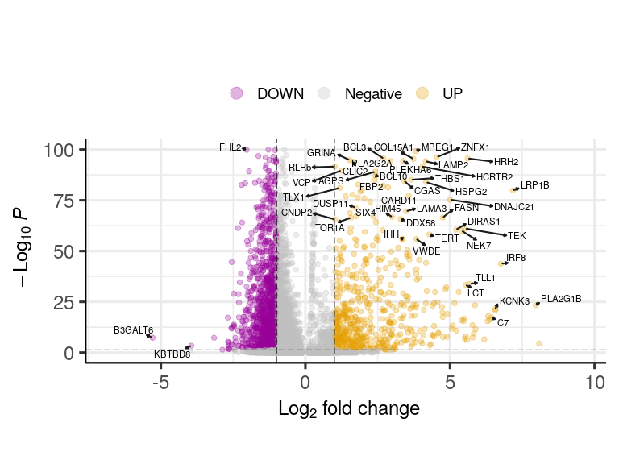

```         

# Immune cluster characterization ----------------------------------------

# =============================================================================

# Cluster 1 markers, visualization, and enrichment analysis

# =============================================================================

library(Seurat) library(ggplot2) library(clusterProfiler) library(enrichplot)

seurat_rds \<- "\~/immune_cells/scRNAseq_analysis/seurat_pipeline/seurat_clust.RDS" go_dir \<- "\~/immune_cells/scRNAseq_analysis/annotaion/GOseq" out_dir \<- "\~/immune_cells/mCherry_RLRb_FACS/Differential_expression/figs_publication" dir.create(out_dir, showWarnings = FALSE, recursive = TRUE)

seurat_obj \<- readRDS(seurat_rds)

# =============================================================================

# 1) Differential expression: Cluster 1 markers

# =============================================================================

cluster_id \<- 1

cluster1_markers \<- FindMarkers( object = seurat_obj, ident.1 = cluster_id, min.pct = 0.25, logfc.threshold = 0.25 )

# Quick peek at top markers

head(cluster1_markers)

## p_val avg_log2FC

## Nvec-vc1.1-XM-001624274.3 0 5.619424

## Nvec-vc1.1-XM-001632975.3 0 4.609391

## Nvec-vc1.1-XM-001637235.3 0 4.544092

## Nvec-vc1.1-XM-032376004.2 0 3.592725

## Nvec-vc1.1-XM-032385537.2 0 6.242463

## Nvec-vc1.1-XM-048733148.1 0 5.136621

## pct.1 pct.2

## Nvec-vc1.1-XM-001624274.3 0.838 0.079

## Nvec-vc1.1-XM-001632975.3 0.917 0.186

## Nvec-vc1.1-XM-001637235.3 0.823 0.108

## Nvec-vc1.1-XM-032376004.2 0.897 0.200

## Nvec-vc1.1-XM-032385537.2 0.689 0.055

## Nvec-vc1.1-XM-048733148.1 0.654 0.036

## p_val_adj

## Nvec-vc1.1-XM-001624274.3 0

## Nvec-vc1.1-XM-001632975.3 0

## Nvec-vc1.1-XM-001637235.3 0

## Nvec-vc1.1-XM-032376004.2 0

## Nvec-vc1.1-XM-032385537.2 0

## Nvec-vc1.1-XM-048733148.1 0

# =============================================================================

# 2) Heatmap: top markers for Cluster 1

# =============================================================================

n_top_markers \<- 50 top_markers \<- rownames(cluster1_markers)[seq_len(min(n_top_markers, nrow(cluster1_markers)))]

heatmap_plot \<- DoHeatmap( object = seurat_obj, features = top_markers, group.by = "seurat_clusters", size = 4 ) + scale_fill_gradientn(colors = c("blue", "white", "red")) + ggtitle(sprintf("Top %d Markers for Cluster %s", length(top_markers), cluster_id)) + theme_minimal(base_size = 14) + theme( plot.title = element_text(hjust = 0.5, face = "bold", size = 16), legend.position = "right", legend.title = element_blank() )

## Scale for fill is already present.

## Adding another scale for fill, which will

## replace the existing scale.

print(heatmap_plot)
```


```         
#ggsave(
#  filename = file.path(out_dir, "cluster1_markers_heatmap.png"),
#  plot     = heatmap_plot,
#  width    = 8,
#  height   = 6,
#  dpi      = 300
#)

# =============================================================================
# 3) Expression visualization: selected immune genes across clusters
# =============================================================================
genes_of_interest <- c(
  "mCherry-plus-strand",
  "Nvec-vc1.1-XM-048731786.1",
  "Nvec-vc1.1-XM-032361976.2",
  "Nvec-vc1.1-XM-048730161.1"
)

vln_plot <- VlnPlot(
  object   = seurat_obj,
  features = genes_of_interest,
  pt.size  = 0,
  group.by = "seurat_clusters",
  ncol     = 1,
  combine  = TRUE
) +
  theme(axis.text.x = element_text(angle = 45, hjust = 1))

print(vln_plot)
```


```         
# =============================================================================
# 5) Prepare ranked gene list (for GSEA-style inputs)
# =============================================================================
gene_list <- cluster1_markers$avg_log2FC
names(gene_list) <- gsub("-", "_", rownames(cluster1_markers))

gene_list <- na.omit(gene_list)
gene_list <- sort(gene_list, decreasing = TRUE)

# =============================================================================
# 7) Load GO annotation tables (TERM2GENE / TERM2NAME)
# =============================================================================
term2gene_path <- file.path(go_dir, "GoName_NewAnnotation.csv")
term2name_path <- file.path(go_dir, "Goterms_NewAnnotation.csv")

TermGene <- read.csv(term2gene_path, header = TRUE, check.names = FALSE)
TermName <- read.csv(term2name_path, header = TRUE, check.names = FALSE)

stopifnot(is.data.frame(TermGene), is.data.frame(TermName))

library(clusterProfiler)
library(enrichplot)
library(ggplot2)

# Filter significant upregulated genes
keep <- cluster1_markers$p_val_adj < 0.05 & cluster1_markers$avg_log2FC > 0.5
genes <- rownames(cluster1_markers[keep, , drop = FALSE])
genes <- gsub("-", "_", genes)
genes <- na.omit(genes)

# Load annotation tables
go_dir <- "~/immune_cells/scRNAseq_analysis/annotaion/GOseq"
TermGene <- read.csv(file.path(go_dir, "GoName_NewAnnotation.csv"), header = TRUE, check.names = FALSE)
TermName <- read.csv(file.path(go_dir, "Goterms_NewAnnotation.csv"), header = TRUE, check.names = FALSE)

# Run ORA
Results <- enricher(
  gene      = genes,
  TERM2GENE = TermGene,
  TERM2NAME = TermName,
  pvalueCutoff = 0.05,
  pAdjustMethod = "BH",
  qvalueCutoff  = 0.2,
  minGSSize = 10,
  maxGSSize = 500
)

# Visualize 
p = barplot(Results, showCategory = 15)

# Rotate the labels by 45 degrees
p + theme(axis.text.y = element_text(angle = 45, hjust = 1))
```


```         
# Save table 
write.table(
  as.data.frame(Results),
  file = "~/immune_cells/mCherry_RLRb_FACS/Differential_expression/figs_publication/mCherry_upregulated_ORA.txt",
  sep = "\t",
  quote = FALSE,
  row.names = FALSE
)


# Finding activation and basal condition specific markers within the immune cluster

# ==========================================================
# Cluster 1 "immune" DE (tPIC vs Ctrl) + GO-based labeling
# Assign each DE gene to TF / Receptor / Effector / Other
# - Produce: (1) DotPlot of top genes per category, (2) compareCluster ORA
# ==========================================================

suppressPackageStartupMessages({
  library(Seurat)
  library(dplyr)
  library(tidyr)
  library(ggplot2)
  library(clusterProfiler)
})

# Inputs 

seurat_obj <- readRDS("~/immune_cells/scRNAseq_analysis/seurat_pipeline/seurat_clust.RDS")
gene_names_df <- readRDS("~/immune_cells/scRNAseq_analysis/annotaion/peptides_annotation.rds")

TermGene <- read.csv(
  file = "~/immune_cells/scRNAseq_analysis/annotaion/GOseq/GoName_NewAnnotation.csv",
  header = TRUE,
  check.names = FALSE
)

TermName <- read.csv(
  file = "~/immune_cells/scRNAseq_analysis/annotaion/GOseq/Goterms_NewAnnotation.csv",
  header = TRUE,
  check.names = FALSE
)

# Parameters I am interested in

cluster_id   <- "1"
cond1        <- "tPIC"
cond2        <- "Ctrl"

# DE settings (FindMarkers)
logfc_thresh <- 0.25
min_pct      <- 0.10

# What you call "strong" DE for downstream summaries
de_fc_cutoff <- 0.5
padj_cutoff  <- 0.05

# How many representatives to show per category
top_n        <- 3

# Outputs (same as your original intent)
out_tpic_csv <- "~/immune_cells/figures_revised/tpic_up_df.csv"
out_ctrl_csv <- "~/immune_cells/figures_revised/ctrl_up_df.csv"
out_portrait <- "~/immune_cells/figures_revised/molecular_portrait.csv"

# Helper: pick top N genes per category (by absolute effect size)

get_top_genes <- function(df, direction, n = 3) {
  df %>%
    group_by(category) %>%
    slice_max(order_by = abs(avg_log2FC), n = n, with_ties = FALSE) %>%
    ungroup() %>%
    mutate(condition = direction)
}

# ==========================================================
# 1) Subset the immune cluster and run DE between conditions
# ==========================================================
immune_cells <- subset(seurat_obj, idents = cluster_id)

# Use Condition as the identity class (so FindMarkers compares conditions)
Idents(immune_cells) <- immune_cells$Condition

de_genes <- FindMarkers(
  immune_cells,
  ident.1 = cond1,
  ident.2 = cond2,
  logfc.threshold = logfc_thresh,
  min.pct = min_pct
)

# ==========================================================
# 2) Build a compact "gene -> GO term names" lookup table
#    (so each gene gets a single text field we can keyword-scan)
# ==========================================================
gene_go <- TermGene %>%
  inner_join(TermName, by = "Go_Term") %>%
  transmute(
    gene = Ids,   # TERM2GENE IDs (underscore format)
    GO_name = Name
  ) %>%
  group_by(gene) %>%
  summarise(
    GO_combined = paste(unique(GO_name), collapse = "; "),
    .groups = "drop"
  )

# ==========================================================
# 3) Attach GO text + peptide annotations to the DE table
#    Then label each gene into coarse functional buckets.
#
# ==========================================================
de_annot <- de_genes %>%
  tibble::rownames_to_column("gene_raw") %>%
  mutate(
    # Normalize for GO join: GO uses underscores
    gene = gsub("-", "_", gene_raw)) %>%
  left_join(gene_go, by = "gene") %>%
  mutate(
    category = dplyr::case_when(
      grepl("transcription factor|DNA-binding|regulation of transcription",
            GO_combined, ignore.case = TRUE) ~ "TF",
      
      grepl("receptor activity|signaling receptor|G protein-coupled receptor|membrane",
            GO_combined, ignore.case = TRUE) ~ "Receptor",
      
      grepl("immune|defense|cytokine|interferon|effector",
            GO_combined, ignore.case = TRUE) ~ "Effector",
      
      TRUE ~ "Other"
    )
  ) %>%
  left_join(gene_names_df, by = c("gene_raw" = "gene_name"))

message("Category counts:")

## Category counts:

print(table(de_annot$category, useNA = "ifany"))

## 
## Effector    Other Receptor       TF 
##       54     3638      396      235

message("Peptide annotation coverage:")

## Peptide annotation coverage:

message("  annotated rows: ", sum(!is.na(de_annot$protein) | !is.na(de_annot$domain), na.rm = TRUE))

##   annotated rows: 4323

message("  total rows:     ", nrow(de_annot))

##   total rows:     4323

# ==========================================================
# 4) Define the "up" gene sets
#    (strong log2foldchange + significant adjusted p-value)
# ==========================================================
tpic_up <- de_annot %>%
  filter(avg_log2FC >  de_fc_cutoff, p_val_adj < padj_cutoff)

ctrl_up <- de_annot %>%
  filter(avg_log2FC < -de_fc_cutoff, p_val_adj < padj_cutoff)

# Save tables
#write.csv(tpic_up, out_tpic_csv, row.names = FALSE)
#write.csv(ctrl_up, out_ctrl_csv, row.names = FALSE)

# ==========================================================
# 5) Quick visual sanity check: DotPlot of representative genes
#    We show the strongest hits per category for each direction.
# ==========================================================
top_genes <- bind_rows(
  get_top_genes(tpic_up, cond1, n = top_n),
  get_top_genes(ctrl_up, cond2, n = top_n)
) %>%
  arrange(condition, category)

# DotPlot needs Seurat's feature names -> use gene_raw
genes_to_plot <- unique(top_genes$gene_raw)

p_dot <- DotPlot(immune_cells, features = genes_to_plot, group.by = "Condition") +
  theme(axis.text.x = element_text(angle = 90, hjust = 1)) +
  labs(title = paste0("Cluster ", cluster_id, ": top DE genes by GO-category (", cond1, " vs ", cond2, ")"))

## Warning: Scaling data with a low number of
## groups may produce misleading results

print(p_dot)
```

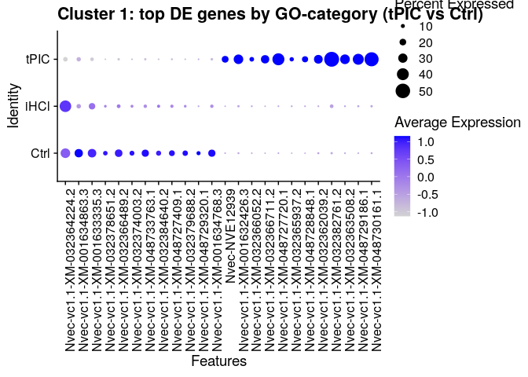

```         
# ==========================================================
# 6) ORA: compare GO enrichment between the two "up" sets
#    Here I use underscore-normalized IDs to match TERM2GENE.
# ==========================================================
gene_lists <- list(
  tPIC_up = unique(tpic_up$gene),
  Ctrl_up = unique(ctrl_up$gene)
)

cc_result <- compareCluster(
  geneCluster = gene_lists,
  fun = "enricher",
  TERM2GENE = TermGene,
  TERM2NAME = TermName,
  pvalueCutoff = 0.05,
  pAdjustMethod = "BH",
  minGSSize = 10,
  maxGSSize = 500,
  qvalueCutoff = 0.2
)

p_cc <- dotplot(cc_result, showCategory = 10, font.size = 12) +
  ggtitle("GO term enrichment comparison: tPIC-up vs Ctrl-up")

print(p_cc)
```

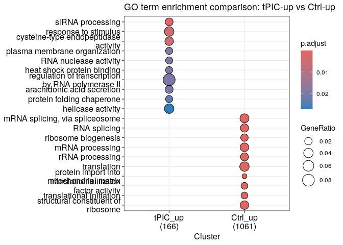

```         
# ==========================================================
# 7) Save the full annotated DE table ("molecular portrait")
# ==========================================================
write.csv(de_annot, out_portrait, row.names = FALSE)

message(
  "Finished.\n",
  "Wrote:\n",
  "  - ", out_tpic_csv, "\n",
  "  - ", out_ctrl_csv, "\n",
  "  - ", out_portrait
)

## Finished.
## Wrote:
##   - ~/immune_cells/figures_revised/tpic_up_df.csv
##   - ~/immune_cells/figures_revised/ctrl_up_df.csv
##   - ~/immune_cells/figures_revised/molecular_portrait.csv

# Comparison with the bulk-RNA-seq results --------------------------------
# Compute module score for the mCherry positive cells and visualize the bulk-RNA-seq.
# Where the mCherry+ genes are expressed?
seurat<- readRDS("~/immune_cells/scRNAseq_analysis/seurat_pipeline/seurat_clust.RDS")
# Load the mCherry+ upregulated genes
gene_set <- read.delim(
  "~/immune_cells/mCherry_RLRb_FACS/Differential_expression/mCherry_upregulated.txt"
)  # Replace the the names from underscore to dash
gene_set <- rownames(gene_set)
gene_set <- gsub("_", "-", gene_set)
# Check if genes exist in the dataset
gene_set <- intersect(gene_set, rownames(seurat_obj))

# Add module score for the gene set
seurat_obj <- AddModuleScore(seurat, features = list(gene_set), name = "ProcessScore")

# Visualize the module score on UMAP
aggregated_score <- FeaturePlot_scCustom(
  seurat_obj,
  features = "ProcessScore1",
  reduction = "umap",
  pt.size = 0.5,
  colors_use = viridis_inferno_dark_high
) +  ggtitle("") + theme(axis.title.x = element_blank(), axis.title.y = element_blank())

## Warning: Some of the plotted features are from
## meta.data slot.
## • Please check that `na_cutoff` param is
##   being set appropriately for those
##   features.

# Display the plot
print(aggregated_score)
```

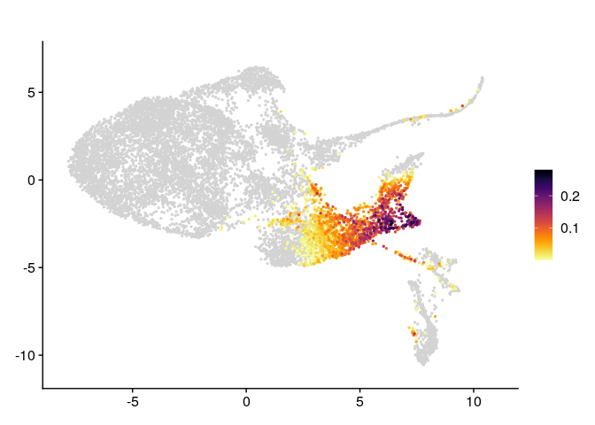

```         
# Save the plot as high-resolution output
ggsave(
  "aggregated_mCherry_score_umap.png",
  plot = aggregated_score,
  width = 8,
  height = 6,
  dpi = 300
)

# Identification of marker genes and annotation ---------------------------
# Cell type markers S6
# All marker genes
cellType_markers <- read.csv(
  "~/immune_cells/scRNAseq_analysis/seurat_pipeline/figs_publication/supplementary/cellType_markers3.csv"
)

# Read the clustered Seurat object
#seurat<- readRDS("~/immune_cells/scRNAseq_analysis/seurat_pipeline/seurat_clust.RDS")
# Add immune genes


# Replace underscores with dashes in the entire data frame
df_markers <- data.frame(lapply(cellType_markers, function(x) {
  if (is.character(x) || is.factor(x)) {
    gsub("_", "-", as.character(x)) # Replace in character or factor columns
  } else {
    x # Leave other columns unchanged
  }
}), stringsAsFactors = FALSE)


df_markers <- df_markers[1:17, ]

# Plotting

library(patchwork)

visualize_markers <- function(seurat, df_markers) {
  plots <- lapply(seq_len(nrow(df_markers)), function(i) {
    gene <- df_markers$DToL[i]
    model <- df_markers$ID[i]
    name <- df_markers$Marker[i]
    
    # Check if the gene exists in the Seurat object
    if (gene %in% rownames(seurat)) {
      FeaturePlot_scCustom(seurat, features = gene) +
        ggtitle(paste(name, ":", model)) +
        theme(plot.title = element_text(size = 8)) +
        theme(axis.title = element_blank())
    } else {
      message(paste("Skipping", gene, "as it is not found in the Seurat object"))
      NULL
    }
  })
  
  # Remove NULL entries from the plot list
  plots <- Filter(Negate(is.null), plots)
  
  # Combine plots if any are available
  if (length(plots) > 0) {
    wrap_plots(plots, ncol = 4)
  } else {
    message("No valid markers found for visualization.")
  }
}

visualize_markers(seurat = seurat, df_markers = df_markers)

## Skipping Nvec-vc1.1-XM-001628041.3 as it is not found in the Seurat object
```


```         
S6 <- visualize_markers(seurat = seurat, df_markers = df_markers)

## Skipping Nvec-vc1.1-XM-001628041.3 as it is not found in the Seurat object

ggsave(
  "S6_marker_genes.png",
  plot = S6,
  width = 12,
  height = 9,
  dpi = 300
)


# Annotate cell types and re-print figure

Idents(seurat) <- "seurat_clusters"

table(Idents(seurat))

## 
##    0    1    2    3    4    5    6 
## 5103 3225  950  651  524  410  202

# Convert to characters

Idents(seurat) <- factor(as.character(seurat$seurat_clusters))
levels(Idents(seurat))

## [1] "0" "1" "2" "3" "4" "5" "6"

cell_types <- c(
  "0" = "Ectoderm",
  "1" = "Immune",
  "2" = "Ect.oral",
  "3" = "Nemtocye",
  "4" = "Ect.aboral",
  "5" = "Gland",
  "6" = "Neuronal"
)

cell_types_num <- setNames(paste0(names(cell_types), ": ", cell_types), names(cell_types))

seurat <- RenameIdents(seurat, cell_types_num)


table(Idents(seurat))

## 
##   0: Ectoderm     1: Immune   2: Ect.oral 
##          5103          3225           950 
##   3: Nemtocye 4: Ect.aboral      5: Gland 
##           651           524           410 
##   6: Neuronal 
##           202

levels(Idents(seurat))

## [1] "0: Ectoderm"   "1: Immune"    
## [3] "2: Ect.oral"   "3: Nemtocye"  
## [5] "4: Ect.aboral" "5: Gland"     
## [7] "6: Neuronal"

DimPlot(seurat)
```

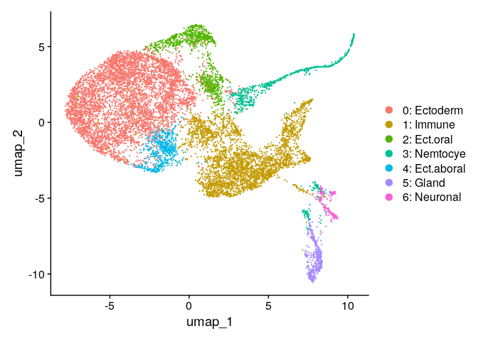

```         
# Save as RDS file (available on Zenodo)
#saveRDS(
#  seurat,
#  "~/immune_cells/scRNAseq_analysis/seurat_pipeline/seurat_obj2_annotated.rds"
#)


# Visualizing the WGCNA metacell results  ---------------------------------

library(Seurat)
library(dplyr)

seurat<- readRDS("~/immune_cells/scRNAseq_analysis/seurat_pipeline/seurat_clust.RDS")
modules<- read.delim("/sci/labs/yehum79/itamar273/scRNAseq Arnau/to_yehu/gene_modules/WGCNA_gmod_annotation.txt")

# seurat: Clustered Seurat object
# modules:  WGCNA data.frame with columns gene_id, gene_module, membership_score, ...

# Make sure clustering identities are the active identities
Idents(seurat) <- "seurat_clusters"


# Apply the same order as the WGCNA compact heatmap (Supplementary Fig. 7a)

gs_order <- c(
  "turquoise", "pink", "grey60", "salmon", "cyan",
  "grey", "green", "yellow", "tan", "greenyellow",
  "blue", "magenta", "black", "red", "purple",
  "lightcyan", "brown", "lightgreen", "midnightblue"
)

GS_names <- paste0("GS", seq_along(gs_order))

modules$gene_id<- gsub("_","-", modules$gene_id)

library(dplyr)

gene_sets_df <- modules %>%
  filter(gene_module %in% gs_order) %>%
  filter(gene_id %in% rownames(seurat)) %>%
  distinct(gene_module, gene_id) %>%
  group_by(gene_module) %>%
  summarise(genes = list(gene_id), .groups = "drop")

gene_sets <- setNames(gene_sets_df$genes, gene_sets_df$gene_module)

gene_sets <- gene_sets[gs_order]

stopifnot(
  length(gene_sets) == 19,
  all(names(gene_sets) == gs_order)
)


seurat <- AddModuleScore(
  object   = seurat,
  features = gene_sets,
  name     = "GS_",
  assay    = DefaultAssay(seurat),
  slot     = "data"
)

meta <- seurat[[]]

old <- paste0("GS_", seq_along(gs_order))
new <- paste0("GS",  seq_along(gs_order))

colnames(meta)[match(old, colnames(meta))] <- new
seurat[[]] <- meta

all(new %in% colnames(seurat[[]]))  # TRUE

## [1] TRUE

vln_plot <- VlnPlot(
  seurat,
  features = new,
  group.by = "seurat_clusters",
  pt.size = 0.1,
  ncol = 7,
  alpha = 0.3,
  cols = rep("grey",7),
) 

print(vln_plot)
```


```         
# Conduct over-representation analysis on individual gene sets

library(dplyr)
library(clusterProfiler)

setwd("~/immune_cells/scRNAseq_analysis/annotaion/GOseq/")

TermGene <- read.csv("GoName_NewAnnotation.csv", header = TRUE, check.names = FALSE)
TermName <- read.csv("Goterms_NewAnnotation.csv", header = TRUE, check.names = FALSE)

out_dir  <- "~/immune_cells/Supp_tables/ORA_GS14_GS17/"
dir.create(out_dir, showWarnings = FALSE, recursive = TRUE)


stopifnot(is.data.frame(TermGene), is.data.frame(TermName))

gs_to_module <- c(
  GS14 = "red",
  GS15 = "purple",
  GS16 = "lightcyan",
  GS17 = "brown"
)

modules$gene_id<- gsub("-","_", modules$gene_id)

ora_results <- list()
ora_plots   <- list()

for (gs in names(gs_to_module)) {
  
  mod <- gs_to_module[[gs]]
  
  genes <- modules %>%
    filter(gene_module == mod) %>%
    pull(gene_id) %>%
    unique()
  
  res <- enricher(
    gene          = genes,
    pvalueCutoff  = 0.05,
    pAdjustMethod = "BH",
    qvalueCutoff  = 0.2,
    minGSSize     = 10,
    maxGSSize     = 500,
    TERM2GENE     = TermGene,
    TERM2NAME     = TermName
  )
  
  ora_results[[gs]] <- res
  
  # only make a plot if enrichment exists
  if (!is.null(res) && nrow(as.data.frame(res)) > 0) {
    ora_plots[[gs]] <- barplot(
      res,
      showCategory = 15,
      title = paste0(gs, " (", mod, ")")
    )
  } else {
    ora_plots[[gs]] <- NULL
  }
}

print(ora_plots$GS14)
```


```         
print(ora_plots$GS15)
```


```         
print(ora_plots$GS16)
```


```         
print(ora_plots$GS17)
```


```         
---

## Session information

```text
 R version 4.4.1 (2024-06-14)
Platform: x86_64-pc-linux-gnu
Running under: Ubuntu 22.04.5 LTS

Matrix products: default
BLAS:   /usr/lib/x86_64-linux-gnu/openblas-pthread/libblas.so.3 
LAPACK: /usr/lib/x86_64-linux-gnu/openblas-pthread/libopenblasp-r0.3.20.so;  LAPACK version 3.10.0

locale:
 [1] LC_CTYPE=en_US.UTF-8      
 [2] LC_NUMERIC=C              
 [3] LC_TIME=en_US.UTF-8       
 [4] LC_COLLATE=en_US.UTF-8    
 [5] LC_MONETARY=en_US.UTF-8   
 [6] LC_MESSAGES=en_US.UTF-8   
 [7] LC_PAPER=en_US.UTF-8      
 [8] LC_NAME=C                 
 [9] LC_ADDRESS=C              
[10] LC_TELEPHONE=C            
[11] LC_MEASUREMENT=en_US.UTF-8
[12] LC_IDENTIFICATION=C       

time zone: Etc/UTC
tzcode source: system (glibc)

attached base packages:
[1] stats4    grid     
[3] stats     graphics 
[5] grDevices utils    
[7] datasets  methods  
[9] base     

other attached packages:
 [1] patchwork_1.3.0            
 [2] enrichplot_1.24.4          
 [3] EnhancedVolcano_1.22.0     
 [4] ggrepel_0.9.6              
 [5] lubridate_1.9.3            
 [6] forcats_1.0.0              
 [7] stringr_1.5.1              
 [8] purrr_1.0.2                
 [9] readr_2.1.5                
[10] tidyr_1.3.1                
[11] tibble_3.2.1               
[12] tidyverse_2.0.0            
[13] scCustomize_3.0.1          
[14] MAST_1.30.0                
[15] SingleCellExperiment_1.26.0
[16] SummarizedExperiment_1.34.0
[17] Biobase_2.64.0             
[18] GenomicRanges_1.56.2       
[19] GenomeInfoDb_1.40.1        
[20] IRanges_2.38.1             
[21] S4Vectors_0.42.1           
[22] BiocGenerics_0.50.0        
[23] MatrixGenerics_1.16.0      
[24] matrixStats_1.4.1          
[25] ggpubr_0.6.0               
[26] ggplot2_3.5.1              
[27] Matrix_1.7-1               
[28] clusterProfiler_4.12.6     
[29] dplyr_1.1.4                
[30] Seurat_5.1.0               
[31] SeuratObject_5.0.2         
[32] sp_2.1-4                   

loaded via a namespace (and not attached):
  [1] R.methodsS3_1.8.2      
  [2] goftest_1.2-3          
  [3] Biostrings_2.72.1      
  [4] vctrs_0.6.5            
  [5] spatstat.random_3.3-2  
  [6] digest_0.6.37          
  [7] png_0.1-8              
  [8] shape_1.4.6.1          
  [9] deldir_2.0-4           
 [10] parallelly_1.38.0      
 [11] MASS_7.3-61            
 [12] reshape2_1.4.4         
 [13] httpuv_1.6.15          
 [14] foreach_1.5.2          
 [15] qvalue_2.36.0          
 [16] withr_3.0.1            
 [17] ggrastr_1.0.2          
 [18] xfun_0.48              
 [19] ggfun_0.1.7            
 [20] survival_3.7-0         
 [21] memoise_2.0.1          
 [22] ggbeeswarm_0.7.2       
 [23] janitor_2.2.1          
 [24] gson_0.1.0             
 [25] systemfonts_1.1.0      
 [26] tidytree_0.4.6         
 [27] zoo_1.8-15             
 [28] GlobalOptions_0.1.2    
 [29] pbapply_1.7-2          
 [30] R.oo_1.26.0            
 [31] Formula_1.2-5          
 [32] rematch2_2.1.2         
 [33] KEGGREST_1.44.1        
 [34] promises_1.3.0         
 [35] httr_1.4.7             
 [36] rstatix_0.7.2          
 [37] globals_0.16.3         
 [38] fitdistrplus_1.2-1     
 [39] rstudioapi_0.16.0      
 [40] UCSC.utils_1.0.0       
 [41] miniUI_0.1.1.1         
 [42] generics_0.1.3         
 [43] DOSE_3.30.5            
 [44] zlibbioc_1.50.0        
 [45] ggraph_2.2.1           
 [46] polyclip_1.10-7        
 [47] GenomeInfoDbData_1.2.12
 [48] SparseArray_1.4.8      
 [49] xtable_1.8-4           
 [50] doParallel_1.0.17      
 [51] evaluate_1.0.1         
 [52] S4Arrays_1.4.1         
 [53] hms_1.1.3              
 [54] irlba_2.3.5.1          
 [55] colorspace_2.1-1       
 [56] ROCR_1.0-11            
 [57] reticulate_1.39.0      
 [58] spatstat.data_3.1-2    
 [59] magrittr_2.0.3         
 [60] lmtest_0.9-40          
 [61] snakecase_0.11.1       
 [62] later_1.3.2            
 [63] viridis_0.6.5          
 [64] ggtree_3.12.0          
 [65] lattice_0.22-6         
 [66] spatstat.geom_3.3-3    
 [67] future.apply_1.11.2    
 [68] scattermore_1.2        
 [69] shadowtext_0.1.4       
 [70] cowplot_1.1.3          
 [71] RcppAnnoy_0.0.22       
 [72] pillar_1.9.0           
 [73] nlme_3.1-166           
 [74] iterators_1.0.14       
 [75] compiler_4.4.1         
 [76] RSpectra_0.16-2        
 [77] stringi_1.8.4          
 [78] tensor_1.5             
 [79] plyr_1.8.9             
 [80] crayon_1.5.3           
 [81] abind_1.4-8            
 [82] gridGraphics_0.5-1     
 [83] locfit_1.5-9.10        
 [84] graphlayouts_1.2.0     
 [85] bit_4.5.0              
 [86] fastmatch_1.1-4        
 [87] codetools_0.2-20       
 [88] textshaping_0.4.0      
 [89] bslib_0.8.0            
 [90] paletteer_1.6.0        
 [91] GetoptLong_1.0.5       
 [92] plotly_4.10.4          
 [93] mime_0.12              
 [94] splines_4.4.1          
 [95] circlize_0.4.16        
 [96] Rcpp_1.0.14            
 [97] fastDummies_1.7.4      
 [98] knitr_1.48             
 [99] blob_1.2.4             
[100] utf8_1.2.4             
[101] clue_0.3-65            
[102] fs_1.6.4               
[103] listenv_0.9.1          
[104] ggsignif_0.6.4         
[105] ggplotify_0.1.2        
[106] statmod_1.5.0          
[107] tzdb_0.4.0             
[108] tweenr_2.0.3           
[109] pkgconfig_2.0.3        
[110] tools_4.4.1            
[111] cachem_1.1.0           
[112] RSQLite_2.3.7          
[113] viridisLite_0.4.2      
[114] DBI_1.2.3              
[115] fastmap_1.2.0          
[116] rmarkdown_2.28         
[117] scales_1.3.0           
[118] ica_1.0-3              
[119] broom_1.0.7            
[120] sass_0.4.9             
[121] ggprism_1.0.5          
[122] dotCall64_1.2          
[123] carData_3.0-5          
[124] RANN_2.6.2             
[125] farver_2.1.2           
[126] tidygraph_1.3.1        
[127] scatterpie_0.2.4       
[128] mgcv_1.9-1             
[129] yaml_2.3.10            
[130] cli_3.6.3              
[131] leiden_0.4.3.1         
[132] lifecycle_1.0.4        
[133] uwot_0.2.2             
[134] presto_1.0.0           
[135] backports_1.5.0        
[136] BiocParallel_1.38.0    
[137] timechange_0.3.0       
[138] gtable_0.3.5           
[139] rjson_0.2.23           
[140] ggridges_0.5.6         
[141] progressr_0.14.0       
[142] parallel_4.4.1         
[143] ape_5.8                
[144] limma_3.60.6           
[145] jsonlite_1.8.9         
[146] RcppHNSW_0.6.0         
[147] bit64_4.5.2            
[148] Rtsne_0.17             
[149] yulab.utils_0.1.7      
[150] spatstat.utils_3.1-0   
[151] jquerylib_0.1.4        
[152] highr_0.11             
[153] GOSemSim_2.30.2        
[154] spatstat.univar_3.0-1  
[155] R.utils_2.12.3         
[156] lazyeval_0.2.2         
[157] shiny_1.9.1            
[158] htmltools_0.5.8.1      
[159] GO.db_3.19.1           
[160] sctransform_0.4.1      
[161] rappdirs_0.3.3         
[162] glue_1.8.0             
[163] ggvenn_0.1.10          
[164] spam_2.11-0            
[165] httr2_1.0.5            
[166] XVector_0.44.0         
[167] treeio_1.28.0          
[168] gridExtra_2.3          
[169] igraph_2.0.3           
[170] R6_2.5.1               
[171] DESeq2_1.44.0          
[172] labeling_0.4.3         
[173] cluster_2.1.6          
[174] pkgload_1.4.0          
[175] aplot_0.2.3            
[176] DelayedArray_0.30.1    
[177] tidyselect_1.2.1       
[178] vipor_0.4.7            
[179] ggforce_0.4.2          
[180] car_3.1-3              
[181] AnnotationDbi_1.66.0   
[182] future_1.34.0          
[183] munsell_0.5.1          
[184] KernSmooth_2.23-24     
[185] data.table_1.16.2      
[186] htmlwidgets_1.6.4      
[187] fgsea_1.30.0           
[188] ComplexHeatmap_2.20.0  
[189] RColorBrewer_1.1-3     
[190] rlang_1.1.4            
[191] spatstat.sparse_3.1-0  
[192] spatstat.explore_3.3-2 
[193] fansi_1.0.6            
[194] beeswarm_0.4.0          
```
