```         
# Trajectory inference across conditions: differential expression and differential progression
suppressPackageStartupMessages({
  library(slingshot)
  library(SingleCellExperiment)
  library(RColorBrewer)
  library(scales)
  library(viridis)
  library(UpSetR)
  library(pheatmap)
  library(msigdbr)
  library(fgsea)
  library(knitr)
  library(ggplot2)
  library(gridExtra)
  library(tradeSeq)
})

# Load data
seurat<- readRDS("~/immune_cells/scRNAseq_analysis/seurat_pipeline/seurat_clust.RDS")
sce<- Seurat::as.SingleCellExperiment(seurat, assay = "RNA")

## Warning: Layer 'data' is empty

## Warning: Layer 'scale.data' is empty

# Take 1:49 dimensions to avoid a bug in slingshot 
reducedDim(sce, 'PCA_corrected') <- reducedDim(sce, 'PCA')[, 1:49]


# Re-clustering of the immune cluster (cluster 1) -------------------------


# Reclustering of cluster 1 
library(Seurat)
cluster_of_interest <- "1"  
subset_obj <- subset(seurat, idents = cluster_of_interest)

subset_obj <- NormalizeData(subset_obj)
subset_obj <- FindVariableFeatures(subset_obj)
subset_obj <- ScaleData(subset_obj)

## Centering and scaling data matrix

subset_obj <- RunPCA(subset_obj)

## Warning in PrepDR(object = object, features = features,
## verbose = verbose): The following 8 features requested have
## zero variance (running reduction without them):
## Nvec-vc1.1-XM-032376085.2, Nvec-vc1.1-XM-048721562.1,
## Nvec-vc1.1-XM-001637272.3, Nvec-vc1.1-XM-032385587.2,
## Nvec-vc1.1-XM-048730230.1, Nvec-NVE8960,
## Nvec-vc1.1-XM-048720064.1, Nvec-vc1.1-XM-048734475.1

## PC_ 1 
## Positive:  Nvec-vc1.1-XM-001628602.3, Nvec-vc1.1-XM-048726226.1, Nvec-vc1.1-XM-048724836.1, Nvec-vc1.1-XM-032364690.2, Nvec-vc1.1-XM-001639565.3, Nvec-vc1.1-XM-001636847.3, Nvec-vc1.1-XM-001639785.3, Nvec-vc1.1-XM-032364189.2, Nvec-vc1.1-XM-048728800.1, Nvec-vc1.1-XM-032383755.2 
##     Nvec-vc1.1-XM-032365713.2, Nvec-vc1.1-XM-001639517.3, Nvec-vc1.1-XM-032362159.2, Nvec-vc1.1-XM-001634267.3, Nvec-vc1.1-XM-048726696.1, Nvec-vc1.1-XM-001623084.3, Nvec-vc1.1-XM-001624688.3, Nvec-vc1.1-XM-001626284.3, Nvec-vc1.1-XM-032381908.2, Nvec-vc1.1-XM-032385246.1 
##     Nvec-vc1.1-XM-048733219.1, Nvec-vc1.1-XM-001638182.3, Nvec-vc1.1-XM-048733547.1, Nvec-vc1.1-XM-032384891.2, Nvec-vc1.1-XM-048731958.1, Nvec-vc1.1-XM-001636352.3, Nvec-NVE22144, Nvec-vc1.1-XM-048730287.1, Nvec-vc1.1-XM-032381020.2, Nvec-vc1.1-XM-048727073.1 
## Negative:  Nvec-vc1.1-XM-001636807.3, Nvec-vc1.1-XM-048721665.1, Nvec-NVE23841, Nvec-vc1.1-XM-032384093.2, Nvec-vc1.1-XM-001641184.3, Nvec-vc1.1-XM-001627177.2, Nvec-vc1.1-XM-048721305.1, Nvec-vc1.1-XM-001629447.3, Nvec-vc1.1-XM-001638302.3, Nvec-vc1.1-XM-048728987.1 
##     Nvec-NVE4998, Nvec-vc1.1-XM-032363373.2, Nvec-vc1.1-XM-001636595.3, Nvec-vc1.1-XM-001637026.3, Nvec-vc1.1-XM-032382358.2, Nvec-vc1.1-XM-048733915.1, Nvec-vc1.1-XM-001632206.3, Nvec-vc1.1-XM-001631860.3, Nvec-NVE19743, Nvec-vc1.1-XM-032378378.2 
##     Nvec-vc1.1-XM-048725824.1, Nvec-vc1.1-XM-048720625.1, Nvec-vc1.1-XM-001634866.3, Nvec-vc1.1-XM-001634923.3, Nvec-vc1.1-XM-001640033.3, Nvec-vc1.1-XM-032381945.2, Nvec-vc1.1-XM-032381032.2, Nvec-vc1.1-XM-001634550.3, Nvec-vc1.1-XM-048730261.1, Nvec-vc1.1-XM-048722947.1 
## PC_ 2 
## Positive:  Nvec-vc1.1-XM-001632975.3, Nvec-NVE814, Nvec-vc1.1-XM-048726145.1, Nvec-vc1.1-XM-001624274.3, Nvec-vc1.1-XM-032385537.2, Nvec-vc1.1-XM-001633845.3, Nvec-vc1.1-XM-001637235.3, Nvec-vc1.1-XM-001627335.3, Nvec-NVE25581, Nvec-vc1.1-XM-048733148.1 
##     Nvec-vc1.1-XM-032376004.2, Nvec-vc1.1-XM-048727073.1, Nvec-vc1.1-XM-032378741.2, Nvec-v1g241372, Nvec-vc1.1-XM-001638182.3, Nvec-vc1.1-XM-048726161.1, Nvec-NVE6615, Nvec-vc1.1-XM-001626643.3, Nvec-vc1.1-XM-001623327.3, Nvec-vc1.1-XM-048726143.1 
##     mCherry-plus-strand, Nvec-vc1.1-XM-001629490.3, Nvec-vc1.1-XM-001633167.3, Nvec-vc1.1-XM-048733926.1, Nvec-vc1.1-XM-001639260.3, Nvec-vc1.1-XM-032370353.2, Nvec-vc1.1-XM-001632093.3, Nvec-vc1.1-XM-048728853.1, Nvec-vc1.1-XM-001637508.3, Nvec-vc1.1-XM-001633857.3 
## Negative:  Nvec-vc1.1-XM-032366489.2, Nvec-vc1.1-XM-032383755.2, Nvec-vc1.1-XM-048731958.1, Nvec-vc1.1-XM-048733219.1, Nvec-vc1.1-XM-032379496.2, Nvec-vc1.1-XM-032377563.1, Nvec-vc1.1-XM-032386983.2, Nvec-vc1.1-XM-032378857.2, Nvec-vc1.1-XM-001634768.3, Nvec-vc1.1-XM-032386058.2 
##     Nvec-vc1.1-XM-032375635.2, Nvec-vc1.1-XM-032379868.2, Nvec-vc1.1-XM-048733763.1, Nvec-vc1.1-XM-048727409.1, Nvec-NVE6151, Nvec-vc1.1-XM-032387186.2, Nvec-vc1.1-XM-032381908.2, Nvec-vc1.1-XM-032379688.2, Nvec-vc1.1-XM-032385020.2, Nvec-vc1.1-XM-001629834.3 
##     Nvec-vc1.1-XM-001630068.3, Nvec-vc1.1-XM-048730287.1, Nvec-vc1.1-XM-001639517.3, Nvec-vc1.1-XM-048725715.1, Nvec-vc1.1-XM-048725908.1, Nvec-v1g160811, Nvec-NVE15402, Nvec-vc1.1-XM-032377472.2, Nvec-vc1.1-XM-032383753.2, Nvec-vc1.1-XM-032374003.2 
## PC_ 3 
## Positive:  Nvec-vc1.1-XM-001635365.3, Nvec-vc1.1-XM-032364224.2, Nvec-NVE23746, Nvec-vc1.1-XM-001639027.3, Nvec-vc1.1-XM-032363855.2, Nvec-v1g244133, Nvec-v1g246292, Nvec-vc1.1-XM-001632792.3, Nvec-vc1.1-XM-032385153.2, Nvec-vc1.1-XM-048731785.1 
##     Nvec-vc1.1-XM-032379075.2, Nvec-vc1.1-XM-032382667.2, Nvec-vc1.1-XM-032370269.2, Nvec-vc1.1-XM-001637591.3, Nvec-vc1.1-XM-032381935.2, Nvec-vc1.1-XM-032376926.2, Nvec-vc1.1-XM-032383717.2, Nvec-vc1.1-XM-032383364.2, Nvec-vc1.1-XM-048731786.1, Nvec-vc1.1-XM-001632108.3 
##     Nvec-vc1.1-XM-001630092.3, Nvec-vc1.1-XM-001631543.3, Nvec-vc1.1-XM-001623004.3, Nvec-vc1.1-XM-032366972.2, Nvec-vc1.1-XM-048726238.1, Nvec-vc1.1-XM-032365937.2, Nvec-vc1.1-XM-048724711.1, Nvec-vc1.1-XM-032364091.2, Nvec-vc1.1-XM-032372612.2, Nvec-vc1.1-XM-048721953.1 
## Negative:  Nvec-vc1.1-XM-032383475.2, Nvec-vc1.1-XM-001629534.3, Nvec-vc1.1-XM-001639609.3, Nvec-vc1.1-XM-001639829.3, Nvec-vc1.1-XM-001639516.3, Nvec-vc1.1-XM-001633386.3, Nvec-vc1.1-XM-001632976.3, Nvec-vc1.1-XM-048728564.1, Nvec-vc1.1-XM-001633450.3, Nvec-vc1.1-XM-032383053.2 
##     Nvec-vc1.1-XM-001629800.3, Nvec-vc1.1-XM-001626010.3, Nvec-vc1.1-XM-032381153.2, Nvec-vc1.1-XM-001640277.3, Nvec-vc1.1-XM-001640395.3, Nvec-vc1.1-XM-001637780.3, Nvec-vc1.1-XM-001633797.3, Nvec-NVE4021, Nvec-vc1.1-XM-048733046.1, Nvec-vc1.1-XM-001630762.3 
##     Nvec-vc1.1-XM-001639576.3, Nvec-vc1.1-XM-001629287.3, Nvec-vc1.1-XM-001626643.3, Nvec-vc1.1-XM-001626244.3, Nvec-vc1.1-XM-032372726.2, Nvec-vc1.1-XM-001641466.3, Nvec-vc1.1-XM-001622452.3, Nvec-vc1.1-XM-032378741.2, Nvec-vc1.1-XM-001628129.2, Nvec-vc1.1-XM-048726615.1 
## PC_ 4 
## Positive:  Nvec-vc1.1-XM-001641184.3, Nvec-vc1.1-XM-032383075.2, Nvec-vc1.1-XM-032363855.2, Nvec-vc1.1-XM-032378021.2, Nvec-vc1.1-XM-001631860.3, Nvec-vc1.1-XM-001632792.3, Nvec-vc1.1-XM-048721953.1, Nvec-vc1.1-XM-001623050.3, Nvec-vc1.1-XM-032384077.2, Nvec-NVE23746 
##     Nvec-vc1.1-XM-032364224.2, Nvec-vc1.1-XM-001637508.3, Nvec-vc1.1-XM-032385537.2, Nvec-vc1.1-XM-048724753.1, Nvec-vc1.1-XM-001640395.3, Nvec-NVE13160, Nvec-vc1.1-XM-032384420.2, Nvec-vc1.1-XM-001636807.3, Nvec-vc1.1-XM-001626010.3, Nvec-vc1.1-XM-048731153.1 
##     Nvec-vc1.1-XM-001630533.3, Nvec-vc1.1-XM-032362939.2, Nvec-vc1.1-XM-048730105.1, Nvec-vc1.1-XM-032361844.2, Nvec-vc1.1-XM-048721466.1, Nvec-vc1.1-XM-001633845.3, Nvec-vc1.1-XM-048724711.1, Nvec-vc1.1-XM-032382667.2, Nvec-vc1.1-XM-001639027.3, Nvec-vc1.1-XM-001634866.3 
## Negative:  Nvec-vc1.1-XM-032366733.2, Nvec-vc1.1-XM-001639192.3, Nvec-vc1.1-XM-048733625.1, Nvec-vc1.1-XM-032367336.2, Nvec-vc1.1-XM-001625109.3, Nvec-NVE7516, Nvec-vc1.1-XM-001636862.3, Nvec-v1g204906, Nvec-vc1.1-XM-001634253.3, Nvec-vc1.1-XM-032363367.2 
##     Nvec-vc1.1-XM-001634945.3, Nvec-vc1.1-XM-032386947.2, Nvec-vc1.1-XM-001633176.3, Nvec-v1g232030, Nvec-vc1.1-XM-001632947.3, Nvec-vc1.1-XM-032367599.2, Nvec-vc1.1-XM-032369905.2, Nvec-vc1.1-XM-001635456.3, Nvec-vc1.1-XM-032367434.2, Nvec-vc1.1-XM-001636823.3 
##     Nvec-vc1.1-XM-032366211.2, Nvec-vc1.1-XM-032365014.2, Nvec-vc1.1-XM-001640398.3, Nvec-vc1.1-XM-001641704.3, Nvec-vc1.1-XM-048724045.1, Nvec-v1g244904, Nvec-vc1.1-XM-032373112.2, Nvec-vc1.1-XM-048732319.1, Nvec-vc1.1-XM-032383563.2, Nvec-vc1.1-XM-048730289.1 
## PC_ 5 
## Positive:  Nvec-vc1.1-XM-001637351.3, Nvec-vc1.1-XM-001631546.3, Nvec-vc1.1-XM-001630761.3, Nvec-vc1.1-XM-001635326.3, Nvec-vc1.1-XM-048733982.1, Nvec-vc1.1-XM-001629370.2, Nvec-vc1.1-XM-001623054.3, Nvec-vc1.1-XM-001636673.3, Nvec-vc1.1-XM-001641331.3, Nvec-vc1.1-XM-001637264.3 
##     Nvec-vc1.1-XM-032373445.2, Nvec-vc1.1-XM-032376026.2, Nvec-vc1.1-XM-001634241.3, Nvec-vc1.1-XM-001634963.3, Nvec-v1g237368, Nvec-vc1.1-XM-032381032.2, Nvec-vc1.1-XM-032386833.2, Nvec-vc1.1-XM-001627853.3, Nvec-vc1.1-XM-001632772.3, Nvec-vc1.1-XM-001637127.3 
##     Nvec-vc1.1-XM-001634894.3, Nvec-vc1.1-XM-001629664.3, Nvec-vc1.1-XM-001633623.3, Nvec-vc1.1-XM-001638558.3, Nvec-vc1.1-XM-048727864.1, Nvec-vc1.1-XM-001633183.3, Nvec-vc1.1-XM-001633078.3, Nvec-vc1.1-XM-001630698.3, Nvec-vc1.1-XM-001626383.3, Nvec-vc1.1-XM-032384019.2 
## Negative:  Nvec-vc1.1-XM-048726540.1, Nvec-vc1.1-XM-001637788.3, Nvec-vc1.1-XM-048726541.1, Nvec-vc1.1-XM-032366807.2, Nvec-vc1.1-XM-001626437.3, Nvec-vc1.1-XM-001629840.3, Nvec-vc1.1-XM-001640837.3, Nvec-vc1.1-XM-048730022.1, Nvec-vc1.1-XM-001635666.3, Nvec-vc1.1-XM-001619665.3 
##     Nvec-vc1.1-XM-032385139.2, Nvec-vc1.1-XM-001631982.3, Nvec-vc1.1-XM-001628594.3, Nvec-vc1.1-XM-001631955.3, Nvec-vc1.1-XM-032376968.2, Nvec-vc1.1-XM-001628897.3, Nvec-vc1.1-XM-001632373.3, Nvec-vc1.1-XM-001627329.3, Nvec-vc1.1-XM-001641074.3, Nvec-vc1.1-XM-032361895.2 
##     Nvec-vc1.1-XM-001640185.3, Nvec-vc1.1-XM-048724568.1, Nvec-vc1.1-XM-032362919.2, Nvec-vc1.1-XM-032363240.2, Nvec-vc1.1-XM-001638302.3, Nvec-v1g240440, Nvec-vc1.1-XM-032381084.2, Nvec-vc1.1-XM-001625750.3, Nvec-NVE2083, Nvec-vc1.1-XM-032375338.2

ElbowPlot(subset_obj)
```

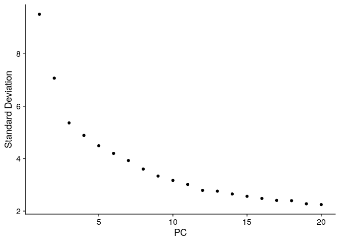

```         
subset_obj <- RunUMAP(subset_obj, dims = 1:15)  

## 15:02:48 UMAP embedding parameters a = 0.9922 b = 1.112

## 15:02:48 Read 3225 rows and found 15 numeric columns

## 15:02:48 Using Annoy for neighbor search, n_neighbors = 30

## 15:02:48 Building Annoy index with metric = cosine, n_trees = 50

## 0%   10   20   30   40   50   60   70   80   90   100%

## [----|----|----|----|----|----|----|----|----|----|

## **************************************************|
## 15:02:48 Writing NN index file to temp file /tmp/Rtmpgfdf9X/file1f864860424a7d
## 15:02:48 Searching Annoy index using 1 thread, search_k = 3000
## 15:02:49 Annoy recall = 100%
## 15:02:50 Commencing smooth kNN distance calibration using 1 thread with target n_neighbors = 30
## 15:02:51 Initializing from normalized Laplacian + noise (using RSpectra)
## 15:02:51 Commencing optimization for 500 epochs, with 126734 positive edges
## 15:02:55 Optimization finished

subset_obj <- FindNeighbors(subset_obj, dims = 1:15)

## Computing nearest neighbor graph
## Computing SNN

subset_obj <- FindClusters(subset_obj, resolution = 0.2)  

## Modularity Optimizer version 1.3.0 by Ludo Waltman and Nees Jan van Eck
## 
## Number of nodes: 3225
## Number of edges: 102803
## 
## Running Louvain algorithm...
## Maximum modularity in 10 random starts: 0.8752
## Number of communities: 4
## Elapsed time: 0 seconds

DimPlot(subset_obj, reduction = "pca", label = TRUE)
```

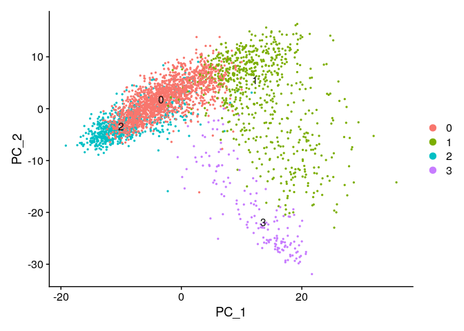

```         
# Renaming the clusters

# Extract current identities
current_clusters <- Idents(subset_obj)

#Define the mapping (e.g., 2 → 0, 0 → 1, 1 → 2, 3 → 3)
new_cluster_mapping <- c("2" = "0", "0" = "1", "1" = "2", "3" = "3")

#Rename the clusters based on the mapping
new_clusters <- as.character(new_cluster_mapping[as.character(current_clusters)])

#Update the identities in the Seurat object
Idents(subset_obj) <- factor(new_clusters, levels = unique(new_clusters))

# Number of cells per cluster 
table(Idents(subset_obj))

## 
##    2    0    1    3 
##  695  688 1686  156

# PCA plot of re-clustering 
library(ggplot2)
library(RColorBrewer)


# Plotting 
# Reorder cluster identities
subset_obj <- subset_obj
Idents(subset_obj) <- factor(Idents(subset_obj), levels = c("0", "1", "2", "3"))

# Generate the plot
library(RColorBrewer)

p <- DimPlot(
  subset_obj, 
  reduction = "pca", 
  label = TRUE,
  label.size = 6,                
  pt.size = 1.5,                 
  cols = brewer.pal(4, "Set2"),  
  alpha = 0.5                   
)

# Customize theme
p <- p + theme_minimal() + 
  theme(
    axis.text = element_text(size = 14),       
    axis.title = element_text(size = 16),     
    legend.title = element_text(size = 14),   
    legend.text = element_text(size = 12)   
  )

# Display the plot
print(p)
```

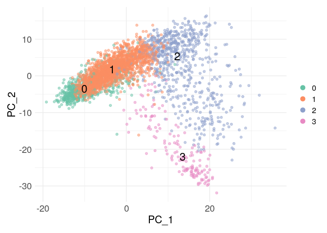

```         
# Finding markers for each sub-cluster 

# Find markers for each sub-cluster compared to all other sub-clusters
markers <- FindAllMarkers(subset_obj, 
                          group.by = "seurat_clusters",
                          min.pct = 0.25,             
                          logfc.threshold = 0.25)     

## Calculating cluster 0
## Calculating cluster 1
## Calculating cluster 2
## Calculating cluster 3

head(markers)

##                                   p_val avg_log2FC pct.1
## Nvec-vc1.1-XM-001641466.3 1.463915e-163  1.4413568 0.884
## Nvec-vc1.1-XM-032378741.2 5.701121e-126  1.1126279 0.895
## Nvec-vc1.1-XM-032364690.2 5.329247e-110 -5.4606895 0.036
## Nvec-vc1.1-XM-001626643.3 3.243773e-104  0.9525481 0.900
## Nvec-vc1.1-XM-032362159.2  1.410147e-95 -4.4353533 0.024
## Nvec-vc1.1-XM-001639517.3  1.034686e-90 -4.6778179 0.034
##                           pct.2     p_val_adj cluster
## Nvec-vc1.1-XM-001641466.3 0.487 2.420584e-159       0
## Nvec-vc1.1-XM-032378741.2 0.565 9.426804e-122       0
## Nvec-vc1.1-XM-032364690.2 0.331 8.811911e-106       0
## Nvec-vc1.1-XM-001626643.3 0.613 5.363578e-100       0
## Nvec-vc1.1-XM-032362159.2 0.282  2.331678e-91       0
## Nvec-vc1.1-XM-001639517.3 0.287  1.710853e-86       0
##                                                gene
## Nvec-vc1.1-XM-001641466.3 Nvec-vc1.1-XM-001641466.3
## Nvec-vc1.1-XM-032378741.2 Nvec-vc1.1-XM-032378741.2
## Nvec-vc1.1-XM-032364690.2 Nvec-vc1.1-XM-032364690.2
## Nvec-vc1.1-XM-001626643.3 Nvec-vc1.1-XM-001626643.3
## Nvec-vc1.1-XM-032362159.2 Nvec-vc1.1-XM-032362159.2
## Nvec-vc1.1-XM-001639517.3 Nvec-vc1.1-XM-001639517.3

# Add the protein annotation 
gene_names_df<- readRDS("~/immune_cells/scRNAseq_analysis/annotaion/peptides_annotation.rds")
markers$gene_name <- rownames(markers)

# Merge the dataframes
merged_df <- merge(
  markers,               
  gene_names_df,           
  by.x = "gene_name",      
  by.y = "gene_name",      
  all.x = TRUE,            
  sort = FALSE             
)

# Restore row names
rownames(merged_df) <- merged_df$gene_name
merged_df$gene_name <- NULL

# View the result
head(merged_df)

##                                   p_val avg_log2FC pct.1
## Nvec-vc1.1-XM-001641466.3 1.463915e-163  1.4413568 0.884
## Nvec-vc1.1-XM-032378741.2 5.701121e-126  1.1126279 0.895
## Nvec-vc1.1-XM-032364690.2 5.329247e-110 -5.4606895 0.036
## Nvec-vc1.1-XM-001626643.3 3.243773e-104  0.9525481 0.900
## Nvec-vc1.1-XM-032362159.2  1.410147e-95 -4.4353533 0.024
## Nvec-vc1.1-XM-001639517.3  1.034686e-90 -4.6778179 0.034
##                           pct.2     p_val_adj cluster
## Nvec-vc1.1-XM-001641466.3 0.487 2.420584e-159       0
## Nvec-vc1.1-XM-032378741.2 0.565 9.426804e-122       0
## Nvec-vc1.1-XM-032364690.2 0.331 8.811911e-106       0
## Nvec-vc1.1-XM-001626643.3 0.613 5.363578e-100       0
## Nvec-vc1.1-XM-032362159.2 0.282  2.331678e-91       0
## Nvec-vc1.1-XM-001639517.3 0.287  1.710853e-86       0
##                                                gene protein
## Nvec-vc1.1-XM-001641466.3 Nvec-vc1.1-XM-001641466.3 ZCCHC24
## Nvec-vc1.1-XM-032378741.2 Nvec-vc1.1-XM-032378741.2    UMOD
## Nvec-vc1.1-XM-032364690.2 Nvec-vc1.1-XM-032364690.2        
## Nvec-vc1.1-XM-001626643.3 Nvec-vc1.1-XM-001626643.3    PPA1
## Nvec-vc1.1-XM-032362159.2 Nvec-vc1.1-XM-032362159.2        
## Nvec-vc1.1-XM-001639517.3 Nvec-vc1.1-XM-001639517.3  SBSPON
##                                        domain
## Nvec-vc1.1-XM-001641466.3         zf-3CxxC_2/
## Nvec-vc1.1-XM-032378741.2 EGF/Zona_pellucida/
## Nvec-vc1.1-XM-032364690.2                    
## Nvec-vc1.1-XM-001626643.3    Pyrophosphatase/
## Nvec-vc1.1-XM-032362159.2                    
## Nvec-vc1.1-XM-001639517.3       TSP1_spondin/

write.csv(merged_df, "~/immune_cells/cnidarian_immune_cells/03_scRNAseq/03_pseudotime/results/S11_table.csv")
# Visualize top markers 
# Top 10 markers for visualization
library(tidyverse)
top10_markers <- merged_df %>% group_by(cluster) %>% top_n(10, wt = avg_log2FC)

# Plot the top markers
DotPlot(subset_obj, features = top10_markers$gene) + 
  RotatedAxis()  # Rotate axis labels for better readability

## Warning: Scaling data with a low number of groups may produce
## misleading results
```

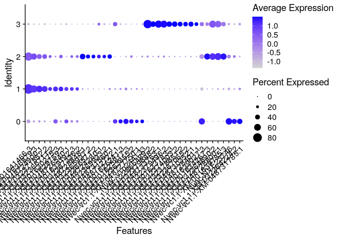

```         
# Visualizing a heatmap for the top markers
DoHeatmap(subset_obj, features = top10_markers$gene) + 
  scale_fill_viridis()  # Optional, for a nicer color scale

## Warning in DoHeatmap(subset_obj, features =
## top10_markers$gene): The following features were omitted as
## they were not found in the scale.data slot for the SCT assay:
## Nvec-vc1.1-XM-048728401.1, Nvec-vc1.1-XM-048730352.1,
## Nvec-vc1.1-XM-032378651.2, Nvec-vc1.1-XM-001633783.3,
## Nvec-vc1.1-XM-001630275.3

## Scale for fill is already present.
## Adding another scale for fill, which will replace the
## existing scale.
```

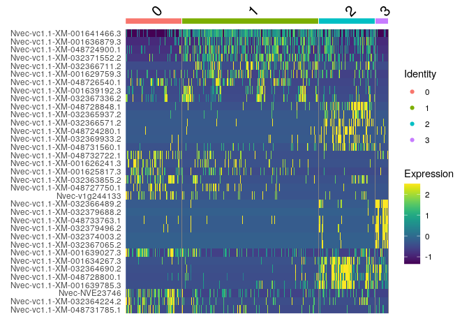

```         
# Reshape the data into a tidy format suitable for ggplot2
dotplot_data <- merged_df %>%
  select(protein, cluster, avg_log2FC, pct.1) %>%  
  mutate(cluster = factor(cluster))  

library(ggplot2)
library(dplyr)


#Filter proteins with non-empty annotations and pct.1 > 0.1
filtered_data <- merged_df %>%
  filter(!is.na(protein) & protein != "") %>%  # Keep only rows with non-empty protein annotations
  filter(pct.1 > 0.1)  # Only keep proteins expressed in >10% of cells

#Select top 10 markers per cluster based on avg_log2FC
top_markers <- filtered_data %>%
  group_by(cluster) %>%
  top_n(10, wt = avg_log2FC) %>%
  ungroup()  # Remove grouping after filtering

#Create the DotPlot using ggplot2
ggplot(top_markers, aes(x = protein, y = cluster, size = pct.1, color = avg_log2FC)) +
  geom_point() +                              
  scale_size(range = c(2, 6)) +                
  scale_color_gradient2(low = "blue", high = "red", mid = "white", midpoint = 0) +
  theme_minimal() +                            
  theme(axis.text.x = element_text(angle = 90, hjust = 1),  
        axis.text = element_text(size = 12),    
        axis.title = element_text(size = 14),   
        legend.title = element_text(size = 12), 
        legend.text = element_text(size = 10))  
```

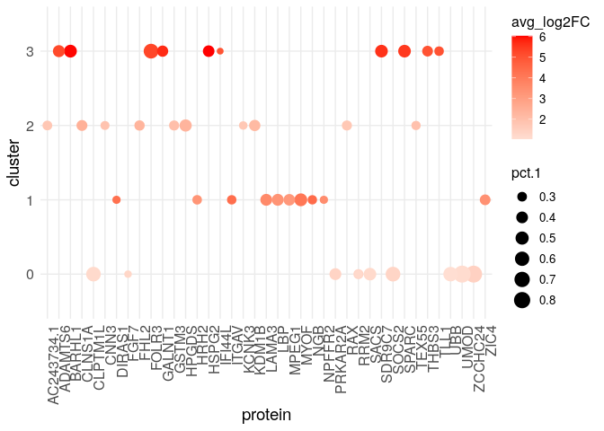

```         
# Optimized 

library(dplyr)
library(ggplot2)
library(viridis)

#Filter proteins with non-empty annotations and pct.1 > 0.1
filtered_data <- merged_df %>%
  filter(!is.na(protein) & protein != "") %>%
  filter(pct.1 > 0.1)

#Select top 10 markers per cluster based on avg_log2FC
top_markers <- filtered_data %>%
  group_by(cluster) %>%
  top_n(10, wt = avg_log2FC) %>%
  ungroup()

#Order proteins within each cluster by avg_log2FC for better grouping
top_markers <- top_markers %>%
  group_by(cluster) %>%
  arrange(desc(avg_log2FC), .by_group = TRUE) %>%
  mutate(protein_ordered = factor(protein, levels = unique(protein))) %>%
  ungroup()

#Sort the clusters for better control of y-axis order
top_markers$cluster <- factor(top_markers$cluster, levels = sort(unique(top_markers$cluster)))

# Select top proteins
top_proteins <- top_markers$protein %>% unique()

# Filter full data for those proteins across all clusters
full_marker_data <- filtered_data %>%
  filter(protein %in% top_proteins)

# Reorder factor levels for plotting
full_marker_data <- full_marker_data %>%
  mutate(protein_ordered = factor(protein, levels = unique(top_markers$protein)))

# Plot
ggplot(full_marker_data, aes(x = protein_ordered, y = factor(cluster), size = pct.1, color = avg_log2FC)) +
  geom_point() +
  scale_size(range = c(2, 6)) +
  scale_color_viridis(option = "plasma", direction = -1) +
  theme_minimal(base_size = 14) +
  theme(
    axis.text.x = element_text(angle = 90, hjust = 1),
    axis.title = element_blank(),
    panel.grid.major = element_line(color = "grey85")
  ) +
  guides(
    color = guide_colorbar(title = "avg_log2FC"),
    size = guide_legend(title = "pct.1")
  )
```

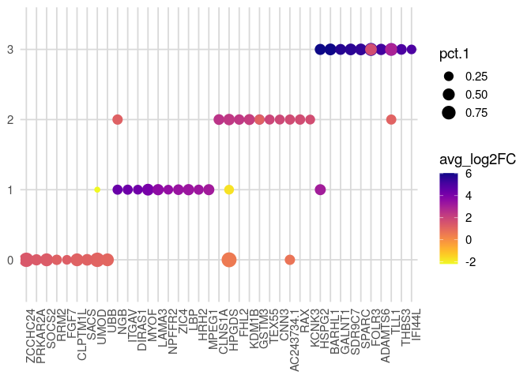

```         
# Pseudotime analysis  ----------------------------------------------------

# Slingshot trajectory analysis using the subset 
sce<- as.SingleCellExperiment(subset_obj, assay = "RNA")

## Warning: Layer 'data' is empty
## Layer 'scale.data' is empty

library(SingleCellExperiment)

# Extract the correct cluster identities from the Seurat object
correct_clusters <- as.character(Idents(subset_obj))

# Assign these identities to the SCE object
sce$ident <- factor(correct_clusters, levels = c("0", "1", "2", "3"))


# Verify the changes
table(sce$ident)

## 
##    0    1    2    3 
##  688 1686  695  156

reducedDim(sce, 'PCA_corrected') <- reducedDim(sce, 'PCA')[, 1:49]


slingshot <- slingshot::slingshot(
  sce, 
  reducedDim = 'PCA_corrected', 
  clusterLabels = sce$seurat_clusters
)
slingshot::slingLineages(slingshot)

## $Lineage1
## [1] "2" "0" "1" "3"

# Fetching pseudotime
sce$pseudotime <- slingshot::slingPseudotime(slingshot)[, 'Lineage1']

# Fetching principal curve in PCA space
pca_curve <- slingshot::slingCurves(slingshot, as.df = TRUE)
colnames(pca_curve) <- paste0('PC', 1:ncol(pca_curve))
head(pca_curve)

##         PC1       PC2      PC3        PC4      PC5       PC6
## 1 -19.19110 -9.123004 14.25185 -0.6641329 2.010631 -4.546044
## 2 -18.88220 -8.922314 13.86199 -0.6285849 1.948113 -4.406892
## 3 -18.57329 -8.721624 13.47213 -0.5930369 1.885595 -4.267740
## 4 -18.26438 -8.520933 13.08227 -0.5574889 1.823077 -4.128588
## 5 -17.95547 -8.320243 12.69241 -0.5219409 1.760559 -3.989437
## 6 -17.64656 -8.119527 12.30252 -0.4864289 1.698002 -3.850330
##        PC7      PC8       PC9      PC10       PC11     PC12
## 1 4.722869 2.091968 0.7219191 0.8566457 -0.4755743 4.352659
## 2 4.595977 2.012812 0.7035884 0.8406448 -0.4663742 4.214855
## 3 4.469086 1.933655 0.6852576 0.8246439 -0.4571741 4.077050
## 4 4.342194 1.854499 0.6669268 0.8086430 -0.4479739 3.939246
## 5 4.215302 1.775342 0.6485960 0.7926421 -0.4387738 3.801441
## 6 4.088404 1.696197 0.6302561 0.7766122 -0.4295818 3.663666
##       PC13     PC14       PC15      PC16      PC17       PC18
## 1 1.758679 1.822292 0.13529250 -1.995096 -1.384639 -0.3760751
## 2 1.692704 1.765503 0.12739210 -1.928103 -1.338381 -0.3598781
## 3 1.626729 1.708713 0.11949170 -1.861110 -1.292122 -0.3436811
## 4 1.560754 1.651923 0.11159130 -1.794117 -1.245864 -0.3274840
## 5 1.494779 1.595134 0.10369090 -1.727124 -1.199606 -0.3112870
## 6 1.428837 1.538299 0.09583699 -1.660150 -1.153369 -0.2951393
##        PC19         PC20      PC21        PC22       PC23
## 1 0.6004171 -0.004796684 0.1680319 -0.02696476 -0.2101580
## 2 0.5738173 -0.011112509 0.1554505 -0.02966719 -0.2050757
## 3 0.5472174 -0.017428334 0.1428690 -0.03236962 -0.1999934
## 4 0.5206176 -0.023744159 0.1302876 -0.03507204 -0.1949111
## 5 0.4940177 -0.030059983 0.1177061 -0.03777447 -0.1898288
## 6 0.4674319 -0.036392861 0.1051639 -0.04044851 -0.1847541
##         PC24      PC25       PC26      PC27       PC28
## 1 -0.6173286 0.7423586 -0.9257129 1.1256226 -0.1801515
## 2 -0.5958177 0.7204656 -0.8901946 1.0854549 -0.1706839
## 3 -0.5743068 0.6985726 -0.8546762 1.0452873 -0.1612163
## 4 -0.5527959 0.6766797 -0.8191579 1.0051196 -0.1517488
## 5 -0.5312850 0.6547867 -0.7836395 0.9649519 -0.1422812
## 6 -0.5097704 0.6328835 -0.7481486 0.9247978 -0.1328166
##        PC29       PC30       PC31       PC32       PC33
## 1 0.1453366 -0.5626819 -0.9506135 -0.3867703 0.05821324
## 2 0.1443724 -0.5409877 -0.9193998 -0.3731053 0.05331059
## 3 0.1434082 -0.5192934 -0.8881861 -0.3594403 0.04840794
## 4 0.1424440 -0.4975991 -0.8569724 -0.3457753 0.04350528
## 5 0.1414798 -0.4759048 -0.8257587 -0.3321104 0.03860263
## 6 0.1405303 -0.4542131 -0.7945732 -0.3184572 0.03370967
##          PC34       PC35        PC36       PC37      PC38
## 1 0.003886751 -0.1941401 -0.06121446 -0.2268144 0.4609386
## 2 0.006092800 -0.1921287 -0.05763081 -0.2193119 0.4423532
## 3 0.008298849 -0.1901173 -0.05404717 -0.2118094 0.4237677
## 4 0.010504898 -0.1881059 -0.05046352 -0.2043069 0.4051823
## 5 0.012710947 -0.1860944 -0.04687987 -0.1968043 0.3865969
## 6 0.014947741 -0.1840750 -0.04330066 -0.1893073 0.3679823
##         PC39      PC40      PC41        PC42       PC43
## 1 -0.3530722 0.3618764 0.3250815 -0.11087315 -0.1300118
## 2 -0.3400421 0.3464232 0.3174727 -0.10611768 -0.1247119
## 3 -0.3270119 0.3309700 0.3098639 -0.10136221 -0.1194121
## 4 -0.3139817 0.3155168 0.3022552 -0.09660674 -0.1141122
## 5 -0.3009516 0.3000637 0.2946464 -0.09185127 -0.1088124
## 6 -0.2879067 0.2846116 0.2870368 -0.08712747 -0.1035146
##        PC44       PC45       PC46        PC47      PC48
## 1 0.2546789 -0.6956322 -0.4647057 -0.05567613 0.6274889
## 2 0.2444793 -0.6708872 -0.4452024 -0.04987562 0.6046113
## 3 0.2342797 -0.6461422 -0.4256991 -0.04407510 0.5817337
## 4 0.2240801 -0.6213973 -0.4061958 -0.03827458 0.5588562
## 5 0.2138805 -0.5966523 -0.3866925 -0.03247407 0.5359786
## 6 0.2036581 -0.5719450 -0.3672088 -0.02673241 0.5131195
##        PC49 PC50 PC51
## 1 0.1945098    1    1
## 2 0.1848385    2    1
## 3 0.1751673    3    1
## 4 0.1654960    4    1
## 5 0.1558248    5    1
## 6 0.1461803    6    1

umap_curve <- slingshot::embedCurves(slingshot, 'UMAP', smoother = 'loess', span = 0.1) |> 
  slingshot::slingCurves(as.df = TRUE)
umap_curve <- umap_curve[order(umap_curve$Order), ]
head(umap_curve)

##                             umap_1    umap_2 Order Lineage
## Nvec01_TGAGCGCCACGGCACT-1 3.784394 -3.914203     1       1
## Nvec01_CAGAGCCTCACTTGGA-1 3.784394 -3.914203     2       1
## Nvec01_GAACACTCAGCTGAGA-1 3.784394 -3.914203     3       1
## Nvec01_CCTCACAAGCTCTGTA-1 3.784394 -3.914203     4       1
## Nvec01_GAACTGTGTGTCCCTT-1 3.784394 -3.914203     5       1
## Nvec01_CACGTGGGTATAGGAT-1 3.784394 -3.914203     6       1

# Plotting
library(tibble)
library(ggplot2)
df <- tibble(
  PC1 = reducedDim(sce, 'PCA_corrected')[,1], 
  PC2 = reducedDim(sce, 'PCA_corrected')[,2], 
  UMAP1 = reducedDim(sce, 'UMAP')[,1], 
  UMAP2 = reducedDim(sce, 'UMAP')[,2], 
  annotation = sce$ident, 
  pseudotime = sce$pseudotime,
  condition = sce$Condition
)

# Plotting paramaters p <- DimPlot(subset_obj, reduction = "pca", label = TRUE, 
# label.size = 6,              # Increase label size
# pt.size = 1.5,               # Adjust point size
# cols = brewer.pal(4, "Set2"), # Use the Set2 palette for 4 clusters
# alpha = 0.5)     

cowplot::plot_grid(
  df |> 
    ggplot() + 
    geom_point(aes(PC1, PC2, col = annotation)) + 
    geom_path(data = pca_curve, aes(x = PC1, y = PC2)) + 
    theme_bw() + 
    coord_fixed(),
  df |> 
    ggplot() + 
    geom_point(aes(UMAP1, UMAP2, col = annotation)) + 
    geom_path(data = umap_curve, aes(x = umap_1, y = umap_2)) + 
    theme_bw() + 
    coord_fixed(),
  df |> 
    ggplot() + 
    geom_point(aes(PC1, PC2, col = pseudotime)) + 
    geom_path(data = pca_curve, aes(x = PC1, y = PC2)) + 
    theme_bw() + 
    coord_fixed(),
  df |> 
    ggplot() + 
    geom_point(aes(UMAP1, UMAP2, col = pseudotime)) + 
    geom_path(data = umap_curve, aes(x = umap_1, y = umap_2)) + 
    theme_bw() + 
    coord_fixed()
)
```

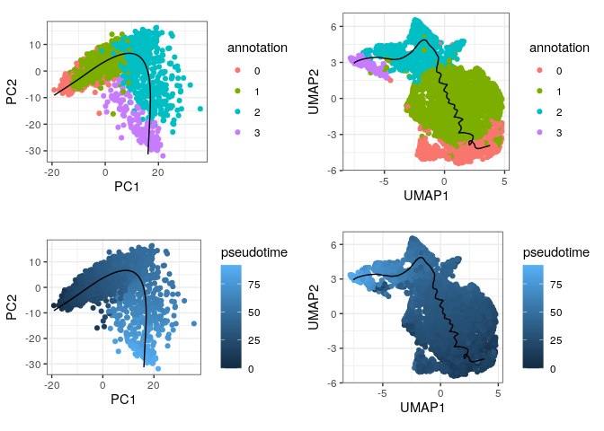

```         
df |>
  ggplot() +
  geom_point(aes(PC1, PC2, col = annotation)) +
  geom_path(data = pca_curve, aes(x = PC1, y = PC2)) +
  theme_bw() +
  coord_fixed() +
  facet_wrap(~condition)
```

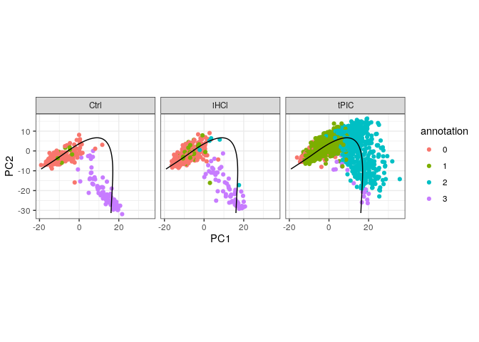

```         
# fig 6D optimized

library(ggplot2)
library(viridis)

p<- df |> 
  ggplot(aes(x = PC1, y = PC2)) + 
  geom_point(aes(color = pseudotime), size = 1, alpha = 0.8) +         # Tighter point size and transparency
  geom_path(data = pca_curve, aes(x = PC1, y = PC2), color = "black", linewidth = 0.8) + 
  scale_color_viridis(name = "Pseudotime", option = "viridis") +      # Better color scale
  coord_fixed() +
  theme_minimal(base_size = 14) +                                     # Cleaner theme
  theme(
    axis.title = element_text(size = 16),
    axis.text = element_text(size = 12),
    legend.title = element_text(size = 13),
    legend.text = element_text(size = 11),
    panel.grid.major = element_line(color = "grey90"),
    panel.grid.minor = element_blank()
  )

print(p)
```

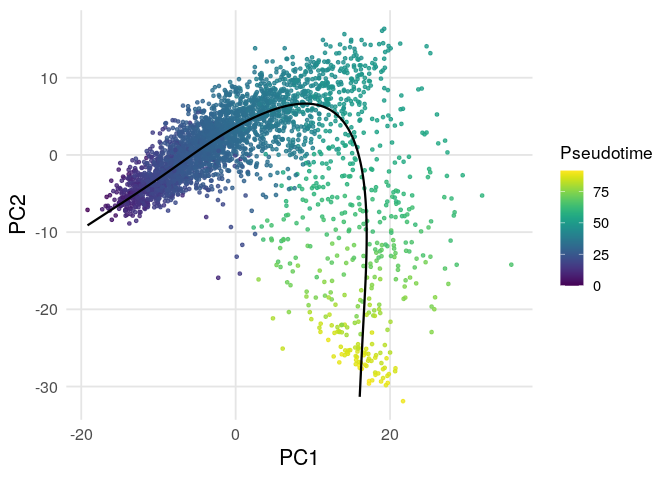

```         
ggsave("~/immune_cells/figures_revised/pseudotime_pca_plot.png", plot = p, width = 6, height = 8, units = "in", dpi = 600)


# Match the style to the previous plots
library(ggplot2)
library(RColorBrewer)

# Define the color palette
set2_palette <- brewer.pal(4, "Set2")

# Update the ggplot2-based plot to match DimPlot appearance
df |>
  ggplot(aes(x = PC1, y = PC2)) +
  geom_point(aes(col = annotation), size = 1.5, alpha = 0.5) +
  geom_path(data = pca_curve, aes(x = PC1, y = PC2)) +        
  scale_color_manual(values = set2_palette) +                  
  theme_minimal() +                                            
  theme(
    axis.text = element_text(size = 14),       
    axis.title = element_text(size = 16),   
    legend.title = element_text(size = 14),   
    legend.text = element_text(size = 12)     
  ) +
  coord_fixed()  
```

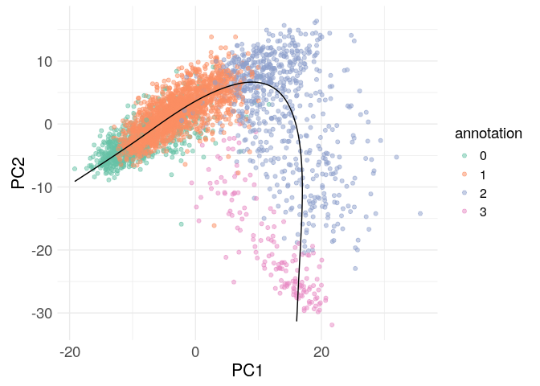

```         
# By conditions plot
library(ggplot2)
library(RColorBrewer)

# Define the color palette
set2_palette <- brewer.pal(4, "Set2")

# Update the faceted ggplot2 plot to match DimPlot appearance
p2<- df |>
  ggplot(aes(x = PC1, y = PC2)) +
  geom_point(aes(col = annotation), size = 1.5, alpha = 0.5) +  
  geom_path(data = pca_curve, aes(x = PC1, y = PC2)) +    
  scale_color_manual(values = set2_palette) +                  
  theme_minimal() +                                            
  theme(
    axis.text = element_text(size = 14),       
    axis.title = element_text(size = 16),     
    legend.title = element_text(size = 14),   
    legend.text = element_text(size = 12),    
    strip.text = element_text(size = 14)      
  ) +
  coord_fixed() +  
  facet_wrap(~condition)  

print(p2)
```

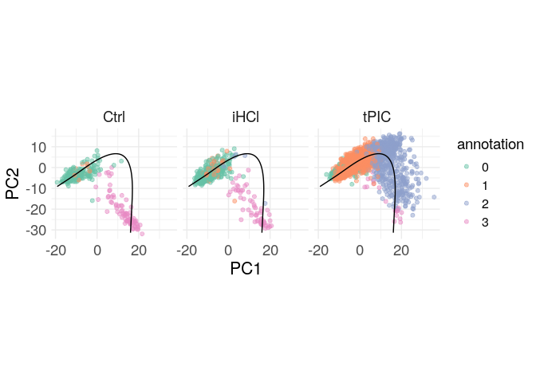

```         
ggsave("~/immune_cells/figures_revised/pseudotime_by_condition_pca_plot.png", plot = p2, width = 6, height = 8, units = "in", dpi = 600)

# Normalize the data
# Compute size factors for normalization
sce<- scuttle::logNormCounts(sce) 

# Ensure 'ident' is a factor or integer vector
sce$ident <- factor(sce$ident, levels = c(0, 1, 2, 3))

# Replace with new labels
levels(sce$ident) <- c("1", "2", "0", "1")
library(tidyverse)
# Genes of interest as a function of pseudotime
# This order: mCherry, MPEG1, RLRa, IFI44L
genes <- c('mCherry-plus-strand',"Nvec-vc1.1-XM-048733868.1","Nvec-vc1.1-XM-032385537.2","Nvec-vc1.1-XM-001625557.3")
fitExprs <- logcounts(sce[genes, ]) |> # ----------------------------------- Get norm. counts for genes of interest
  as.matrix() |> 
  t() |> 
  as_tibble() |> 
  mutate(  # ----------------------------------------------------------------- Add information for each cell
    cellID = colnames(sce), 
    annotation = factor(sce$ident), 
    pseudotime = sce$pseudotime
  ) |> 
  pivot_longer(contains(genes), names_to = 'gene', values_to = 'obs_expr') |> # - Pivot in "long" tidy format 
  mutate(gene = factor(gene, genes)) |> 
  group_by(gene) |> # ------------------------------------------------------- Group rows by genes
  nest(.key = 'data') |> # -------------------------------------------------- For each gene, extract the subtable into a column named data
  mutate(
    gamModel = map(data, ~mgcv::gam(obs_expr ~ s(pseudotime, bs = "cs"), data = .)), 
    gamFitted_expr = map(gamModel, predict) # ------------------------------ For each gene, fit the expression values ~ pseudotime with a GAM
  ) |> 
  dplyr::select(-ends_with('Model')) |> 
  unnest(c(data, ends_with('_expr'))) # -------------------------------------- Unnest all the modelled expressions
ggplot(fitExprs) + 
  geom_point(aes(x = pseudotime, y = obs_expr, col = annotation), alpha = 0.5) + 
  geom_line(aes(x = pseudotime, y = gamFitted_expr), col = 'white', size = 2, alpha = 0.5) + 
  geom_line(aes(x = pseudotime, y = gamFitted_expr), col = '#af2d0c', size = 1) +
  theme_bw() + 
  facet_grid(gene~., scales = 'free') + 
  labs(y = 'logcounts') + 
  ggtitle('Fitted models of pseudotime-dependent gene expression')
```

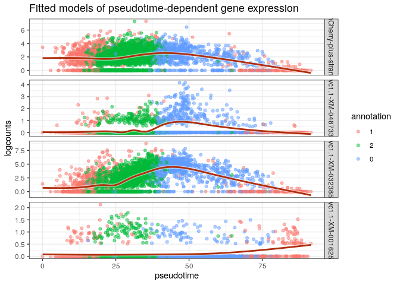

```         
setwd("~/immune_cells/scRNAseq_analysis/pseudotime_analysis/figs_publication/")


# Define the color palette
set2_palette <- brewer.pal(4, "Set2")

# Update the plot to match the DimPlot appearance
ggplot(fitExprs) +
  geom_point(aes(x = pseudotime, y = obs_expr, col = annotation), alpha = 0.5, size = 1.5) +  
  geom_line(aes(x = pseudotime, y = gamFitted_expr), col = 'white', size = 2, alpha = 0.5) +  
  geom_line(aes(x = pseudotime, y = gamFitted_expr), col = '#af2d0c', size = 1) +             
  scale_color_manual(values = set2_palette) +                                                
  theme_minimal() +                                                                         
  theme(
    axis.text = element_text(size = 14),       
    axis.title = element_text(size = 16),     
    legend.title = element_text(size = 14),   
    legend.text = element_text(size = 12),    
    strip.text = element_text(size = 14)      
  ) +
  facet_wrap(~gene, scales = 'free', ncol = 2) +      
  labs(
    y = 'logcounts',                           
    x = 'Pseudotime',                          
    title = 'Fitted models of pseudotime-dependent gene expression'
  )
```

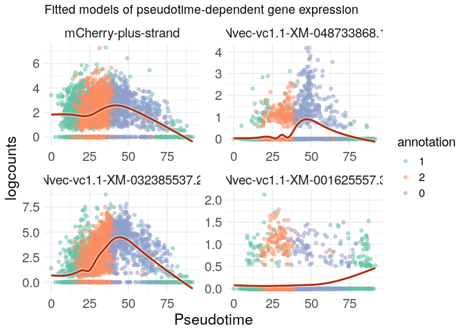

```         
# Over-representation analysis for the re-clustered data  -----------------


# Loading Nematostella annotation files
setwd("~/immune_cells/scRNAseq_analysis/annotaion/GOseq/")
list.files()

##  [1] "Consolidated_by_Gene.csv"         
##  [2] "GoName_InputClusterprofile.csv"   
##  [3] "GoName_NewAnnotation.csv"         
##  [4] "GoTerms_InputClusterProfile.csv"  
##  [5] "Goterms_NewAnnotation.csv"        
##  [6] "Goterms_PM.csv"                   
##  [7] "Goterms_PMC.csv"                  
##  [8] "GSEA_metrics_table.pdf"           
##  [9] "GSEA_metrics_table.png"           
## [10] "ImmuneGenes_56.xlsx"              
## [11] "mCherry_upregulated_ORA.txt"      
## [12] "shared_immune_genes_31outOf48.csv"

TermGene  <- read.csv(file = 'GoName_NewAnnotation.csv',header=TRUE, check.names=FALSE)
head(TermGene)

##      Go_Term                       Ids
## 1 GO:0004930 Nvec_vc1.1_XM_001617885.3
## 2 GO:0008188 Nvec_vc1.1_XM_001617885.3
## 3 GO:0007165 Nvec_vc1.1_XM_001617885.3
## 4 GO:0007186 Nvec_vc1.1_XM_001617885.3
## 5 GO:0003677 Nvec_vc1.1_XM_001618208.3
## 6 GO:0030527 Nvec_vc1.1_XM_001618208.3

is.data.frame(TermGene)

## [1] TRUE

TermName  <- read.csv(file = 'Goterms_NewAnnotation.csv',header=TRUE, check.names=FALSE)
head(TermName)

##      Go_Term                                         Name
## 1 GO:0004930          G protein-coupled receptor activity
## 2 GO:0008188               neuropeptide receptor activity
## 3 GO:0007165                          signal transduction
## 4 GO:0007186 G protein-coupled receptor signaling pathway
## 5 GO:0003677                                  DNA binding
## 6 GO:0030527          structural constituent of chromatin

is.data.frame(TermName)

## [1] TRUE

#Running ORA 
library(clusterProfiler)

# Visualize cluster 0 and 1 (ORA analysis) 

df1 <- merged_df %>% filter (cluster == 0) 
rownames(df1) <- gsub("-", "_", rownames(df1))
keep<- df1$p_val_adj <0.05 & df1$avg_log2FC> 0.5
# 129 genes

df1<- df1[keep,] 
clust0<- rownames(df1)
nrow(df1)

## [1] 129

clust0<- rownames(df1)


df2 <- merged_df %>% filter (cluster == 1) 
rownames(df2) <- gsub("-", "_", rownames(df2))
keep<- df2$p_val_adj <0.05 & df2$avg_log2FC> 0.5
df2<- df2[keep,] 
nrow(df2)

## [1] 477

clust1<- rownames(df2)

gene_lists <- list(
  Condition1 = clust0,
  Condition2 = clust1
)

library(clusterProfiler)

cc_result <- compareCluster(geneCluster = gene_lists, fun = "enricher", pvalueCutoff = 0.05, pAdjustMethod = "BH", minGSSize = 10, maxGSSize = 500, qvalueCutoff = 0.2, TERM2GENE = TermGene, TERM2NAME = TermName)

dotplot(cc_result, showCategory = 8, font.size = 12) + ggtitle("Enrichment Comparison")
```

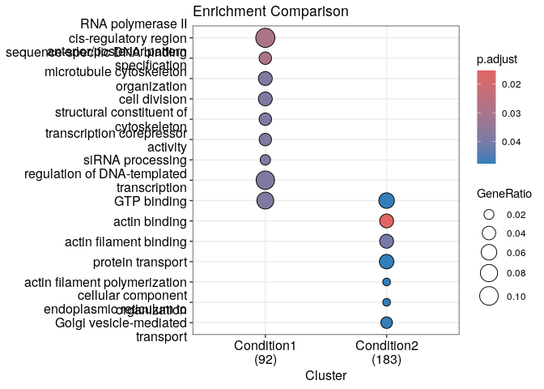

```         
res1 <- enricher(gene_lists[[1]], pvalueCutoff = 0.05, pAdjustMethod = "BH", minGSSize = 10, maxGSSize = 500, qvalueCutoff = 0.2, TERM2GENE = TermGene, TERM2NAME = TermName)
res2 <- enricher(gene_lists[[2]], pvalueCutoff = 0.05, pAdjustMethod = "BH", minGSSize = 10, maxGSSize = 500, qvalueCutoff = 0.2, TERM2GENE = TermGene, TERM2NAME = TermName)

res1@result$group <- "Condition1"
res2@result$group <- "Condition2"

combined <- rbind(res1@result, res2@result)
top_terms <- combined %>%
  group_by(group) %>%
  slice_min(p.adjust, n = 10)  


library(ggplot2)

ggplot(top_terms, aes(x = -log10(p.adjust), y = fct_reorder(Description, p.adjust), color = group)) +
  geom_point(size = 3) +
  facet_wrap(~ group, scales = "free_y") +
  labs(x = "-log10 adjusted p-value", y = "GO Term", title = "GO Enrichment") +
  theme_bw()
```

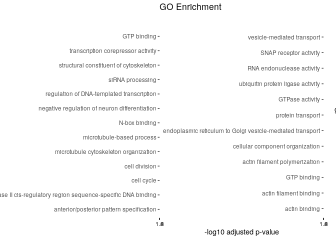
