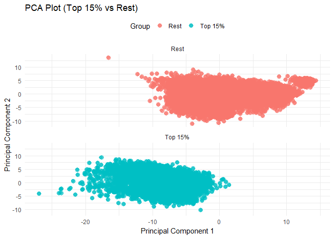
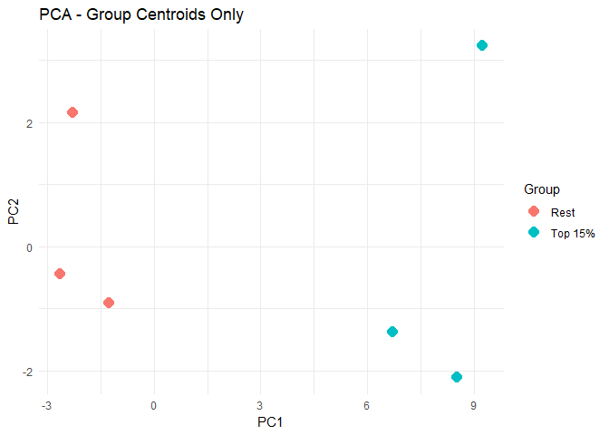
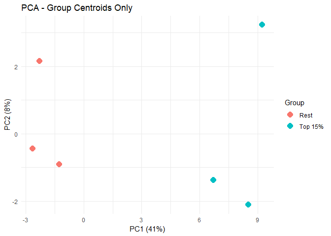
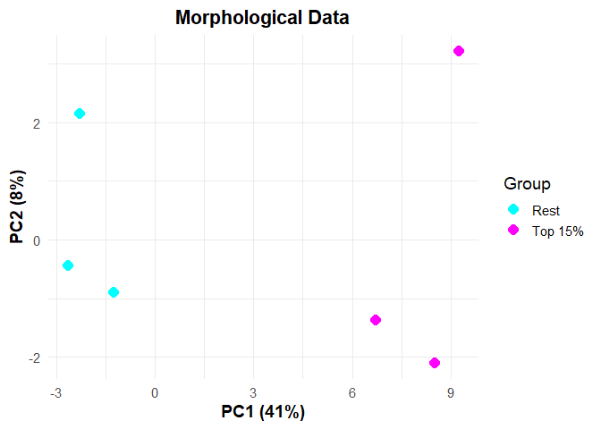
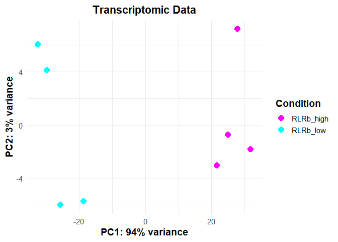
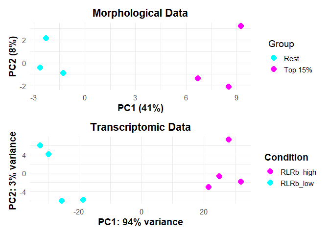
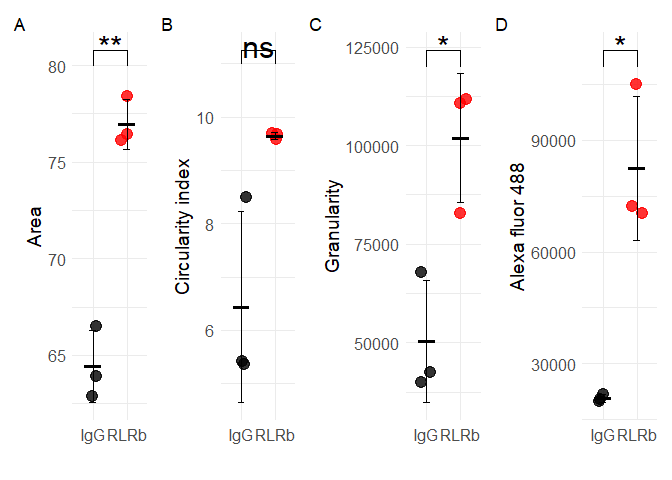

## 

---
title: "Imaging cytometry analysis"
author: "Itamar Kozlovski"
date: "2026-01-17"
---

## Data availability

All processed ImageStream flow cytometry data used in this analysis are publicly available from the following Zenodo repository under the [DOI:\\](DOI:\){.uri} [**https://doi.org/10.5281/zenodo.18212340**](https://doi.org/10.5281/zenodo.18212340){.uri}.

The processed single-cell feature tables used for downstream analysis (CSV format) are included within the archive\
**`ImageStream_processed.tar.gz`**, which contains all extracted quantitative measurements generated from the ImageStream experiments.

## Script description

This script performs a global quantitative analysis of individual morphological and intensity-based features extracted from ImageStream flow cytometry data across three independent biological replicates. Per-cell feature tables were first combined across replicates, followed by filtering and quality-control steps to remove missing values and non-informative features. Summary statistics were computed for individual features across experimental conditions and replicates.

To assess global patterns in cellular morphology and fluorescence intensity, principal component analysis (PCA) was performed on scaled feature values. Cells were additionally stratified based on RLRb fluorescence intensity to compare the top 15% of RLRb-expressing cells with the remaining population. PCA results were visualized to evaluate differences in multivariate feature space between groups and across biological replicates.

``` r
# PCA analysis  -----------------------------------------------------------
library(tidyverse)
library(ggplot2)
library(ggpubr)

setwd("~/immune_cells/cnidarian_immune_cells/05_Imaging_cytometry_analysis/input/")


RLRb1<- read.csv("RLRb_exp_1.csv", header = T, skip = 1)
RLRb2<- read.csv("RLRb_exp_2.csv", header = T, skip = 1)
RLRb3<- read.csv("RLRb_exp_3.csv", header = T, skip = 1)
IgG1<- read.csv("IgG_exp_1.csv", header = T, skip = 1)
IgG2<- read.csv("IgG_exp_2.csv", header = T, skip = 1)
IgG3<- read.csv("IgG_exp_3.csv", header = T, skip = 1)


#Add a column for replicate number and status (IgG vs. RLRb)
RLRb1$status<- "RLRb1"
RLRb1$replicate<- 1

RLRb2$status<- "RLRb2"
RLRb2$replicate<- 2

RLRb3$status<- "RLRb3"
RLRb3$replicate<- 3

IgG1$status<- "IgG1"
IgG1$replicate<- 1

IgG2$status<- "IgG2"
IgG2$replicate<- 2

IgG3$status<- "IgG3"
IgG3$replicate<- 3


# Compare the to 15% of RLRb expressing cells against the rest

combined.rlrb<- rbind(RLRb1,RLRb2,RLRb3)
dim(combined.rlrb)

## [1] 39325   106

colnames(combined.rlrb)

##   [1] "Object.Number"                            
##   [2] "Area_M02"                                 
##   [3] "Area_M06"                                 
##   [4] "Area_MC"                                  
##   [5] "Aspect.Ratio_M02"                         
##   [6] "Aspect.Ratio_M06"                         
##   [7] "Aspect.Ratio.Intensity_M02_Ch02"          
##   [8] "Aspect.Ratio.Intensity_M06_Ch06"          
##   [9] "Bkgd.Mean_Ch02"                           
##  [10] "Bkgd.Mean_Ch06"                           
##  [11] "Modulation_M02_Ch02"                      
##  [12] "Modulation_M06_Ch06"                      
##  [13] "Contrast_M02_Ch02"                        
##  [14] "Contrast_M06_Ch06"                        
##  [15] "Gradient.RMS_M02_Ch02"                    
##  [16] "Gradient.RMS_M06_Ch06"                    
##  [17] "Intensity_MC_Ch02"                        
##  [18] "Intensity_MC_Ch06"                        
##  [19] "Mean.Pixel_M02_Ch02"                      
##  [20] "Mean.Pixel_M06_Ch06"                      
##  [21] "Median.Pixel_M02_Ch02"                    
##  [22] "Median.Pixel_M06_Ch06"                    
##  [23] "Max.Pixel_MC_Ch02"                        
##  [24] "Max.Pixel_MC_Ch06"                        
##  [25] "Raw.Max.Pixel_MC_Ch02"                    
##  [26] "Raw.Max.Pixel_MC_Ch06"                    
##  [27] "Raw.Min.Pixel_MC_Ch02"                    
##  [28] "Raw.Min.Pixel_MC_Ch06"                    
##  [29] "Length_M02"                               
##  [30] "Length_M06"                               
##  [31] "Width_M02"                                
##  [32] "Width_M06"                                
##  [33] "Height_M02"                               
##  [34] "Height_M06"                               
##  [35] "Saturation.Count_M02_Ch02"                
##  [36] "Saturation.Count_M06_Ch06"                
##  [37] "Saturation.Percent_M02_Ch02"              
##  [38] "Saturation.Percent_M06_Ch06"              
##  [39] "Bright.Detail.Intensity.R3_MC_Ch02"       
##  [40] "Bright.Detail.Intensity.R3_MC_Ch06"       
##  [41] "Time"                                     
##  [42] "Object.Number.1"                          
##  [43] "Raw.Centroid.X"                           
##  [44] "Raw.Centroid.Y"                           
##  [45] "Flow.Speed"                               
##  [46] "Circularity_Morphology.M02.Ch02."         
##  [47] "Intensity_MC_Ch05"                        
##  [48] "Circularity_Morphology.M05.Ch05."         
##  [49] "Circularity_Morphology.M06.Ch06."         
##  [50] "Bright.Detail.Similarity.R3_MC_Ch02_Ch05" 
##  [51] "Similarity_Morphology.M02.Ch02._Ch05_Ch02"
##  [52] "Mean.Pixel.Ch05"                          
##  [53] "Median.Pixel.Ch05"                        
##  [54] "Gradient.RMS.Ch05"                        
##  [55] "Bkgd.Mean_Ch05"                           
##  [56] "Bkgd.StdDev_Ch05"                         
##  [57] "Compactness_M05_Ch05"                     
##  [58] "Diameter_M05"                             
##  [59] "Gradient.Max_M05_Ch05"                    
##  [60] "Length_M05"                               
##  [61] "Max.Pixel_M05_Ch05"                       
##  [62] "Min.Pixel_M05_Ch05"                       
##  [63] "Minor.Axis_M05"                           
##  [64] "Minor.Axis.Intensity_M05_Ch05"            
##  [65] "Modulation_M05_Ch05"                      
##  [66] "Raw.Max.Pixel_M05_Ch05"                   
##  [67] "Raw.Mean.Pixel_M05_Ch05"                  
##  [68] "Raw.Median.Pixel_M05_Ch05"                
##  [69] "Raw.Min.Pixel_M05_Ch05"                   
##  [70] "Saturation.Count_M05_Ch05"                
##  [71] "Saturation.Percent_M05_Ch05"              
##  [72] "Width_M05"                                
##  [73] "Area_M05"                                 
##  [74] "Aspect.Ratio_M05"                         
##  [75] "Aspect.Ratio.Intensity_M05_Ch05"          
##  [76] "Contrast_M05_Ch05"                        
##  [77] "H.Contrast.Mean_M05_Ch05_5"               
##  [78] "H.Contrast.Std_M05_Ch05_5"                
##  [79] "H.Correlation.Mean_M05_Ch05_5"            
##  [80] "H.Correlation.Std_M05_Ch05_5"             
##  [81] "H.Energy.Mean_M05_Ch05_5"                 
##  [82] "H.Energy.Std_M05_Ch05_5"                  
##  [83] "H.Entropy.Mean_M05_Ch05_5"                
##  [84] "H.Entropy.Std_M05_Ch05_5"                 
##  [85] "Height_M05"                               
##  [86] "Raw.Intensity_M05_Ch05"                   
##  [87] "Shape.Ratio_M05"                          
##  [88] "Spot.Area.Min_M05"                        
##  [89] "Spot.Count_M05_4"                         
##  [90] "Spot.Distance.Min_M05"                    
##  [91] "Spot.Intensity.Max_M05_Ch05"              
##  [92] "Spot.Intensity.Min_M05_Ch05"              
##  [93] "Thickness.Max_M05"                        
##  [94] "Thickness.Min_M05"                        
##  [95] "Max.Pixel_MC_Ch05"                        
##  [96] "Internalization_Erode.M02..4._Ch05"       
##  [97] "Area_Morphology.M02.Ch02."                
##  [98] "Intensity_Morphology.M02.Ch02._Ch02"      
##  [99] "Gradient.RMS_M01_Ch01"                    
## [100] "Area_M01"                                 
## [101] "Aspect.Ratio_M01"                         
## [102] "Circularity_Morphology.M02.Ch02.1"        
## [103] "Intensity_MC_Ch01"                        
## [104] "Circularity_Object.M01.Ch01.Tight."       
## [105] "status"                                   
## [106] "replicate"

#1: Split into top 15% vs the rest
threshold <- quantile(combined.rlrb$Intensity_MC_Ch02, 0.85) # Top 15% threshold
df <- combined.rlrb %>%
  mutate(Group = ifelse(Intensity_MC_Ch02 >= threshold, "Top 15%", "Rest"))
dim(df)

## [1] 39325   107

#2: Select numeric data and remove zero-variance columns
# Ensure `Group` is retained for alignment
numeric_data <- df %>%
  select(-status, -Intensity_MC_Ch02, -replicate) %>% na.omit() %>% 
  select(Group ,where(~ is.numeric(.) && var(.) > 0.01))

#3: Perform PCA on scaled data
pca_result <- prcomp(select(numeric_data, -Group), scale. = TRUE)

#4: Add PCA results and Group column
pca_df <- as.data.frame(pca_result$x) %>%
  bind_cols(Group = numeric_data$Group)

# Step 5: Visualize PCA by Group
ggplot(pca_df, aes(x = PC1, y = PC2, color = Group)) +
  geom_point(size = 3, alpha = 0.7, shape = 16) +  
  labs(
    title = "PCA Plot (Top 15% vs Rest)",
    x = "Principal Component 1",
    y = "Principal Component 2"
  ) +
  theme_minimal() +
  theme(legend.position = "top") +
  facet_wrap(~ Group, ncol = 1) +
  geom_jitter(width = 0.1, height = 0.1, alpha = 0.5, size = 2)
```



```         
# Show only the centroids representing each of the replicates 

#1: Split data into Top 15% vs Rest for each status
df_split <- df %>%
  group_by(status) %>%
  mutate(
    Group = ifelse(Intensity_MC_Ch02 >= quantile(Intensity_MC_Ch02, 0.85), "Top 15%", "Rest")
  )

#2: Select numeric data and remove zero-variance columns

numeric_data <- df_split %>%
  select( -Intensity_MC_Ch02, -replicate, -Object.Number) %>% na.omit() %>% 
  select(Group, status, where(~ is.numeric(.) && var(.) > 0.01))
colnames(numeric_data)

##  [1] "Group"                                    
##  [2] "status"                                   
##  [3] "Area_M02"                                 
##  [4] "Area_M06"                                 
##  [5] "Area_MC"                                  
##  [6] "Aspect.Ratio_M06"                         
##  [7] "Aspect.Ratio.Intensity_M02_Ch02"          
##  [8] "Aspect.Ratio.Intensity_M06_Ch06"          
##  [9] "Bkgd.Mean_Ch02"                           
## [10] "Bkgd.Mean_Ch06"                           
## [11] "Modulation_M02_Ch02"                      
## [12] "Modulation_M06_Ch06"                      
## [13] "Contrast_M02_Ch02"                        
## [14] "Contrast_M06_Ch06"                        
## [15] "Gradient.RMS_M02_Ch02"                    
## [16] "Gradient.RMS_M06_Ch06"                    
## [17] "Intensity_MC_Ch06"                        
## [18] "Mean.Pixel_M02_Ch02"                      
## [19] "Mean.Pixel_M06_Ch06"                      
## [20] "Median.Pixel_M02_Ch02"                    
## [21] "Median.Pixel_M06_Ch06"                    
## [22] "Max.Pixel_MC_Ch02"                        
## [23] "Max.Pixel_MC_Ch06"                        
## [24] "Raw.Max.Pixel_MC_Ch02"                    
## [25] "Raw.Max.Pixel_MC_Ch06"                    
## [26] "Raw.Min.Pixel_MC_Ch02"                    
## [27] "Raw.Min.Pixel_MC_Ch06"                    
## [28] "Length_M02"                               
## [29] "Length_M06"                               
## [30] "Width_M02"                                
## [31] "Width_M06"                                
## [32] "Height_M02"                               
## [33] "Height_M06"                               
## [34] "Saturation.Count_M02_Ch02"                
## [35] "Saturation.Count_M06_Ch06"                
## [36] "Bright.Detail.Intensity.R3_MC_Ch02"       
## [37] "Bright.Detail.Intensity.R3_MC_Ch06"       
## [38] "Time"                                     
## [39] "Object.Number.1"                          
## [40] "Raw.Centroid.X"                           
## [41] "Raw.Centroid.Y"                           
## [42] "Flow.Speed"                               
## [43] "Circularity_Morphology.M02.Ch02."         
## [44] "Intensity_MC_Ch05"                        
## [45] "Circularity_Morphology.M05.Ch05."         
## [46] "Circularity_Morphology.M06.Ch06."         
## [47] "Bright.Detail.Similarity.R3_MC_Ch02_Ch05" 
## [48] "Similarity_Morphology.M02.Ch02._Ch05_Ch02"
## [49] "Mean.Pixel.Ch05"                          
## [50] "Median.Pixel.Ch05"                        
## [51] "Gradient.RMS.Ch05"                        
## [52] "Bkgd.Mean_Ch05"                           
## [53] "Bkgd.StdDev_Ch05"                         
## [54] "Compactness_M05_Ch05"                     
## [55] "Diameter_M05"                             
## [56] "Gradient.Max_M05_Ch05"                    
## [57] "Length_M05"                               
## [58] "Max.Pixel_M05_Ch05"                       
## [59] "Min.Pixel_M05_Ch05"                       
## [60] "Minor.Axis_M05"                           
## [61] "Minor.Axis.Intensity_M05_Ch05"            
## [62] "Modulation_M05_Ch05"                      
## [63] "Raw.Max.Pixel_M05_Ch05"                   
## [64] "Raw.Mean.Pixel_M05_Ch05"                  
## [65] "Raw.Median.Pixel_M05_Ch05"                
## [66] "Raw.Min.Pixel_M05_Ch05"                   
## [67] "Width_M05"                                
## [68] "Area_M05"                                 
## [69] "Aspect.Ratio_M05"                         
## [70] "Aspect.Ratio.Intensity_M05_Ch05"          
## [71] "Contrast_M05_Ch05"                        
## [72] "H.Correlation.Mean_M05_Ch05_5"            
## [73] "H.Entropy.Mean_M05_Ch05_5"                
## [74] "H.Entropy.Std_M05_Ch05_5"                 
## [75] "Height_M05"                               
## [76] "Raw.Intensity_M05_Ch05"                   
## [77] "Shape.Ratio_M05"                          
## [78] "Spot.Area.Min_M05"                        
## [79] "Spot.Count_M05_4"                         
## [80] "Spot.Distance.Min_M05"                    
## [81] "Spot.Intensity.Max_M05_Ch05"              
## [82] "Spot.Intensity.Min_M05_Ch05"              
## [83] "Thickness.Max_M05"                        
## [84] "Thickness.Min_M05"                        
## [85] "Max.Pixel_MC_Ch05"                        
## [86] "Internalization_Erode.M02..4._Ch05"       
## [87] "Area_Morphology.M02.Ch02."                
## [88] "Intensity_Morphology.M02.Ch02._Ch02"      
## [89] "Gradient.RMS_M01_Ch01"                    
## [90] "Area_M01"                                 
## [91] "Circularity_Morphology.M02.Ch02.1"        
## [92] "Intensity_MC_Ch01"                        
## [93] "Circularity_Object.M01.Ch01.Tight."

numeric_data_clean <- numeric_data %>%
  ungroup() %>%
  select(-Group, -status)

#3 Standardize the data before PCA
numeric_data_scaled <- scale(numeric_data_clean)
dim(numeric_data_clean)

## [1] 28409    91

#4: Perform PCA on the scaled numeric data
pca_result <- prcomp(numeric_data_scaled, scale. = TRUE)

# Step 5: Add PCA results and status + Group columns for visualization
pca_df <- as.data.frame(pca_result$x) %>%
  bind_cols(Group = numeric_data$Group, status = numeric_data$status)

# Calculate centroids (means) for each group
centroids <- pca_df %>%
  group_by(Group, status) %>%
  summarise(PC1 = mean(PC1), PC2 = mean(PC2), .groups = 'drop')

# Now plot the PCA with only the centroids (dots for the centroids)
ggplot() +
  geom_point(data = centroids, aes(x = PC1, y = PC2, color = Group), size = 4, shape = 16) +
  labs(x = "PC1", y = "PC2", title = "PCA - Group Centroids Only") +
  theme_minimal()
```



```         
# Variance explained
# Extract variance explained
variances <- pca_result$sdev^2  # squared singular values (standard deviations)
variance_explained <- variances / sum(variances) * 100  # percentage variance explained

# Create PCA plot with variance explained on the axes
ggplot() +
  geom_point(data = centroids, aes(x = PC1, y = PC2, color = Group), size = 4, shape = 16) +
  labs(
    x = paste("PC1 (", round(variance_explained[1]), "%)", sep = ""),
    y = paste("PC2 (", round(variance_explained[2]), "%)", sep = ""),
    title = "PCA - Group Centroids Only"
  ) +
  theme_minimal()
```



```         
# Define custom colors
centroids$Group

## [1] "Rest"    "Rest"    "Rest"    "Top 15%" "Top 15%"
## [6] "Top 15%"

custom_colors <- c("Rest" = "cyan", "Top 15%" = "magenta") 

# Create the plot
pca_plot1 <- ggplot(data = centroids) +
  geom_point(
    aes(x = PC1, y = PC2, color = Group),
    size = 4,
    shape = 16
  ) +
  scale_color_manual(values = custom_colors) +
  labs(
    x = paste("PC1 (", round(variance_explained[1]), "%)", sep = ""),
    y = paste("PC2 (", round(variance_explained[2]), "%)", sep = ""),
    title = "Morphological Data",
    color = "Group"  
  ) +
  theme_minimal(base_size = 14) + 
  theme(
    plot.title = element_text(hjust = 0.5, face = "bold"), 
    axis.title = element_text(face = "bold"),             
    legend.position = "right"                             
  )

# Display the plot
print(pca_plot1)
```



```         
# PCA for transcriptomic data
pcaData<- readRDS("pcaData.rds")
percentVar<- readRDS("percentVar.rds")
# Define custom colors for Conditions
custom_colors <- c("RLRb_low" = "cyan", "RLRb_high" = "magenta") 

# Create PCA plot
pca_plot2 <- ggplot(pcaData, aes(x = PC1, y = PC2, label = rownames(pcaData), color = Condition)) +
  geom_point(size = 4, shape = 16) +                            
  scale_color_manual(values = custom_colors) +                
  labs(
    x = paste0("PC1: ", percentVar[1], "% variance"),
    y = paste0("PC2: ", percentVar[2], "% variance"),
    title = "Transcriptomic Data",
    color = "Condition"                                          
  ) +
  theme_minimal(base_size = 14) +                               
  theme(
    plot.title = element_text(hjust = 0.5, face = "bold"),      
    axis.title = element_text(face = "bold"),                  
    legend.position = "right",                                 
    legend.title = element_text(face = "bold")                 
  )

# Display the plot
print(pca_plot2)
```



```         
# Plot them together in 1 column
library(patchwork)
# Combine both PCA plots into one column
combined_plot <- pca_plot1 / pca_plot2

# Display the combined plot
print(combined_plot)
```



```         
# Extract the loadings
# Extract PCA loadings (eigenvectors)
loadings <- pca_result$rotation

# Compute the absolute values of the loadings for the first PC and second PC
pc1_loadings <- abs(loadings[, 1])  # Absolute values for PC1
pc2_loadings <- abs(loadings[, 2])  # Absolute values for PC2

# Rank features by their contribution to the first principal component (PC1)
pc1_contrib <- sort(pc1_loadings, decreasing = TRUE)
top_features_pc1 <- names(pc1_contrib)[1:20]  # Top 10 features contributing to PC1

# Rank features by their contribution to the second principal component (PC2)
pc2_contrib <- sort(pc2_loadings, decreasing = TRUE)
top_features_pc2 <- names(pc2_contrib)[1:20]  # Top 10 features contributing to PC2

# Print the top features for both PC1 and PC2
cat("Top 10 features contributing to PC1:\n", top_features_pc1, "\n")

## Top 10 features contributing to PC1:
##  Diameter_M05 Minor.Axis_M05 Width_M02 Width_M05 Area_M02 Raw.Intensity_M05_Ch05 Intensity_MC_Ch05 Area_M01 Area_M05 Thickness.Max_M05 Spot.Area.Min_M05 Height_M02 Area_MC Height_M05 Length_M02 Length_M05 Area_Morphology.M02.Ch02. Area_M06 Width_M06 Thickness.Min_M05

cat("Top 10 features contributing to PC2:\n", top_features_pc2, "\n")

## Top 10 features contributing to PC2:
##  Circularity_Morphology.M06.Ch06. Intensity_MC_Ch01 Raw.Max.Pixel_M05_Ch05 Max.Pixel_M05_Ch05 Max.Pixel_MC_Ch05 Spot.Intensity.Min_M05_Ch05 Spot.Intensity.Max_M05_Ch05 Raw.Mean.Pixel_M05_Ch05 Mean.Pixel.Ch05 Bkgd.Mean_Ch05 Modulation_M05_Ch05 Aspect.Ratio.Intensity_M06_Ch06 Gradient.RMS.Ch05 Bkgd.Mean_Ch06 Raw.Median.Pixel_M05_Ch05 Median.Pixel.Ch05 Aspect.Ratio_M06 Raw.Min.Pixel_MC_Ch02 Modulation_M02_Ch02 Gradient.Max_M05_Ch05

# Individual plots of IDEAS data --------

# Combine all data 

combined.data<- rbind(IgG1,IgG2,IgG3,RLRb1,RLRb2,RLRb3)

#Get the median intensity of antibody staining  for each condition 
dim(combined.data)

## [1] 82340   106

colnames(combined.data)

##   [1] "Object.Number"                            
##   [2] "Area_M02"                                 
##   [3] "Area_M06"                                 
##   [4] "Area_MC"                                  
##   [5] "Aspect.Ratio_M02"                         
##   [6] "Aspect.Ratio_M06"                         
##   [7] "Aspect.Ratio.Intensity_M02_Ch02"          
##   [8] "Aspect.Ratio.Intensity_M06_Ch06"          
##   [9] "Bkgd.Mean_Ch02"                           
##  [10] "Bkgd.Mean_Ch06"                           
##  [11] "Modulation_M02_Ch02"                      
##  [12] "Modulation_M06_Ch06"                      
##  [13] "Contrast_M02_Ch02"                        
##  [14] "Contrast_M06_Ch06"                        
##  [15] "Gradient.RMS_M02_Ch02"                    
##  [16] "Gradient.RMS_M06_Ch06"                    
##  [17] "Intensity_MC_Ch02"                        
##  [18] "Intensity_MC_Ch06"                        
##  [19] "Mean.Pixel_M02_Ch02"                      
##  [20] "Mean.Pixel_M06_Ch06"                      
##  [21] "Median.Pixel_M02_Ch02"                    
##  [22] "Median.Pixel_M06_Ch06"                    
##  [23] "Max.Pixel_MC_Ch02"                        
##  [24] "Max.Pixel_MC_Ch06"                        
##  [25] "Raw.Max.Pixel_MC_Ch02"                    
##  [26] "Raw.Max.Pixel_MC_Ch06"                    
##  [27] "Raw.Min.Pixel_MC_Ch02"                    
##  [28] "Raw.Min.Pixel_MC_Ch06"                    
##  [29] "Length_M02"                               
##  [30] "Length_M06"                               
##  [31] "Width_M02"                                
##  [32] "Width_M06"                                
##  [33] "Height_M02"                               
##  [34] "Height_M06"                               
##  [35] "Saturation.Count_M02_Ch02"                
##  [36] "Saturation.Count_M06_Ch06"                
##  [37] "Saturation.Percent_M02_Ch02"              
##  [38] "Saturation.Percent_M06_Ch06"              
##  [39] "Bright.Detail.Intensity.R3_MC_Ch02"       
##  [40] "Bright.Detail.Intensity.R3_MC_Ch06"       
##  [41] "Time"                                     
##  [42] "Object.Number.1"                          
##  [43] "Raw.Centroid.X"                           
##  [44] "Raw.Centroid.Y"                           
##  [45] "Flow.Speed"                               
##  [46] "Circularity_Morphology.M02.Ch02."         
##  [47] "Intensity_MC_Ch05"                        
##  [48] "Circularity_Morphology.M05.Ch05."         
##  [49] "Circularity_Morphology.M06.Ch06."         
##  [50] "Bright.Detail.Similarity.R3_MC_Ch02_Ch05" 
##  [51] "Similarity_Morphology.M02.Ch02._Ch05_Ch02"
##  [52] "Mean.Pixel.Ch05"                          
##  [53] "Median.Pixel.Ch05"                        
##  [54] "Gradient.RMS.Ch05"                        
##  [55] "Bkgd.Mean_Ch05"                           
##  [56] "Bkgd.StdDev_Ch05"                         
##  [57] "Compactness_M05_Ch05"                     
##  [58] "Diameter_M05"                             
##  [59] "Gradient.Max_M05_Ch05"                    
##  [60] "Length_M05"                               
##  [61] "Max.Pixel_M05_Ch05"                       
##  [62] "Min.Pixel_M05_Ch05"                       
##  [63] "Minor.Axis_M05"                           
##  [64] "Minor.Axis.Intensity_M05_Ch05"            
##  [65] "Modulation_M05_Ch05"                      
##  [66] "Raw.Max.Pixel_M05_Ch05"                   
##  [67] "Raw.Mean.Pixel_M05_Ch05"                  
##  [68] "Raw.Median.Pixel_M05_Ch05"                
##  [69] "Raw.Min.Pixel_M05_Ch05"                   
##  [70] "Saturation.Count_M05_Ch05"                
##  [71] "Saturation.Percent_M05_Ch05"              
##  [72] "Width_M05"                                
##  [73] "Area_M05"                                 
##  [74] "Aspect.Ratio_M05"                         
##  [75] "Aspect.Ratio.Intensity_M05_Ch05"          
##  [76] "Contrast_M05_Ch05"                        
##  [77] "H.Contrast.Mean_M05_Ch05_5"               
##  [78] "H.Contrast.Std_M05_Ch05_5"                
##  [79] "H.Correlation.Mean_M05_Ch05_5"            
##  [80] "H.Correlation.Std_M05_Ch05_5"             
##  [81] "H.Energy.Mean_M05_Ch05_5"                 
##  [82] "H.Energy.Std_M05_Ch05_5"                  
##  [83] "H.Entropy.Mean_M05_Ch05_5"                
##  [84] "H.Entropy.Std_M05_Ch05_5"                 
##  [85] "Height_M05"                               
##  [86] "Raw.Intensity_M05_Ch05"                   
##  [87] "Shape.Ratio_M05"                          
##  [88] "Spot.Area.Min_M05"                        
##  [89] "Spot.Count_M05_4"                         
##  [90] "Spot.Distance.Min_M05"                    
##  [91] "Spot.Intensity.Max_M05_Ch05"              
##  [92] "Spot.Intensity.Min_M05_Ch05"              
##  [93] "Thickness.Max_M05"                        
##  [94] "Thickness.Min_M05"                        
##  [95] "Max.Pixel_MC_Ch05"                        
##  [96] "Internalization_Erode.M02..4._Ch05"       
##  [97] "Area_Morphology.M02.Ch02."                
##  [98] "Intensity_Morphology.M02.Ch02._Ch02"      
##  [99] "Gradient.RMS_M01_Ch01"                    
## [100] "Area_M01"                                 
## [101] "Aspect.Ratio_M01"                         
## [102] "Circularity_Morphology.M02.Ch02.1"        
## [103] "Intensity_MC_Ch01"                        
## [104] "Circularity_Object.M01.Ch01.Tight."       
## [105] "status"                                   
## [106] "replicate"

median.intensity <- combined.data |>
  na.omit() |>
  dplyr::filter(Intensity_MC_Ch02 > 0) |>
  dplyr::group_by(status, replicate) |>
  dplyr::summarise(
    median_fluoresence_intensity = median(Intensity_MC_Ch02),
    .groups = "drop"
  )


print(median.intensity)

## # A tibble: 6 × 3
##   status replicate median_fluoresence_intensity
##   <chr>      <dbl>                        <dbl>
## 1 IgG1           1                        9531.
## 2 IgG2           2                        7704.
## 3 IgG3           3                        7846.
## 4 RLRb1          1                       26209.
## 5 RLRb2          2                       37701.
## 6 RLRb3          3                       27219.

# For the actual comparison I used the statistics computed based on the gating in IDEAS software

#Area median from software MO1 (brightfield)


Area_dat<- data.frame(Ab = c(rep("IgG",3),rep("RLRb",3)), value = c(66.44,64,62.78,78.44,76.06,76.33))
t.test(data = Area_dat, value~Ab)

## 
##  Welch Two Sample t-test
## 
## data:  value by Ab
## t = -9.5488, df = 3.5785, p-value = 0.001134
## alternative hypothesis: true difference in means between group IgG and group RLRb is not equal to 0
## 95 percent confidence interval:
##  -16.357606  -8.715728
## sample estimates:
##  mean in group IgG mean in group RLRb 
##           64.40667           76.94333

#p= 001134

library('Hmisc')

# Calculate mean and standard deviation for each group
summary_data <- Area_dat %>%
  group_by(Ab) %>%
  summarise(
    mean = mean(value),
    sd = sd(value)
  )

my_comparisons <- list( c("IgG", "RLRb"))


P<- ggplot(Area_dat, aes(x = Ab, y = value, color = Ab)) +
  geom_point(size = 4, position = position_jitter(width = 0.2), alpha = 0.8) +  
  stat_summary(fun = mean, geom = "crossbar", width = 0.5, color = "black", aes(ymin = ..y.., ymax = ..y..)) +  # Add mean line
  # Add standard deviation error bars
  geom_errorbar(data = summary_data, aes(y = mean, ymin = mean - sd, ymax = mean + sd), 
                width = 0.2, color = "black") +  theme_minimal() +
  theme(legend.position = "none") +
  scale_color_manual(values = c("black", "red")) +
  stat_compare_means(
    comparisons = my_comparisons,
    label = "p.signif",
    method = "t.test", method.args = list(alternative = "two.sided"), label.y = 80, size = 8, 
    vjust = 0.5,
    tip.length = 0.05 
  ) + theme(legend.position = "none")  + ylab("Area") + xlab("") +
  theme(
    plot.title = element_text(size = 16, face = "bold"),  
    axis.title.x = element_text(size = 14),              
    axis.title.y = element_text(size = 14),              
    axis.text.x = element_text(size = 12),               
    axis.text.y = element_text(size = 12)               
  ) 

# Circularity median from software MO2

circularity_dat_M02<- data.frame(Ab = c(rep("IgG",3),rep("RLRb",3)), value = c(5.367,5.428,8.499,9.577,9.689,9.664))
t.test(data = circularity_dat_M02, value~Ab)

## 
##  Welch Two Sample t-test
## 
## data:  value by Ab
## t = -3.1048, df = 2.0043, p-value = 0.08972
## alternative hypothesis: true difference in means between group IgG and group RLRb is not equal to 0
## 95 percent confidence interval:
##  -7.654106  1.230106
## sample estimates:
##  mean in group IgG mean in group RLRb 
##           6.431333           9.643333

# p=0.08972

summary_data <- circularity_dat_M02 %>%
  group_by(Ab) %>%
  summarise(
    mean = mean(value),
    sd = sd(value)
  )


P1<- ggplot(circularity_dat_M02, aes(x = Ab, y = value, color = Ab)) +
  geom_point(size = 4, position = position_jitter(width = 0.2), alpha = 0.8) +  
  stat_summary(fun = mean, geom = "crossbar", width = 0.5, color = "black", aes(ymin = ..y.., ymax = ..y..)) +
  geom_errorbar(data = summary_data, aes(y = mean, ymin = mean - sd, ymax = mean + sd), 
                width = 0.2, color = "black") +  theme_minimal() +
  theme_minimal() +
  theme(legend.position = "none") +
  scale_color_manual(values = c("black", "red")) +
  stat_compare_means(
    comparisons = my_comparisons,
    label = "p.signif",
    method = "t.test", method.args = list(alternative = "two.sided") , label.y = 11, size = 8, # Increase size of the asterisks
    vjust = 0.5, 
    tip.length = 0.05 
  ) + theme(legend.position = "none")  + ylab("Circularity index") + xlab("") +
  theme(
    plot.title = element_text(size = 16, face = "bold"),  
    axis.title.x = element_text(size = 14),              
    axis.title.y = element_text(size = 14),              
    axis.text.x = element_text(size = 12),               
    axis.text.y = element_text(size = 12)                
  ) 

# Granularity (intensity ch06)

Intensity_dat_ch06<- data.frame(Ab = c(rep("IgG",3),rep("RLRb",3)), value = c(68183.09,42904.67,39866.03,110784.7,112058.12,82919.7))
t.test(data = Intensity_dat_ch06, value~Ab)

## 
##  Welch Two Sample t-test
## 
## data:  value by Ab
## t = -3.9467, df = 3.9868, p-value = 0.01697
## alternative hypothesis: true difference in means between group IgG and group RLRb is not equal to 0
## 95 percent confidence interval:
##  -87952.45 -15253.37
## sample estimates:
##  mean in group IgG mean in group RLRb 
##           50317.93          101920.84

summary_data <- Intensity_dat_ch06 %>%
  group_by(Ab) %>%
  summarise(
    mean = mean(value),
    sd = sd(value)
  )

P2<- ggplot(Intensity_dat_ch06, aes(x = Ab, y = value, color = Ab)) +
  geom_point(size = 4, position = position_jitter(width = 0.2), alpha = 0.8) +  
  stat_summary(fun = mean, geom = "crossbar", width = 0.5, color = "black", aes(ymin = ..y.., ymax = ..y..)) +
  geom_errorbar(data = summary_data, aes(y = mean, ymin = mean - sd, ymax = mean + sd), 
                width = 0.2, color = "black") +  theme_minimal() +
  theme_minimal() +
  theme(legend.position = "none") +
  scale_color_manual(values = c("black", "red")) +
  stat_compare_means(
    comparisons = my_comparisons,
    label = "p.signif",
    method = "t.test", method.args = list(alternative = "two.sided"), label.y = 120000, size = 8, 
    vjust = 0.5, 
    tip.length = 0.05 
  ) + theme(legend.position = "none")  + ylab("Granularity") + xlab("") +
  theme(
    plot.title = element_text(size = 16, face = "bold"),  
    axis.title.x = element_text(size = 14),              
    axis.title.y = element_text(size = 14),              
    axis.text.x = element_text(size = 12),              
    axis.text.y = element_text(size = 12)                
  ) 

#Intensity ch02 

Intensity_dat_ch02<- data.frame(Ab = c(rep("IgG",3),rep("RLRb",3)), value = c(19467.65,20586.06,21764.43,70420.64,71974.44,104731.19))
t.test(data = Intensity_dat_ch02, value~Ab)

## 
##  Welch Two Sample t-test
## 
## data:  value by Ab
## t = -5.5119, df = 2.0141, p-value = 0.03089
## alternative hypothesis: true difference in means between group IgG and group RLRb is not equal to 0
## 95 percent confidence interval:
##  -109666.12  -13872.63
## sample estimates:
##  mean in group IgG mean in group RLRb 
##           20606.05           82375.42

summary_data <- Intensity_dat_ch02 %>%
  group_by(Ab) %>%
  summarise(
    mean = mean(value),
    sd = sd(value)
  )

P3<- ggplot(Intensity_dat_ch02, aes(x = Ab, y = value, color = Ab)) +
  geom_point(size = 4, position = position_jitter(width = 0.2), alpha = 0.8) +
  stat_summary(fun = mean, geom = "crossbar", width = 0.5, color = "black", aes(ymin = ..y.., ymax = ..y..)) +
  geom_errorbar(data = summary_data, aes(y = mean, ymin = mean - sd, ymax = mean + sd), 
                width = 0.2, color = "black") +  theme_minimal() +
  theme_minimal() +
  theme(legend.position = "none") +
  scale_color_manual(values = c("black", "red")) +
  stat_compare_means(
    comparisons = my_comparisons,
    label = "p.signif",
    method = "t.test", method.args = list(alternative = "two.sided"), label.y = 110000, size = 8, 
    vjust = 0.5, 
    tip.length = 0.05 
  ) + theme(legend.position = "none")  + ylab("Alexa fluor 488") + xlab("") +
  theme(
    plot.title = element_text(size = 16, face = "bold"),  
    axis.title.x = element_text(size = 14),              
    axis.title.y = element_text(size = 14),              
    axis.text.x = element_text(size = 12),               
    axis.text.y = element_text(size = 12)                
  ) 


library(patchwork)

# Combined plot 
# Combine the plots into a 2x2 grid with labels
combined_plot <- (P + P1) / (P2 + P3) +
  plot_annotation(tag_levels = 'A') 

# Combine the plots into a single row with labels
combined_plot <- P + P1 + P2 + P3 +
  plot_layout(ncol = 4) +          
  plot_annotation(tag_levels = 'A') 

print(combined_plot)
```



```         
sessionInfo()

## R version 4.4.1 (2024-06-14)
## Platform: x86_64-pc-linux-gnu
## Running under: Ubuntu 22.04.5 LTS
## 
## Matrix products: default
## BLAS:   /usr/lib/x86_64-linux-gnu/openblas-pthread/libblas.so.3 
## LAPACK: /usr/lib/x86_64-linux-gnu/openblas-pthread/libopenblasp-r0.3.20.so;  LAPACK version 3.10.0
## 
## locale:
##  [1] LC_CTYPE=en_US.UTF-8       LC_NUMERIC=C              
##  [3] LC_TIME=en_US.UTF-8        LC_COLLATE=en_US.UTF-8    
##  [5] LC_MONETARY=en_US.UTF-8    LC_MESSAGES=en_US.UTF-8   
##  [7] LC_PAPER=en_US.UTF-8       LC_NAME=C                 
##  [9] LC_ADDRESS=C               LC_TELEPHONE=C            
## [11] LC_MEASUREMENT=en_US.UTF-8 LC_IDENTIFICATION=C       
## 
## time zone: Etc/UTC
## tzcode source: system (glibc)
## 
## attached base packages:
## [1] stats     graphics  grDevices utils     datasets 
## [6] methods   base     
## 
## other attached packages:
##  [1] Hmisc_5.2-2     patchwork_1.3.0 ggpubr_0.6.0   
##  [4] lubridate_1.9.3 forcats_1.0.0   stringr_1.5.1  
##  [7] dplyr_1.1.4     purrr_1.0.2     readr_2.1.5    
## [10] tidyr_1.3.1     tibble_3.2.1    ggplot2_3.5.1  
## [13] tidyverse_2.0.0
## 
## loaded via a namespace (and not attached):
##  [1] gtable_0.3.5      bslib_0.8.0       xfun_0.48        
##  [4] htmlwidgets_1.6.4 rstatix_0.7.2     tzdb_0.4.0       
##  [7] vctrs_0.6.5       tools_4.4.1       generics_0.1.3   
## [10] fansi_1.0.6       highr_0.11        cluster_2.1.6    
## [13] pkgconfig_2.0.3   data.table_1.16.2 checkmate_2.3.2  
## [16] lifecycle_1.0.4   compiler_4.4.1    farver_2.1.2     
## [19] munsell_0.5.1     carData_3.0-5     sass_0.4.9       
## [22] htmltools_0.5.8.1 yaml_2.3.10       htmlTable_2.4.3  
## [25] Formula_1.2-5     jquerylib_0.1.4   pillar_1.9.0     
## [28] car_3.1-3         crayon_1.5.3      cachem_1.1.0     
## [31] rpart_4.1.23      abind_1.4-8       tidyselect_1.2.1 
## [34] digest_0.6.37     stringi_1.8.4     labeling_0.4.3   
## [37] fastmap_1.2.0     grid_4.4.1        colorspace_2.1-1 
## [40] cli_3.6.3         magrittr_2.0.3    base64enc_0.1-3  
## [43] utf8_1.2.4        broom_1.0.7       foreign_0.8-87   
## [46] withr_3.0.1       scales_1.3.0      backports_1.5.0  
## [49] timechange_0.3.0  rmarkdown_2.28    nnet_7.3-19      
## [52] gridExtra_2.3     ggsignif_0.6.4    hms_1.1.3        
## [55] evaluate_1.0.1    knitr_1.48        rlang_1.1.4      
## [58] glue_1.8.0        jsonlite_1.8.9    rstudioapi_0.16.0
## [61] R6_2.5.1
```
