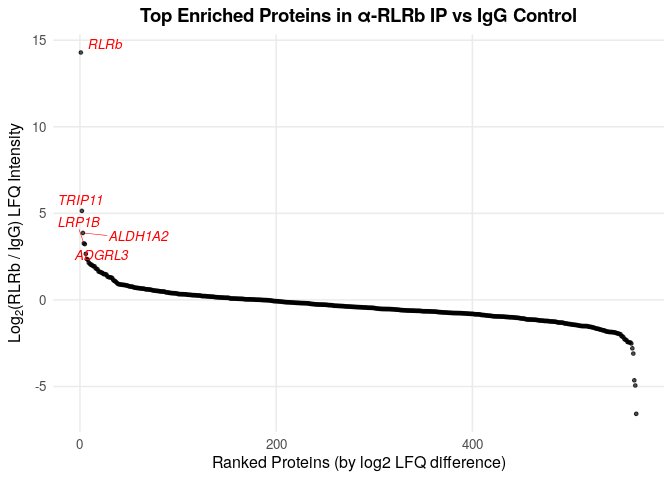

This script visualizes and analyzes mass spectrometry–based proteomics data generated from RLRb immunoprecipitation experiments. MS/MS raw files and MaxQuant output files were deposited to the ProteomeXchange Consortium via the PRIDE partner repository under the dataset identifier **PXD064383**.

The input file used for visualization is **MaxQuant-Perseus-stats-Rubi-20210201.xlsx**, generated from MaxQuant (v1.5.3.12) and downstream statistical analysis in Perseus (n = 3 technical replicates per RLRb-IP). Peptide identification was performed against translated *Nematostella* gene models using standard filtering criteria (1% FDR at peptide and protein levels; ≥2 unique or razor peptides per protein). Relative protein quantification was based on label-free quantification (LFQ).

```         
# Load libraries
library(readr)
library(ggplot2)
library(dplyr)
library(tidyr)

mass_spec<- readxl::read_excel("~/immune_cells/cnidarian_immune_cells/06_Mass_spec_analysis/input_files/MaxQuant-Perseus-stats-Rubi-20210201.xlsx", sheet = 2)

## New names:
## • `` -> `...10`

glimpse(mass_spec)

## Rows: 567
## Columns: 12
## $ `p-value`                             <dbl> 0.001412908…
## $ `ratio of LFQ intensity: RLRb vs IgG` <dbl> 2.002604e+0…
## $ `Fasta headers`                       <chr> "NVE16598",…
## $ `LFQ intensity alpha-RLRb-1`          <dbl> 35.97522, 2…
## $ `LFQ intensity alpha-RLRb-2`          <dbl> 30.99920, 2…
## $ `LFQ intensity alpha-RLRb-3`          <dbl> 36.37318, 2…
## $ `LFQ intensity Rabbit-IgG-1`          <dbl> 19.44059, 2…
## $ `LFQ intensity Rabbit-IgG-2`          <dbl> 19.77698, 2…
## $ `LFQ intensity Rabbit-IgG-3`          <dbl> 21.26127, 2…
## $ ...10                                 <lgl> NA, NA, NA,…
## $ `-LOG(P-value)`                       <dbl> 2.849886, 2…
## $ `log Difference`                      <dbl> 14.2895896,…

#Read dictionary file
dictionary<- read.csv("~/immune_cells/cnidarian_immune_cells/06_Mass_spec_analysis/input_files/Dictionary_Kozlovski_et.al.csv")

# Assign gene names to NVE gene models 

library(stringr)

# 1) Build a mapping: NVE gene -> protein_homolog(s)
gene2homolog <- dictionary %>%
  transmute(
    NVE_gene_model = as.character(NVE_gene_model),
    protein_homolog = na_if(trimws(as.character(protein_homolog)), "")
  ) %>%
  separate_rows(NVE_gene_model, sep = ";") %>%          # handle multi-IDs
  filter(!is.na(NVE_gene_model)) %>%
  group_by(NVE_gene_model) %>%
  summarise(
    protein_homolog_match = paste(unique(na.omit(protein_homolog)), collapse = ";"),
    .groups = "drop"
  )


# 2) Add homolog info to mass_spec WITHOUT duplicating final rows
mass_spec_with_homolog <- mass_spec %>%
  mutate(
    row_id = row_number(),
    `Fasta headers` = as.character(`Fasta headers`)
  ) %>%
  separate_rows(`Fasta headers`, sep = ";") %>%         # split multi-IDs only for lookup
  left_join(gene2homolog, by = c("Fasta headers" = "NVE_gene_model")) %>%
  group_by(row_id) %>%
  summarise(
    across(-c(`Fasta headers`, protein_homolog_match), first),
    protein_homolog_match = paste(unique(na.omit(protein_homolog_match)), collapse = ";"),
    .groups = "drop"
  ) %>%
  select(-row_id)

head(mass_spec_with_homolog)

## # A tibble: 6 × 12
##   `p-value` ratio of LFQ intensity…¹ LFQ intensity alpha-…²
##       <dbl>                    <dbl>                  <dbl>
## 1   0.00141                20026.                      36.0
## 2   0.00189                    0.175                   21.9
## 3   0.00223                    2.93                    26.2
## 4   0.00677                    0.200                   27.1
## 5   0.00750                    3.41                    30.4
## 6   0.00797                    0.544                   24.2
## # ℹ abbreviated names:
## #   ¹​`ratio of LFQ intensity: RLRb vs IgG`,
## #   ²​`LFQ intensity alpha-RLRb-1`
## # ℹ 9 more variables: `LFQ intensity alpha-RLRb-2` <dbl>,
## #   `LFQ intensity alpha-RLRb-3` <dbl>,
## #   `LFQ intensity Rabbit-IgG-1` <dbl>,
## #   `LFQ intensity Rabbit-IgG-2` <dbl>, …

# Rank by p-value
df <- mass_spec_with_homolog %>%
  arrange(desc(`log Difference`)) %>%
  mutate(rank = row_number())

head(df)

## # A tibble: 6 × 13
##   `p-value` ratio of LFQ intensity…¹ LFQ intensity alpha-…²
##       <dbl>                    <dbl>                  <dbl>
## 1   0.00141                 20026.                     36.0
## 2   0.0295                     35.3                    28.8
## 3   0.0106                     14.6                    31.1
## 4   0.142                       9.63                   34.0
## 5   0.0858                      9.34                   27.4
## 6   0.180                       6.32                   34.5
## # ℹ abbreviated names:
## #   ¹​`ratio of LFQ intensity: RLRb vs IgG`,
## #   ²​`LFQ intensity alpha-RLRb-1`
## # ℹ 10 more variables: `LFQ intensity alpha-RLRb-2` <dbl>,
## #   `LFQ intensity alpha-RLRb-3` <dbl>,
## #   `LFQ intensity Rabbit-IgG-1` <dbl>,
## #   `LFQ intensity Rabbit-IgG-2` <dbl>, …

# Note: #1 RLRb. Ambiguous: #3 ALDH1A2;ALDH2, #5  ADGRL3;FBN2
# For simplicity:

df$protein_homolog_match [1] <- "RLRb"
df$protein_homolog_match [2] <- "TRIP11"
df$protein_homolog_match [3] <- "ALDH1A2"
df$protein_homolog_match [4] <- "LRP1B"
df$protein_homolog_match [5] <- "ADGRL3"

top_hits <- df %>% filter(rank <= 5)

print(top_hits)

## # A tibble: 5 × 13
##   `p-value` ratio of LFQ intensity…¹ LFQ intensity alpha-…²
##       <dbl>                    <dbl>                  <dbl>
## 1   0.00141                 20026.                     36.0
## 2   0.0295                     35.3                    28.8
## 3   0.0106                     14.6                    31.1
## 4   0.142                       9.63                   34.0
## 5   0.0858                      9.34                   27.4
## # ℹ abbreviated names:
## #   ¹​`ratio of LFQ intensity: RLRb vs IgG`,
## #   ²​`LFQ intensity alpha-RLRb-1`
## # ℹ 10 more variables: `LFQ intensity alpha-RLRb-2` <dbl>,
## #   `LFQ intensity alpha-RLRb-3` <dbl>,
## #   `LFQ intensity Rabbit-IgG-1` <dbl>,
## #   `LFQ intensity Rabbit-IgG-2` <dbl>, …

library(ggplot2)
library(ggrepel)

ggplot(df, aes(x = rank, y = `log Difference`)) +
  geom_point(size = 1, alpha = 0.7, color = "black") +
  geom_text_repel(
    data = top_hits,
    aes(label = `protein_homolog_match`),
    size = 3.5,
    fontface = "italic",
    color = "red",
    max.overlaps = 100,
    segment.size = 0.2
  ) +
  labs(
    title = "Top Enriched Proteins in α-RLRb IP vs IgG Control",
    x = "Ranked Proteins (by log2 LFQ difference)",
    y = expression(Log[2]*"(RLRb / IgG) LFQ Intensity")
  ) +
  theme_minimal(base_size = 12) +
  theme(
    plot.title = element_text(face = "bold", hjust = 0.5, size = 14),
    axis.title = element_text(size = 12),
    axis.text = element_text(size = 10),
    panel.grid.minor = element_blank()
  )
```



```         
# How many orders of magnitude? 

ratio <- top_hits$`ratio of LFQ intensity: RLRb vs IgG`[1]
log10(ratio)

## [1] 4.301595

# p value for RLRb

print(top_hits$`p-value`[1])

## [1] 0.001412908

sessionInfo()

## R version 4.4.1 (2024-06-14)
## Platform: x86_64-pc-linux-gnu
## Running under: Ubuntu 22.04.5 LTS
## 
## Matrix products: default
## BLAS:   /usr/lib/x86_64-linux-gnu/openblas-pthread/libblas.so.3 
## LAPACK: /usr/lib/x86_64-linux-gnu/openblas-pthread/libopenblasp-r0.3.20.so;  LAPACK version 3.10.0
## 
## locale:
##  [1] LC_CTYPE=en_US.UTF-8       LC_NUMERIC=C              
##  [3] LC_TIME=en_US.UTF-8        LC_COLLATE=en_US.UTF-8    
##  [5] LC_MONETARY=en_US.UTF-8    LC_MESSAGES=en_US.UTF-8   
##  [7] LC_PAPER=en_US.UTF-8       LC_NAME=C                 
##  [9] LC_ADDRESS=C               LC_TELEPHONE=C            
## [11] LC_MEASUREMENT=en_US.UTF-8 LC_IDENTIFICATION=C       
## 
## time zone: Etc/UTC
## tzcode source: system (glibc)
## 
## attached base packages:
## [1] stats     graphics  grDevices utils     datasets 
## [6] methods   base     
## 
## other attached packages:
##  [1] ggrepel_0.9.6   Hmisc_5.2-2     patchwork_1.3.0
##  [4] ggpubr_0.6.0    lubridate_1.9.3 forcats_1.0.0  
##  [7] stringr_1.5.1   dplyr_1.1.4     purrr_1.0.2    
## [10] readr_2.1.5     tidyr_1.3.1     tibble_3.2.1   
## [13] ggplot2_3.5.1   tidyverse_2.0.0
## 
## loaded via a namespace (and not attached):
##  [1] gtable_0.3.5      bslib_0.8.0       xfun_0.48        
##  [4] htmlwidgets_1.6.4 rstatix_0.7.2     tzdb_0.4.0       
##  [7] vctrs_0.6.5       tools_4.4.1       generics_0.1.3   
## [10] fansi_1.0.6       highr_0.11        cluster_2.1.6    
## [13] pkgconfig_2.0.3   data.table_1.16.2 checkmate_2.3.2  
## [16] readxl_1.4.3      lifecycle_1.0.4   compiler_4.4.1   
## [19] farver_2.1.2      munsell_0.5.1     carData_3.0-5    
## [22] sass_0.4.9        htmltools_0.5.8.1 yaml_2.3.10      
## [25] htmlTable_2.4.3   Formula_1.2-5     jquerylib_0.1.4  
## [28] pillar_1.9.0      car_3.1-3         crayon_1.5.3     
## [31] cachem_1.1.0      rpart_4.1.23      abind_1.4-8      
## [34] tidyselect_1.2.1  digest_0.6.37     stringi_1.8.4    
## [37] labeling_0.4.3    fastmap_1.2.0     grid_4.4.1       
## [40] colorspace_2.1-1  cli_3.6.3         magrittr_2.0.3   
## [43] base64enc_0.1-3   utf8_1.2.4        broom_1.0.7      
## [46] foreign_0.8-87    withr_3.0.1       scales_1.3.0     
## [49] backports_1.5.0   timechange_0.3.0  rmarkdown_2.28   
## [52] nnet_7.3-19       gridExtra_2.3     cellranger_1.1.0 
## [55] ggsignif_0.6.4    hms_1.1.3         evaluate_1.0.1   
## [58] knitr_1.48        rlang_1.1.4       Rcpp_1.0.14      
## [61] glue_1.8.0        jsonlite_1.8.9    rstudioapi_0.16.0
## [64] R6_2.5.1
```
