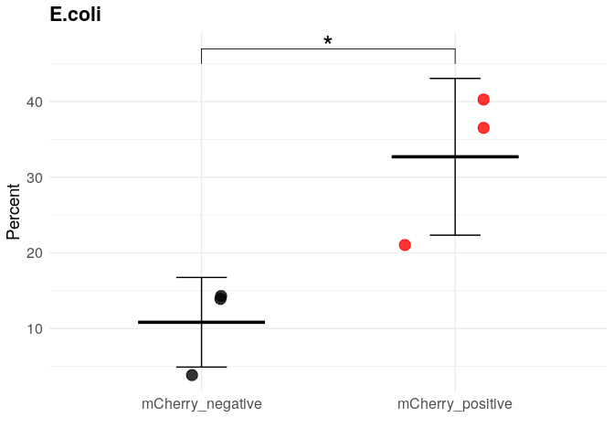
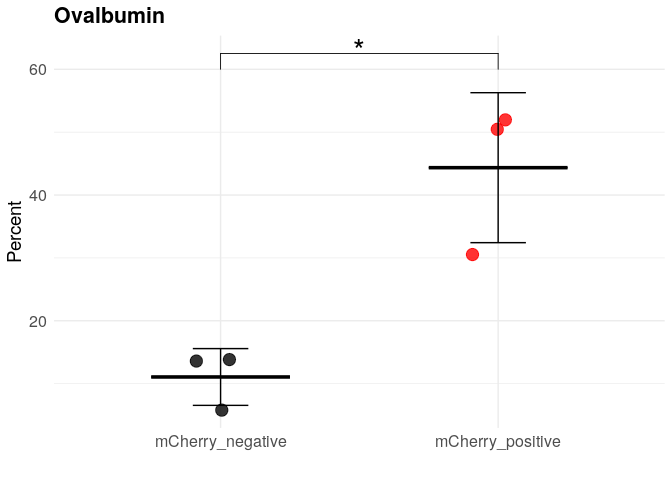
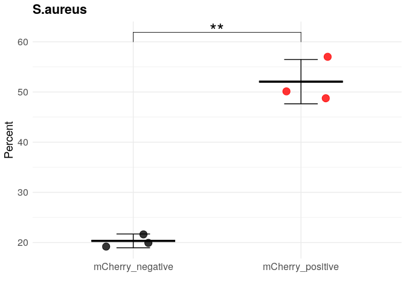
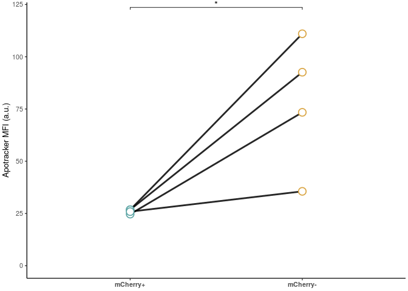
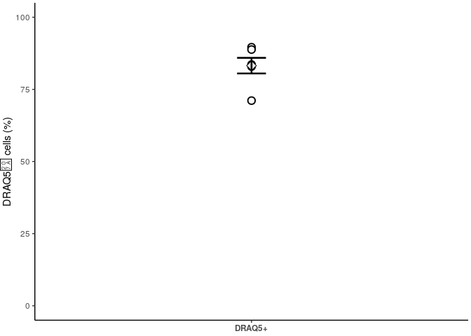
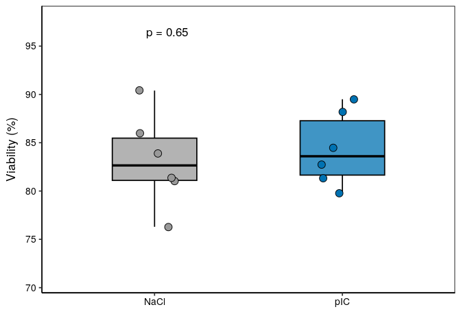
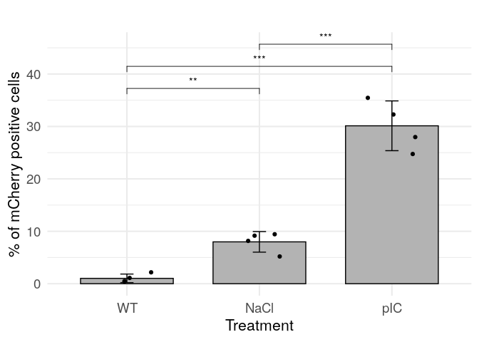
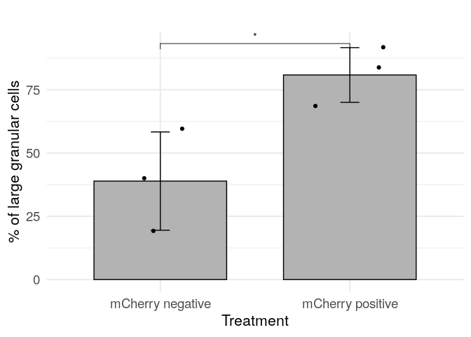

```         
# ============================================================
# Phagocytosis analysis + plots
# ============================================================

suppressPackageStartupMessages({
  library(tidyverse)
  library(ggplot2)
  library(ggpubr)
})

df1 <- read.csv(
  "~/immune_cells/cnidarian_immune_cells/08_flow_cytometry/input/phagocytosis_results.csv",
  header = TRUE
)

# ============================================================
# Part 1: Untreated (ANOVA + Tukey + barplot)
# ============================================================

df_untreated <- df1 %>% filter(Assay == "Untreated")

anova_result <- aov(Percent ~ Fraction, data = df_untreated)
summary(anova_result)

##             Df Sum Sq Mean Sq F value Pr(>F)    
## Fraction     3  455.9  151.97    1197  6e-11 ***
## Residuals    8    1.0    0.13                   
## ---
## Signif. codes:  
## 0 '***' 0.001 '**' 0.01 '*' 0.05 '.' 0.1 ' ' 1

posthoc <- TukeyHSD(anova_result)
print(posthoc)

##   Tukey multiple comparisons of means
##     95% family-wise confidence level
## 
## Fit: aov(formula = Percent ~ Fraction, data = df_untreated)
## 
## $Fraction
##                                                   diff
## RLRb::mCherry pIC-RLRb::mCherry NaCl         12.493333
## RLRb::mCherry uninjected-RLRb::mCherry NaCl  -2.006667
## WT-RLRb::mCherry NaCl                        -2.670667
## RLRb::mCherry uninjected-RLRb::mCherry pIC  -14.500000
## WT-RLRb::mCherry pIC                        -15.164000
## WT-RLRb::mCherry uninjected                  -0.664000
##                                                    lwr
## RLRb::mCherry pIC-RLRb::mCherry NaCl         11.561818
## RLRb::mCherry uninjected-RLRb::mCherry NaCl  -2.938182
## WT-RLRb::mCherry NaCl                        -3.602182
## RLRb::mCherry uninjected-RLRb::mCherry pIC  -15.431516
## WT-RLRb::mCherry pIC                        -16.095516
## WT-RLRb::mCherry uninjected                  -1.595516
##                                                     upr
## RLRb::mCherry pIC-RLRb::mCherry NaCl         13.4248490
## RLRb::mCherry uninjected-RLRb::mCherry NaCl  -1.0751510
## WT-RLRb::mCherry NaCl                        -1.7391510
## RLRb::mCherry uninjected-RLRb::mCherry pIC  -13.5684843
## WT-RLRb::mCherry pIC                        -14.2324843
## WT-RLRb::mCherry uninjected                   0.2675157
##                                                 p adj
## RLRb::mCherry pIC-RLRb::mCherry NaCl        0.0000000
## RLRb::mCherry uninjected-RLRb::mCherry NaCl 0.0005684
## WT-RLRb::mCherry NaCl                       0.0000743
## RLRb::mCherry uninjected-RLRb::mCherry pIC  0.0000000
## WT-RLRb::mCherry pIC                        0.0000000
## WT-RLRb::mCherry uninjected                 0.1813218

pairwise_results <- as.data.frame(posthoc$Fraction) %>%
  mutate(Significance = cut(
    `p adj`,
    breaks = c(-Inf, 0.001, 0.01, 0.05, Inf),
    labels = c("***", "**", "*", "ns")
  ))

comparisons_untreated <- list(
  c("RLRb::mCherry NaCl", "RLRb::mCherry pIC"),
  c("RLRb::mCherry NaCl", "RLRb::mCherry uninjected"),
  c("RLRb::mCherry NaCl", "WT"),
  c("RLRb::mCherry pIC", "RLRb::mCherry uninjected"),
  c("RLRb::mCherry pIC", "WT"),
  c("RLRb::mCherry uninjected", "WT")
)

p_untreated <- ggbarplot(
  df_untreated,
  x = "Fraction",
  y = "Percent",
  add = c("mean_sd", "jitter"),
  add.params = list(shape = "Fraction"),
  fill = "Fraction",
  palette = c("black", "grey", "yellow", "red"),
  position = position_dodge(0.8),
  ylab = "% of cells",
  xlab = "",
  legend.title = ""
) +
  stat_compare_means(comparisons = comparisons_untreated,
                     label = "p.signif",
                     method = "t.test") +
  theme_minimal() +
  theme(legend.position = "none")

p_untreated
```


```         
# ============================================================
# Part 2: Assay-specific scatter + mean ± SD + t-test
#   - E.coli, Ovalbumin, S.aureus
# ============================================================

my_comparisons <- list(c("mCherry_negative", "mCherry_positive"))

make_assay_plot <- function(df_all, assay, label_y) {
  df_assay <- df_all %>% filter(Assay == assay)
  
  summary_data <- df_assay %>%
    group_by(Assay, Fraction) %>%
    summarise(
      mean = mean(Percent, na.rm = TRUE),
      sd   = sd(Percent, na.rm = TRUE),
      .groups = "drop"
    )
  
  ggplot(df_assay, aes(x = Fraction, y = Percent, color = Fraction)) +
    geom_point(size = 4,
               position = position_jitter(width = 0.2),
               alpha = 0.8) +
    stat_summary(
      fun = mean,
      geom = "crossbar",
      width = 0.5,
      color = "black",
      aes(ymin = after_stat(y), ymax = after_stat(y))
    ) +
    geom_errorbar(
      data = summary_data,
      aes(
        y = mean,
        ymin = mean - sd,
        ymax = mean + sd
      ),
      width = 0.2,
      color = "black"
    ) +
    scale_color_manual(values = c("black", "red")) +
    stat_compare_means(
      comparisons = my_comparisons,
      label = "p.signif",
      method = "t.test",
      method.args = list(alternative = "two.sided"),
      label.y = label_y,
      size = 8,
      vjust = 0.5,
      tip.length = 0.05
    ) +
    theme_minimal() +
    theme(
      legend.position = "none",
      plot.title = element_text(size = 16, face = "bold"),
      axis.title.x = element_text(size = 14),
      axis.title.y = element_text(size = 14),
      axis.text.x  = element_text(size = 12),
      axis.text.y  = element_text(size = 12)
    ) +
    ylab("Percent") +
    xlab("") +
    ggtitle(assay)
}

P1 <- make_assay_plot(df1, assay = "E.coli", label_y = 45)
P2 <- make_assay_plot(df1, assay = "Ovalbumin", label_y = 60)
P3 <- make_assay_plot(df1, assay = "S.aureus", label_y = 60)

P1
```



```         
P2
```



```         
P3
```



```         
# Apoptosis (Apotracker green) assay --------------------------------------

library(tidyverse)
library(ggpubr)

df <- tribble(
  ~`mCherry+`, ~`mCherry-`, ~type,
  11.2, 48.6, "percent",
  11.0, 47.8, "percent",
  9.52, 46.5, "percent",
  6.99, 38.3, "percent",
  26.8, 111.0, "MFI",
  26.8, 92.6,  "MFI",
  24.7, 73.4,  "MFI",
  25.9, 35.6,  "MFI"
) %>% group_by(type) %>% mutate(replicate = row_number()) %>% ungroup()

paired_plot <- function(dat, ylab, ylim = NULL,
                                col_plus = "#5BA4A4",   
                                col_minus = "#D9A441",  
                                save_pdf = NULL, width_mm = 55, height_mm = 75) {
  
  # long format (mCherry+ left, mCherry- right)
  long <- dat %>%
    pivot_longer(c(`mCherry+`, `mCherry-`),
                 names_to = "group", values_to = "value") %>%
    mutate(group = factor(group, levels = c("mCherry+", "mCherry-")))
  
  # paired t-test
  wide <- dat %>% select(replicate, `mCherry+`, `mCherry-`)
  tt   <- t.test(wide$`mCherry+`, wide$`mCherry-`, paired = TRUE)
  pval <- tt$p.value
  star <- if      (pval < 0.001) "***"
  else if (pval < 0.01)  "**"
  else if (pval < 0.05)  "*"
  else                   "n.s."
  
  # bracket position
  y_max <- if (is.null(ylim)) max(long$value) else max(ylim)
  p_ann <- tibble(group1 = "mCherry+", group2 = "mCherry-",
                  y.position = y_max * 1.03, p = pval, label = star)
  
  # plot 
  g <- ggplot(long, aes(group, value)) +
    geom_line(aes(group = replicate),
              color = "black", linewidth = 1.0, alpha = 0.85) +
    geom_point(aes(color = group),
               size = 3.8, stroke = 0.9, shape = 21, fill = "white") +
    scale_color_manual(values = c("mCherry+" = col_plus, "mCherry-" = col_minus), guide = "none") +
    labs(x = NULL, y = ylab) +
    theme_classic(base_size = 10) +
    theme(
      axis.text.x = element_text(face = "bold"),
      plot.margin = margin(3, 3, 3, 3)
    ) +
    coord_cartesian(ylim = ylim, clip = "off") +
    stat_pvalue_manual(p_ann, xmin = "group1", xmax = "group2",
                       label = "label", tip.length = 0.01, size = 4)
  
  if (!is.null(save_pdf)) {
    ggsave(save_pdf, g, device = cairo_pdf,
           width = width_mm/25.4, height = height_mm/25.4, units = "in")
  }
  
  list(plot = g, ttest = tt)
}

# View and print exact p-values
p_percent$plot; p_percent$ttest
```


```         
## 
##  Paired t-test
## 
## data:  wide$`mCherry+` and wide$`mCherry-`
## t = -24.687, df = 3, p-value = 0.0001457
## alternative hypothesis: true mean difference is not equal to 0
## 95 percent confidence interval:
##  -40.21472 -31.03028
## sample estimates:
## mean difference 
##        -35.6225

p_mfi$plot;     p_mfi$ttest
```



```         
## 
##  Paired t-test
## 
## data:  wide$`mCherry+` and wide$`mCherry-`
## t = -3.2801, df = 3, p-value = 0.04642
## alternative hypothesis: true mean difference is not equal to 0
## 95 percent confidence interval:
##  -102.648329   -1.551671
## sample estimates:
## mean difference 
##           -52.1

# Proliferation 

# EdU incorporation assay -------------------------------------------------

## ===============================
##  EdU+ fraction: RLRb+ vs RLRb-
## ===============================

library(tidyverse)
library(ggpubr)

# RLRb+ cells
plus_edu_minus <- c(32.8, 34.5, 42.0, 40.4)  # Edu-
plus_edu_plus  <- c(12.9, 14.3, 15.4, 14.0)  # Edu+

# RLRb- cells
minus_edu_minus <- c(45.4, 41.3, 33.8, 37.7)  # Edu-
minus_edu_plus  <- c(8.94, 9.87, 8.82, 7.87)  # Edu+

perc_plus  <- plus_edu_plus  / (plus_edu_minus  + plus_edu_plus)  * 100
perc_minus <- minus_edu_plus / (minus_edu_minus + minus_edu_plus) * 100

# put into a tidy data frame
df <- tibble(
  replicate = 1:4,
  `RLRb+` = perc_plus,
  `RLRb-` = perc_minus
)

df  

## # A tibble: 4 × 3
##   replicate `RLRb+` `RLRb-`
##       <int>   <dbl>   <dbl>
## 1         1    28.2    16.5
## 2         2    29.3    19.3
## 3         3    26.8    20.7
## 4         4    25.7    17.3

tt <- t.test(df$`RLRb+`, df$`RLRb-`, paired = TRUE)
tt  

## 
##  Paired t-test
## 
## data:  df$`RLRb+` and df$`RLRb-`
## t = 7.6009, df = 3, p-value = 0.004726
## alternative hypothesis: true mean difference is not equal to 0
## 95 percent confidence interval:
##   5.288444 12.906633
## sample estimates:
## mean difference 
##        9.097538

pval <- tt$p.value
star <- if      (pval < 0.001) "***" else
  if      (pval < 0.01)  "**"  else
    if      (pval < 0.05)  "*"   else "n.s."

long <- df %>%
  pivot_longer(cols = c(`RLRb-`, `RLRb+`),
               names_to = "group",
               values_to = "value") %>%
  mutate(group = factor(group, levels = c("RLRb+", "RLRb-")))  # RLRb+ on the LEFT

# tighter y-limits based on data
y_min <- min(long$value)
y_max <- max(long$value)
y_range <- y_max - y_min
ylim_use <- c(y_min - 0.15 * y_range,   
              y_max + 0.25 * y_range)   

p_ann <- tibble(
  group1 = "RLRb+",
  group2 = "RLRb-",
  y.position = y_max + 0.18 * y_range,  
  label = star
)

col_plus  <- "#5BA4A4"  # teal
col_minus <- "#D9A441"  # mustard

g <- ggplot(long, aes(group, value)) +
  geom_line(aes(group = replicate),
            color = "black", linewidth = 1.0, alpha = 0.85) +
  geom_point(aes(color = group),
             size = 3.6, shape = 21, fill = "white", stroke = 1) +
  scale_color_manual(values = c("RLRb+" = col_plus, "RLRb-" = col_minus),
                     guide = "none") +
  labs(x = NULL, y = "EdU⁺ cells (% of total)") +
  theme_classic(base_size = 11) +
  theme(
    axis.text.x  = element_text(face = "bold"),
    axis.title.y = element_text(margin = margin(r = 4)),
    plot.margin  = margin(3, 3, 3, 3)
  ) +
  coord_cartesian(ylim = ylim_use, clip = "off") +
  stat_pvalue_manual(
    p_ann,
    xmin = "group1", xmax = "group2",
    label = "label",
    size = 4,
    tip.length = 0.01
  )

g
```


```         
# DRAQ5 -------------------------------------------------------------------

draq <- c(89.6, 83.6, 88.8, 82.9, 83.3, 71.1)

df <- tibble(
  condition = "DRAQ5+",
  value = draq
)

g_draq <- ggplot(df, aes(x = condition, y = value)) +
  # raw points
  geom_point(size = 3, shape = 21, fill = "white", stroke = 1) +
  # mean ± SEM
  stat_summary(fun = mean, geom = "point",
               shape = 23, size = 3.6, fill = "grey90") +
  stat_summary(fun.data = mean_se, geom = "errorbar",
               width = 0.08, linewidth = 0.9) +
  labs(x = NULL, y = "DRAQ5⁺ cells (%)") +
  coord_cartesian(ylim = c(0, 100), clip = "off") +
  theme_classic(base_size = 11) +
  theme(
    axis.text.x = element_text(face = "bold"),
    plot.margin  = margin(3, 3, 3, 3)
  )

g_draq
```



```         
# Viability -------------------------------------------------------------

#––––– Packages –––––#
library(ggplot2)
library(ggpubr)
library(dplyr)

#––––– Data –––––#
df <- data.frame(
  viability = c(79.8, 81, 82.7, 90.4, 89.5, 83.9,
                81.3, 76.3, 88.2, 81.4, 84.5, 86),
  treatment = c("pIC", "NaCl", "pIC", "NaCl", "pIC", "NaCl",
                "pIC", "NaCl", "pIC", "NaCl", "pIC", "NaCl")
)

df$treatment <- factor(df$treatment, levels = c("NaCl", "pIC"))

#––––– Stats –––––#
t_test <- t.test(viability ~ treatment, data = df)
t_test

## 
##  Welch Two Sample t-test
## 
## data:  viability by treatment
## t = -0.46365, df = 9.5389, p-value = 0.6533
## alternative hypothesis: true difference in means between group NaCl and group pIC is not equal to 0
## 95 percent confidence interval:
##  -6.810190  4.476857
## sample estimates:
## mean in group NaCl  mean in group pIC 
##           83.16667           84.33333

#––––– Boxplot –––––#
ggplot(df, aes(x = treatment, y = viability, fill = treatment)) +
  geom_boxplot(
    width = 0.45,
    alpha = 0.75,
    color = "black",
    linewidth = 0.6,
    outlier.shape = NA
  ) +
  geom_jitter(
    width = 0.12,
    size = 3.5,           
    shape = 21,
    stroke = 0.5,
    color = "black",
    aes(fill = treatment)
  ) +
  stat_compare_means(
    method = "t.test",
    label = "p.format",
    size = 4.5,
    label.y = 96
  ) +
  scale_fill_manual(
    values = c("NaCl" = "#999999",     
               "pIC"  = "#0072B2")     
  ) +
  scale_y_continuous(
    name = "Viability (%)",
    limits = c(70, 97),
    breaks = seq(70, 95, 5),
    expand = expansion(mult = c(0.02, 0.08))
  ) +
  labs(x = "") +
  theme_classic(base_size = 13) +
  theme(
    axis.text  = element_text(color = "black"),
    axis.title.y = element_text(margin = margin(r = 8)),
    axis.line  = element_line(color = "black"),
    panel.border = element_rect(color = "black", fill = NA, linewidth = 0.6),
    legend.position = "none"
  )
```



```         
# RLRb::mCherry reporter line  --------------------------------------------
# Create the data frame
# Original data
data <- data.frame(
  treatment = c("NaCl", "NaCl", "NaCl", "NaCl", "pIC", "pIC", "pIC", "pIC", "WT", "WT", "WT", "WT"),
  cells = c(8.15, 9.43, 9.20, 5.16, 28.00, 35.50, 32.30, 24.70, 1.07, 0.49, 2.16, 0.37)
)

# Reorder the treatment levels
data$treatment <- factor(data$treatment, levels = c("WT", "NaCl", "pIC"))

# Plot with ggpubr
plot <- ggbarplot(
  data, 
  x = "treatment", 
  y = "cells", 
  add = c("mean_sd", "jitter"), 
  fill = "gray70", 
  error.plot = "errorbar", 
  width = 0.7,
  position = position_dodge(0.8)
) +
  stat_compare_means(
    method = "t.test",
    comparisons = list(c("WT", "NaCl"), c("WT", "pIC"), c("NaCl", "pIC")),
    label = "p.signif",
    exact = FALSE
  ) +
  labs(
    title = "",
    x = "Treatment",
    y = "% of mCherry positive cells"
  ) +
  theme_minimal(base_size = 16) + 
  theme(
    axis.title = element_text(size = 16), 
    axis.text = element_text(size = 14),  
    legend.position = "none",
    plot.title = element_text(size = 18, hjust = 0.5, face = "bold")
  )

# Print the plot
print(plot)
```



```         
# Granularity 
data <- data.frame(
  mCherry = c("mCherry negative", "mCherry negative", "mCherry negative", "mCherry positive", "mCherry positive", "mCherry positive"),
  Percent = c(39.9,57.8,19.0, 84.0,89.7,68.8)
)

# Reorder the treatment levels
data$mCherry <- factor(data$mCherry, levels = c("mCherry negative", "mCherry positive"))

# Plot with ggpubr
plot <- ggbarplot(
  data, 
  x = "mCherry", 
  y = "Percent", 
  add = c("mean_sd", "jitter"), 
  fill = "gray70", 
  error.plot = "errorbar", 
  width = 0.7,
  position = position_dodge(0.8)
) +
  stat_compare_means(
    method = "t.test",
    comparisons = list(c("mCherry negative", "mCherry positive")),
    label = "p.signif",
    exact = FALSE
  ) +
  labs(
    title = "",
    x = "Treatment",
    y = "% of large granular cells"
  ) +
  theme_minimal(base_size = 16) + 
  theme(
    axis.title = element_text(size = 16), 
    axis.text = element_text(size = 14),  
    legend.position = "none",
    plot.title = element_text(size = 18, hjust = 0.5, face = "bold") 
  )

print(plot)
```



```         
sessionInfo()

## R version 4.4.1 (2024-06-14)
## Platform: x86_64-pc-linux-gnu
## Running under: Ubuntu 22.04.5 LTS
## 
## Matrix products: default
## BLAS:   /usr/lib/x86_64-linux-gnu/openblas-pthread/libblas.so.3 
## LAPACK: /usr/lib/x86_64-linux-gnu/openblas-pthread/libopenblasp-r0.3.20.so;  LAPACK version 3.10.0
## 
## locale:
##  [1] LC_CTYPE=en_US.UTF-8      
##  [2] LC_NUMERIC=C              
##  [3] LC_TIME=en_US.UTF-8       
##  [4] LC_COLLATE=en_US.UTF-8    
##  [5] LC_MONETARY=en_US.UTF-8   
##  [6] LC_MESSAGES=en_US.UTF-8   
##  [7] LC_PAPER=en_US.UTF-8      
##  [8] LC_NAME=C                 
##  [9] LC_ADDRESS=C              
## [10] LC_TELEPHONE=C            
## [11] LC_MEASUREMENT=en_US.UTF-8
## [12] LC_IDENTIFICATION=C       
## 
## time zone: Etc/UTC
## tzcode source: system (glibc)
## 
## attached base packages:
## [1] stats     graphics  grDevices utils    
## [5] datasets  methods   base     
## 
## other attached packages:
##  [1] ggpubr_0.6.0    lubridate_1.9.3
##  [3] forcats_1.0.0   stringr_1.5.1  
##  [5] dplyr_1.1.4     purrr_1.0.2    
##  [7] readr_2.1.5     tidyr_1.3.1    
##  [9] tibble_3.2.1    ggplot2_3.5.1  
## [11] tidyverse_2.0.0
## 
## loaded via a namespace (and not attached):
##  [1] sass_0.4.9        utf8_1.2.4       
##  [3] generics_0.1.3    rstatix_0.7.2    
##  [5] stringi_1.8.4     hms_1.1.3        
##  [7] digest_0.6.37     magrittr_2.0.3   
##  [9] evaluate_1.0.1    grid_4.4.1       
## [11] timechange_0.3.0  fastmap_1.2.0    
## [13] jsonlite_1.8.9    backports_1.5.0  
## [15] Formula_1.2-5     fansi_1.0.6      
## [17] scales_1.3.0      jquerylib_0.1.4  
## [19] abind_1.4-8       cli_3.6.3        
## [21] rlang_1.1.4       munsell_0.5.1    
## [23] cachem_1.1.0      yaml_2.3.10      
## [25] withr_3.0.1       tools_4.4.1      
## [27] tzdb_0.4.0        ggsignif_0.6.4   
## [29] colorspace_2.1-1  broom_1.0.7      
## [31] vctrs_0.6.5       R6_2.5.1         
## [33] lifecycle_1.0.4   car_3.1-3        
## [35] pkgconfig_2.0.3   bslib_0.8.0      
## [37] pillar_1.9.0      gtable_0.3.5     
## [39] glue_1.8.0        highr_0.11       
## [41] xfun_0.48         tidyselect_1.2.1 
## [43] rstudioapi_0.16.0 knitr_1.48       
## [45] farver_2.1.2      htmltools_0.5.8.1
## [47] rmarkdown_2.28    carData_3.0-5    
## [49] labeling_0.4.3    compiler_4.4.1
```
