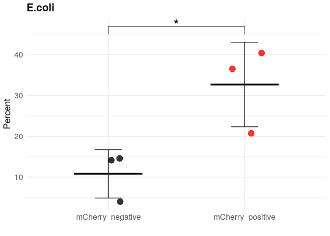
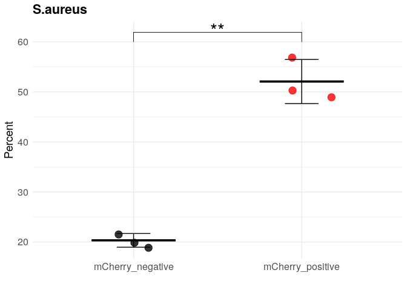

```         
# ============================================================
# Phagocytosis analysis + plots
# ============================================================

suppressPackageStartupMessages({
  library(tidyverse)
  library(ggplot2)
  library(ggpubr)
})

df1 <- read.csv(
  "~/immune_cells/cnidarian_immune_cells/08_phagocytosis/input/phagocytosis_results.csv",
  header = TRUE
)

# ============================================================
# Part 1: Untreated (ANOVA + Tukey + barplot)
# ============================================================

df_untreated <- df1 %>% filter(Assay == "Untreated")

anova_result <- aov(Percent ~ Fraction, data = df_untreated)
summary(anova_result)

##             Df Sum Sq Mean Sq F value Pr(>F)    
## Fraction     3  455.9  151.97    1197  6e-11 ***
## Residuals    8    1.0    0.13                   
## ---
## Signif. codes:  
## 0 '***' 0.001 '**' 0.01 '*' 0.05 '.' 0.1 ' ' 1

posthoc <- TukeyHSD(anova_result)
print(posthoc)

##   Tukey multiple comparisons of means
##     95% family-wise confidence level
## 
## Fit: aov(formula = Percent ~ Fraction, data = df_untreated)
## 
## $Fraction
##                                                   diff
## RLRb::mCherry pIC-RLRb::mCherry NaCl         12.493333
## RLRb::mCherry uninjected-RLRb::mCherry NaCl  -2.006667
## WT-RLRb::mCherry NaCl                        -2.670667
## RLRb::mCherry uninjected-RLRb::mCherry pIC  -14.500000
## WT-RLRb::mCherry pIC                        -15.164000
## WT-RLRb::mCherry uninjected                  -0.664000
##                                                    lwr
## RLRb::mCherry pIC-RLRb::mCherry NaCl         11.561818
## RLRb::mCherry uninjected-RLRb::mCherry NaCl  -2.938182
## WT-RLRb::mCherry NaCl                        -3.602182
## RLRb::mCherry uninjected-RLRb::mCherry pIC  -15.431516
## WT-RLRb::mCherry pIC                        -16.095516
## WT-RLRb::mCherry uninjected                  -1.595516
##                                                     upr
## RLRb::mCherry pIC-RLRb::mCherry NaCl         13.4248490
## RLRb::mCherry uninjected-RLRb::mCherry NaCl  -1.0751510
## WT-RLRb::mCherry NaCl                        -1.7391510
## RLRb::mCherry uninjected-RLRb::mCherry pIC  -13.5684843
## WT-RLRb::mCherry pIC                        -14.2324843
## WT-RLRb::mCherry uninjected                   0.2675157
##                                                 p adj
## RLRb::mCherry pIC-RLRb::mCherry NaCl        0.0000000
## RLRb::mCherry uninjected-RLRb::mCherry NaCl 0.0005684
## WT-RLRb::mCherry NaCl                       0.0000743
## RLRb::mCherry uninjected-RLRb::mCherry pIC  0.0000000
## WT-RLRb::mCherry pIC                        0.0000000
## WT-RLRb::mCherry uninjected                 0.1813218

pairwise_results <- as.data.frame(posthoc$Fraction) %>%
  mutate(Significance = cut(
    `p adj`,
    breaks = c(-Inf, 0.001, 0.01, 0.05, Inf),
    labels = c("***", "**", "*", "ns")
  ))

comparisons_untreated <- list(
  c("RLRb::mCherry NaCl", "RLRb::mCherry pIC"),
  c("RLRb::mCherry NaCl", "RLRb::mCherry uninjected"),
  c("RLRb::mCherry NaCl", "WT"),
  c("RLRb::mCherry pIC", "RLRb::mCherry uninjected"),
  c("RLRb::mCherry pIC", "WT"),
  c("RLRb::mCherry uninjected", "WT")
)

p_untreated <- ggbarplot(
  df_untreated,
  x = "Fraction",
  y = "Percent",
  add = c("mean_sd", "jitter"),
  add.params = list(shape = "Fraction"),
  fill = "Fraction",
  palette = c("black", "grey", "yellow", "red"),
  position = position_dodge(0.8),
  ylab = "% of cells",
  xlab = "",
  legend.title = ""
) +
  stat_compare_means(comparisons = comparisons_untreated,
                     label = "p.signif",
                     method = "t.test") +
  theme_minimal() +
  theme(legend.position = "none")

p_untreated
```


```         
# ============================================================
# Part 2: Assay-specific scatter + mean ± SD + t-test
#   - E.coli, Ovalbumin, S.aureus
# ============================================================

my_comparisons <- list(c("mCherry_negative", "mCherry_positive"))

make_assay_plot <- function(df_all, assay, label_y) {
  df_assay <- df_all %>% filter(Assay == assay)
  
  summary_data <- df_assay %>%
    group_by(Assay, Fraction) %>%
    summarise(
      mean = mean(Percent, na.rm = TRUE),
      sd   = sd(Percent, na.rm = TRUE),
      .groups = "drop"
    )
  
  ggplot(df_assay, aes(x = Fraction, y = Percent, color = Fraction)) +
    geom_point(size = 4,
               position = position_jitter(width = 0.2),
               alpha = 0.8) +
    stat_summary(
      fun = mean,
      geom = "crossbar",
      width = 0.5,
      color = "black",
      aes(ymin = after_stat(y), ymax = after_stat(y))
    ) +
    geom_errorbar(
      data = summary_data,
      aes(
        y = mean,
        ymin = mean - sd,
        ymax = mean + sd
      ),
      width = 0.2,
      color = "black"
    ) +
    scale_color_manual(values = c("black", "red")) +
    stat_compare_means(
      comparisons = my_comparisons,
      label = "p.signif",
      method = "t.test",
      method.args = list(alternative = "two.sided"),
      label.y = label_y,
      size = 8,
      vjust = 0.5,
      tip.length = 0.05
    ) +
    theme_minimal() +
    theme(
      legend.position = "none",
      plot.title = element_text(size = 16, face = "bold"),
      axis.title.x = element_text(size = 14),
      axis.title.y = element_text(size = 14),
      axis.text.x  = element_text(size = 12),
      axis.text.y  = element_text(size = 12)
    ) +
    ylab("Percent") +
    xlab("") +
    ggtitle(assay)
}

P1 <- make_assay_plot(df1, assay = "E.coli", label_y = 45)
P2 <- make_assay_plot(df1, assay = "Ovalbumin", label_y = 60)
P3 <- make_assay_plot(df1, assay = "S.aureus", label_y = 60)

P1
```



```         
P2
```


```         
P3
```



```         
sessionInfo()

## R version 4.4.1 (2024-06-14)
## Platform: x86_64-pc-linux-gnu
## Running under: Ubuntu 22.04.5 LTS
## 
## Matrix products: default
## BLAS:   /usr/lib/x86_64-linux-gnu/openblas-pthread/libblas.so.3 
## LAPACK: /usr/lib/x86_64-linux-gnu/openblas-pthread/libopenblasp-r0.3.20.so;  LAPACK version 3.10.0
## 
## locale:
##  [1] LC_CTYPE=en_US.UTF-8      
##  [2] LC_NUMERIC=C              
##  [3] LC_TIME=en_US.UTF-8       
##  [4] LC_COLLATE=en_US.UTF-8    
##  [5] LC_MONETARY=en_US.UTF-8   
##  [6] LC_MESSAGES=en_US.UTF-8   
##  [7] LC_PAPER=en_US.UTF-8      
##  [8] LC_NAME=C                 
##  [9] LC_ADDRESS=C              
## [10] LC_TELEPHONE=C            
## [11] LC_MEASUREMENT=en_US.UTF-8
## [12] LC_IDENTIFICATION=C       
## 
## time zone: Etc/UTC
## tzcode source: system (glibc)
## 
## attached base packages:
## [1] stats     graphics  grDevices utils    
## [5] datasets  methods   base     
## 
## other attached packages:
##  [1] ggpubr_0.6.0    lubridate_1.9.3
##  [3] forcats_1.0.0   stringr_1.5.1  
##  [5] dplyr_1.1.4     purrr_1.0.2    
##  [7] readr_2.1.5     tidyr_1.3.1    
##  [9] tibble_3.2.1    ggplot2_3.5.1  
## [11] tidyverse_2.0.0
## 
## loaded via a namespace (and not attached):
##  [1] sass_0.4.9        utf8_1.2.4       
##  [3] generics_0.1.3    rstatix_0.7.2    
##  [5] stringi_1.8.4     hms_1.1.3        
##  [7] digest_0.6.37     magrittr_2.0.3   
##  [9] evaluate_1.0.1    grid_4.4.1       
## [11] timechange_0.3.0  fastmap_1.2.0    
## [13] jsonlite_1.8.9    backports_1.5.0  
## [15] Formula_1.2-5     fansi_1.0.6      
## [17] scales_1.3.0      jquerylib_0.1.4  
## [19] abind_1.4-8       cli_3.6.3        
## [21] rlang_1.1.4       munsell_0.5.1    
## [23] cachem_1.1.0      yaml_2.3.10      
## [25] withr_3.0.1       tools_4.4.1      
## [27] tzdb_0.4.0        ggsignif_0.6.4   
## [29] colorspace_2.1-1  broom_1.0.7      
## [31] vctrs_0.6.5       R6_2.5.1         
## [33] lifecycle_1.0.4   car_3.1-3        
## [35] pkgconfig_2.0.3   bslib_0.8.0      
## [37] pillar_1.9.0      gtable_0.3.5     
## [39] glue_1.8.0        highr_0.11       
## [41] xfun_0.48         tidyselect_1.2.1 
## [43] rstudioapi_0.16.0 knitr_1.48       
## [45] farver_2.1.2      htmltools_0.5.8.1
## [47] rmarkdown_2.28    carData_3.0-5    
## [49] labeling_0.4.3    compiler_4.4.1
```
